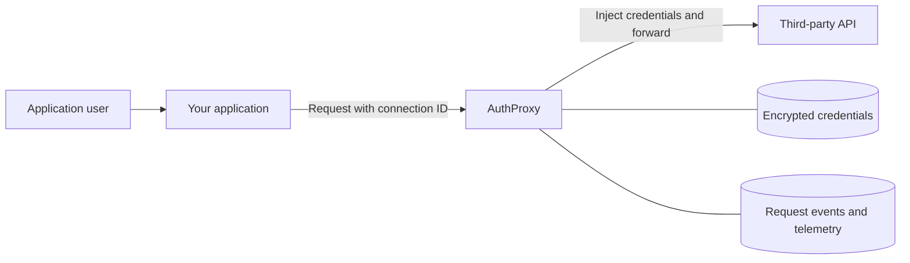
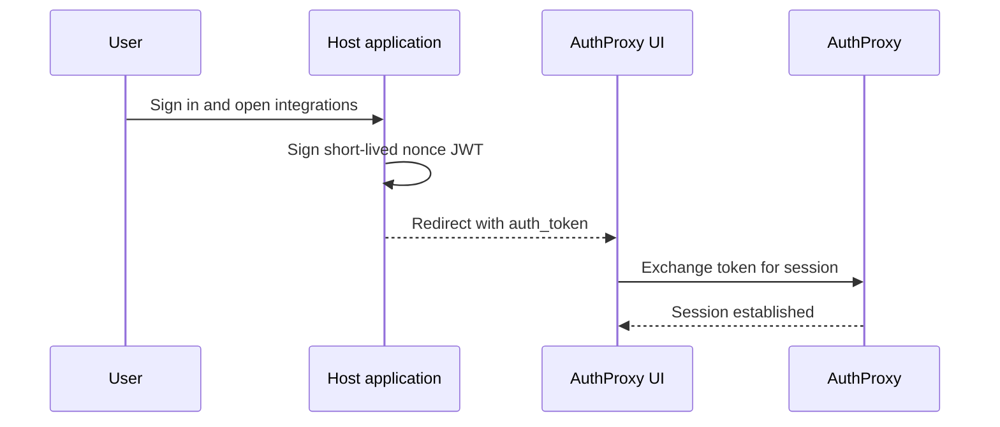

# AuthProxy

AuthProxy is an open-source, embeddable connection platform for applications
that call third-party APIs. It centralizes OAuth tokens and API keys, injects
credentials at request time, refreshes OAuth tokens, and records what happened.
Your application keeps using each provider's native API while AuthProxy manages
the connection lifecycle.

## What AuthProxy is and why use it

AuthProxy sits between your application and the APIs it integrates with:


```mermaid
flowchart LR
    User["Application user"] --> Host["Your application"]
    Host -->|"Request with connection ID"| AP["AuthProxy"]
    AP -->|"Inject credentials and forward"| Provider["Third-party API"]
    AP --- Store[("Encrypted credentials")]
    AP --- Audit[("Request events and telemetry")]
```

A **connector** describes how a provider authenticates and how a connection is
set up. A **connection** is a namespace-scoped configured instance of that
connector for a tenant, team, user, or service, including its encrypted
credentials. Your application sends the connection ID with a request; it never
needs to retrieve the credential.

AuthProxy is useful when you want to:

- **Build instead of outsource your integration logic.** Keep native provider
  APIs, SDKs, and data models rather than adopting a lossy unified API.
- **Avoid rebuilding connection infrastructure.** OAuth callbacks, refresh,
  API-key injection, setup forms, health probes, connector versioning, and
  connection UIs are shared across integrations.
- **Keep control of the data plane.** AuthProxy is open source and self-hosted,
  so credentials and request data can remain inside infrastructure you control.
- **Embed integrations into your product.** The Marketplace UI fits into the
  host application's sign-in flow; actors, namespaces, and scoped permissions
  map AuthProxy resources to the host's users and tenants.
- **Give operators one control plane.** The Admin UI, request-event store,
  rate limits, tasks, and OpenTelemetry signals make integration behavior
  inspectable without scattering secrets and logs through application code.
- **Limit credential exposure.** Sensitive fields use application-level
  encryption, namespace-scoped keys can isolate tenants, and external KMS or
  secret providers can retain control of wrapping material.

AuthProxy focuses on authentication, connection lifecycle, proxying, and
governance. It is not a workflow builder or a replacement for the business
logic in your application. See the [core concepts](docs/src/content/docs/concepts/index.md)
and [comparison with related projects](docs/src/content/docs/reference/related-projects.md) for
more detail.

## Demos

Start at the [AuthProxy demo](https://demo.authproxy.net/). The sign-in page is
a small stand-in for an application that embeds AuthProxy. Choose an example
identity, then open either the Marketplace or Admin UI.

The demo shell signs a short-lived, one-time JWT for the selected actor and
redirects the browser to AuthProxy. AuthProxy verifies the token and establishes
the UI session. In a real integration, your application performs this handoff
after authenticating its own user.


```mermaid
sequenceDiagram
    participant User
    participant Host as Host application
    participant UI as AuthProxy UI
    participant AP as AuthProxy

    User->>Host: Sign in and open integrations
    Host->>Host: Sign short-lived nonce JWT
    Host-->>UI: Redirect with auth_token
    UI->>AP: Exchange token for session
    AP-->>UI: Session established
```

The demo is public and shared, so its contents may change or be reset. Do not
enter real credentials or private data.

### Marketplace


The [Marketplace](https://marketplace.demo.authproxy.net/) shows how users
discover and manage integrations inside a host application. The demo catalog
includes:

- a no-auth connector;
- an API-key connector that accepts the intentionally fake key
  `demo-api-key`;
- a basic OAuth authorization-code flow;
- OAuth with tenant selection before authorization; and
- OAuth followed by resource selection after authorization.

The OAuth examples use a dedicated `go-oauth2-server` test provider instead of
a real third party. Use the credentials shown in the connector description, or
select **Register** on the provider login page to create any fake account you
want. This lets you test the complete connection flow without giving the demo
access to a real Google, GitHub, or other provider account.

### Administration and observability


The [Admin UI](https://admin.demo.authproxy.net/) lets operators inspect
namespaces, actors, connectors, connections, requests, tasks, encryption keys,
and rate limits.

[Grafana](https://demo.authproxy.net/grafana) is available with anonymous
viewer access. It includes an
[AuthProxy app-metrics dashboard](https://demo.authproxy.net/grafana/d/authproxy-app-metrics-demo/authproxy-app-metrics?orgId=1&from=now-1h&to=now)
and [Explore](https://demo.authproxy.net/grafana/explore?orgId=1), with
AuthProxy, Prometheus, Tempo, and Loki data sources.

## Developer quick start

You need [Git](https://git-scm.com/) and
[Docker Desktop](https://www.docker.com/products/docker-desktop/).

```bash
git clone https://github.com/rmorlok/authproxy.git
cd authproxy
docker compose --profile server up --build -d
```

The first run builds AuthProxy and its embedded UIs, then starts Postgres,
Redis, MinIO, ClickHouse, and all four AuthProxy services. Verify the API:

```bash
curl http://localhost:8081/ping
```

The public and Admin services use a self-signed development certificate at
`https://localhost:8080` and `https://localhost:8082`; a browser will warn until
you trust it. Stop the stack with:

```bash
docker compose --profile server down
```

For local UI sign-in, source-mode development, alternate data stores, tests,
and observability, continue with the
[development quick start](docs/src/content/docs/development/quick-start.md).
