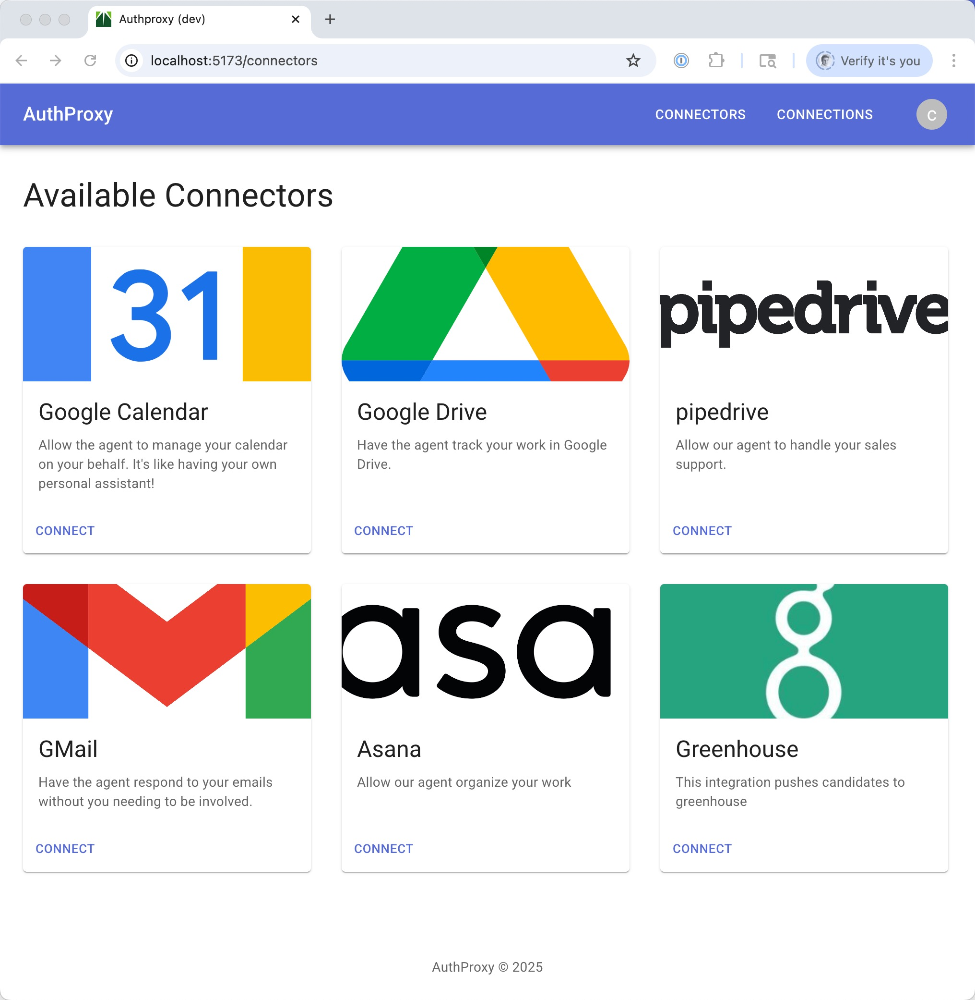

# AuthProxy

AuthProxy is an open source, embeddable integration platform-as-a-service (iPaaS). It offloads the work of managing
the connection lifecycle to 3rd party systems so your application can call to those systems using an authenticating
proxy and stay focussed on the business logic of your product.



## Running Locally

### Quick Start with Docker Compose

The fastest way to get started is with Docker Compose, which manages all dependencies for you.

**Prerequisites:** Install [Docker Desktop](https://www.docker.com/products/docker-desktop/).

**Start data stores only** (for local Go/frontend development):

```bash
docker compose up -d
```

This starts PostgreSQL (5432), Redis (6379), MinIO (9000/9001), and ClickHouse (8123/9009).

Then run the server locally:

```bash
go run ./cmd/server serve --config=./dev_config/default.yaml all
```

**Start the full stack** (server runs in Docker too):

```bash
docker compose --profile server up -d
```

This also builds and starts the AuthProxy server (ports 8080-8083) using `dev_config/docker.yaml`.

**Start monitoring tools:**

```bash
docker compose --profile tools up -d
```

This adds RedisInsight on port 5540. Connect to `redis://default@redis:6379`.

**Stop everything:**

```bash
docker compose --profile server --profile tools down
```

Add `-v` to also remove data volumes.

### Manual Setup

If you prefer to manage dependencies yourself:

#### Prerequisites

Install the following on MacOS:

```bash
brew install go
brew install gh
brew install volta
brew install jq
```

Install Docker Desktop separately from their website.

Setup Javascript/Typescript dependencies:

```bash
volta install node
volta install yarn
yarn install
```

#### Start Dependencies

Create a network for the asynq system to interact with redis:

```bash
docker network create authproxy
```

Start redis (requires search module):

```bash
docker run --name redis-server -p 6379:6379 --network authproxy -d redis/redis-stack-server:latest
```

Start Postgres (for local development and tests):

```bash
docker run --name postgres-server -p 5432:5432 --network authproxy -e POSTGRES_USER=postgres -e POSTGRES_PASSWORD=postgres -e POSTGRES_DB=authproxy -d postgres:16
```

Configure Postgres in `dev_config/default.yaml`:

```yaml
database:
  provider: postgres
  auto_migrate: true
  host: localhost
  port: 5432
  user: postgres
  password: postgres
  database: authproxy
  sslmode: disable
```

#### Start the Server

```bash
go run ./cmd/server serve --config=./dev_config/default.yaml all
```

Run the client to proxy authenticated calls to the backend:

```bash
go run ./cmd/cli raw-proxy --enableLoginRedirect=true --proxyTo=api
```

### Testing

Run tests with SQLite (default):

```bash
go test -v ./...
```

Run tests with Postgres (ensure Postgres is running via Docker Compose or manually):

```bash
AUTH_PROXY_TEST_DATABASE_PROVIDER=postgres \
POSTGRES_TEST_HOST=localhost \
POSTGRES_TEST_PORT=5432 \
POSTGRES_TEST_USER=postgres \
POSTGRES_TEST_PASSWORD=postgres \
POSTGRES_TEST_DATABASE=postgres \
POSTGRES_TEST_OPTIONS=sslmode=disable \
go test -v ./...
```

## UI

### Marketplace UI

Run the marketplace UI:

```bash
yarn workspace @authproxy/marketplace dev
```

### Admin UI
Run the admin UI:

```bash
yarn workspace @authproxy/admin dev
```

### Viewing Redis Data

If using Docker Compose, start RedisInsight with:

```bash
docker compose --profile tools up -d
```

Then open http://localhost:5540 and connect to `redis://default@redis:6379`.

Alternatively, run RedisInsight manually:

```bash
docker run -d --name redisinsight -p 5540:5540 -v redisinsight:/data --network authproxy redis/redisinsight:latest
```

Add a connection to redis. Connect to the redis server using the following URI:

```
redis://default@redis-server:6379
```


### Viewing Background Tasks
To manage tasks in asynq, install the [asynq cli](https://github.com/hibiken/asynq/blob/master/tools/asynq/README.md):

```bash
go install github.com/hibiken/asynq/tools/asynq@latest
```

and run the cli:

```bash
asynq dash
````

run the web monitoring tool:

```bash
docker run --rm \
    -d \
    --name asynqmon \
    --network authproxy \
    -p 8090:8080 \
    hibiken/asynqmon \
    --redis-addr=redis-server:6379
```

open the web ui:

```bash
open http://localhost:8090
```


## Client Config

The client cli looks for a config file at `~/.authproxy.yaml`:

```yaml
admin_username: bobdole
admin_private_key_path: /path/to/private/key
server:
  api: http://localhost:8081
```
