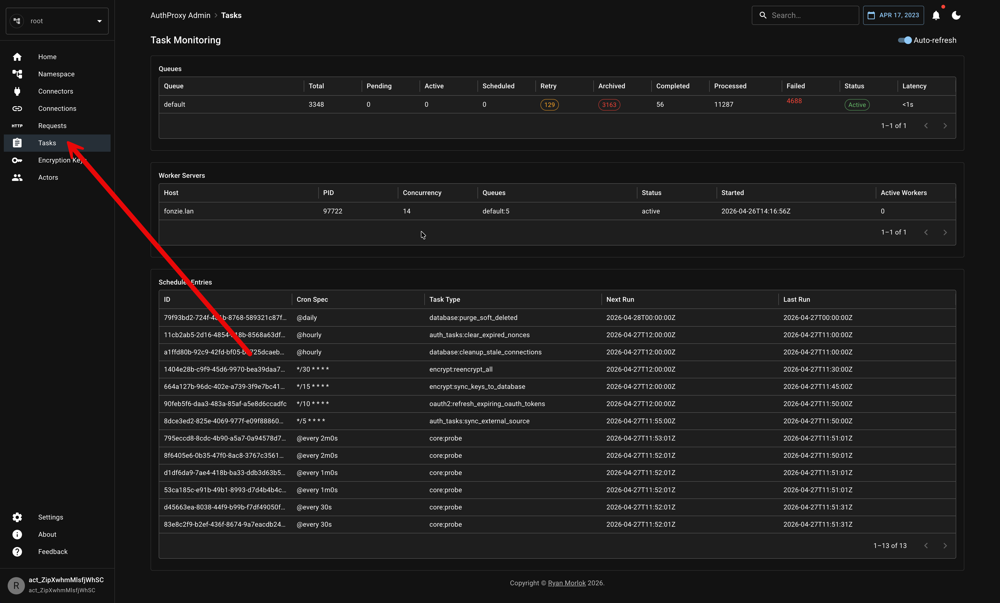

# Viewing Background Tasks
AuthProxy Admin UI itself provides a Tasks view that allows you to monitor the Asynq background tasks.



If you would like further granularity, you can use Asynq tools directly. To manage tasks in asynq, install the [asynq cli](https://github.com/hibiken/asynq/blob/master/tools/asynq/README.md):

```bash
go install github.com/hibiken/asynq/tools/asynq@latest
```

and run the cli:

```bash
asynq dash
````

run the web monitoring tool:

```bash
docker run --rm \
    -d \
    --name asynqmon \
    --network authproxy \
    -p 8090:8080 \
    hibiken/asynqmon \
    --redis-addr=redis-server:6379
```

open the web ui:

```bash
open http://localhost:8090
```


