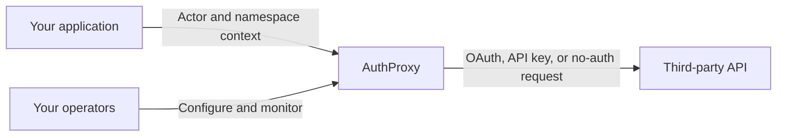
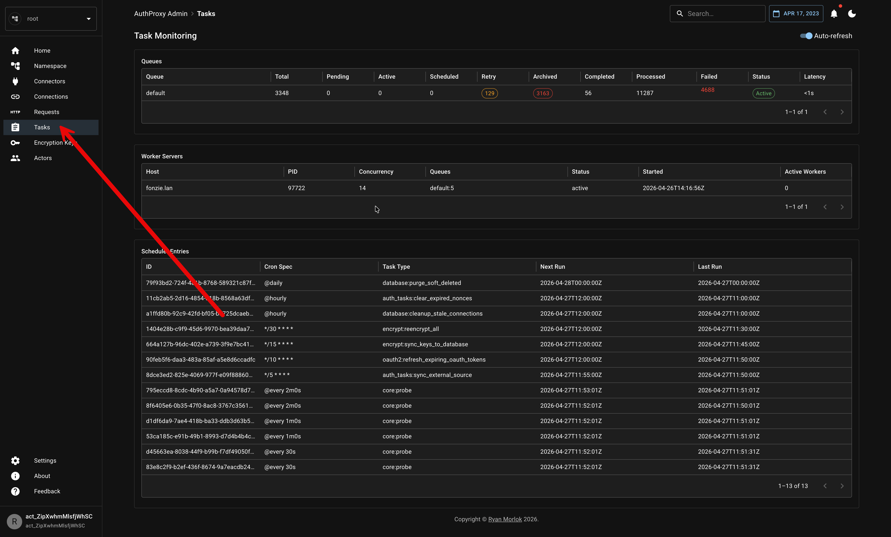

AuthProxy exists to make third-party API integrations easier to build without making authentication, credentials, and operations an afterthought. This blog is where we will share the reasoning, tradeoffs, and practical techniques behind that work.

You can use it to follow the project, but its main job is more useful than announcements: it will collect focused articles for the awkward parts of integration work. That includes designing connector setup flows, protecting credentials, diagnosing failed connections, proxying API calls, and operating a self-hosted integration platform.

## One integration boundary

AuthProxy keeps the host application focused on its own users and product rules. It owns the connection lifecycle and authenticating boundary to each third-party API.

The exact mapping is yours: one connection may belong to a user, a service, or a namespace. AuthProxy makes that ownership explicit and keeps credentials encrypted, scoped, and out of your application’s request path.

## What to expect here

We will publish short, durable problem-solving guides alongside project updates. The documentation remains the canonical reference for setup and configuration; articles here will explain why a particular approach works, when to use it, and how to diagnose it when it does not.

The Admin UI includes operational views such as background tasks, so a connection problem can be investigated as a lifecycle event rather than an opaque failure in application code.

To get started today, visit the [AuthProxy documentation](https://docs.authproxy.net) or explore the [source code on GitHub](https://github.com/rmorlok/authproxy).
