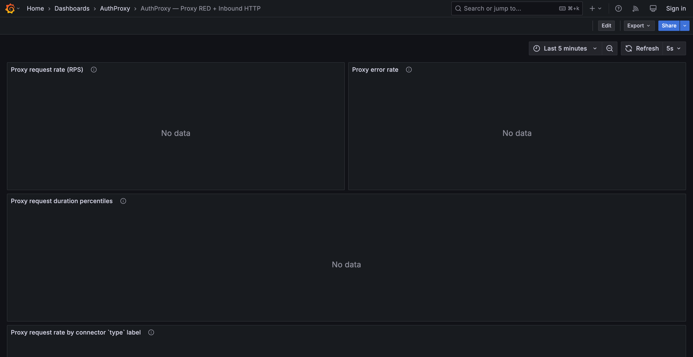
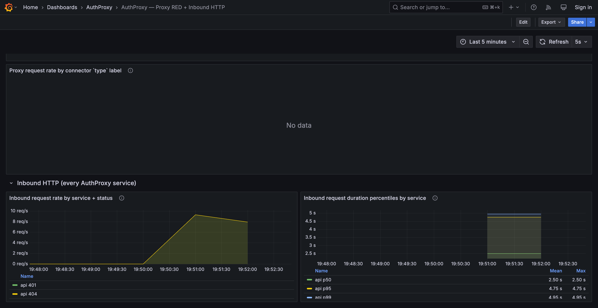
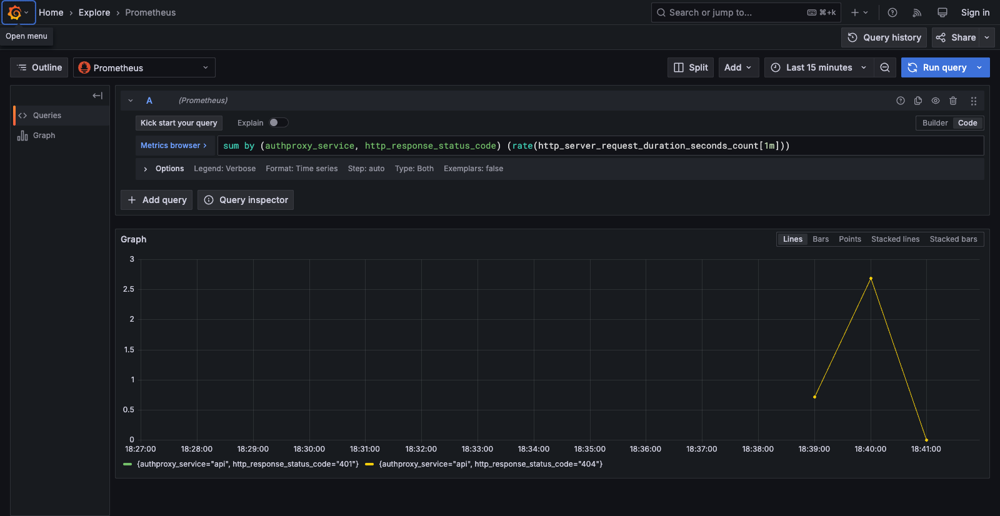
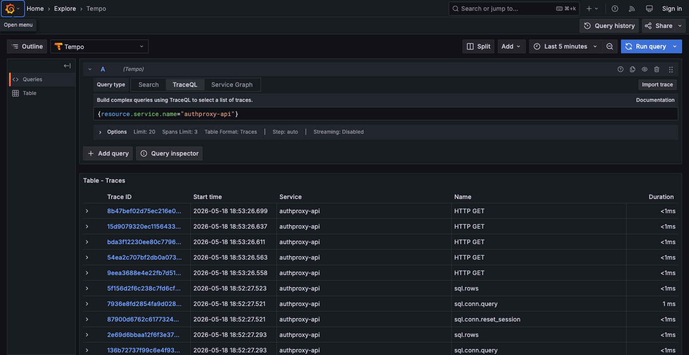
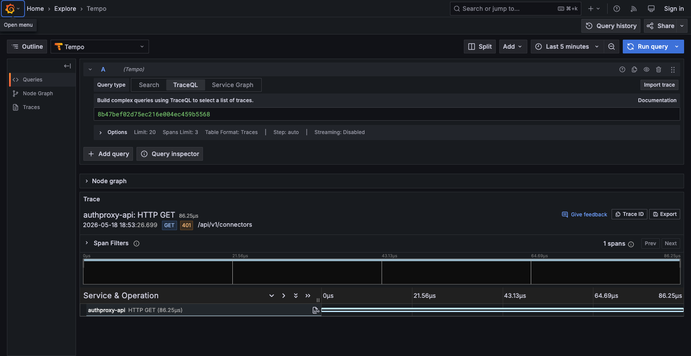
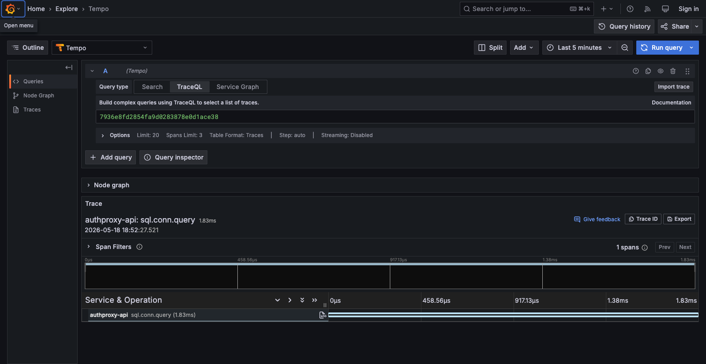

# Local observability sample

A single-container Grafana + Tempo + Loki + Prometheus + OTel Collector
stack ([`grafana/otel-lgtm`](https://github.com/grafana/docker-otel-lgtm))
for inspecting AuthProxy traces, metrics, and logs end-to-end in development.

## Bring it up

```bash
docker compose --profile observability up -d
```

Wait a few seconds for the container to finish initialising, then point
AuthProxy at it before starting the services:

```bash
export AUTHPROXY_OTEL_ENDPOINT=http://localhost:4317
go run ./cmd/server serve --config=./dev_config/default.yaml all
```

The `telemetry:` block in `dev_config/default.yaml` is endpoint-gated:
when `AUTHPROXY_OTEL_ENDPOINT` is unset the SDK falls through to no-op
providers (no SDK warnings, no dialling of any collector) so the
profile-off path stays exactly like vanilla dev. Once the env var
points at a real OTLP endpoint, AuthProxy starts emitting traces,
metrics, and logs.

Grafana is at `http://localhost:3000` — no login required. The
pre-provisioned "AuthProxy / Proxy RED" dashboard lives under the
`AuthProxy` folder; it surfaces request rate / error ratio / latency
percentiles plus a per-`type` panel demonstrating the
`metric_dimension_labels` projection from #232.

## Finding things in Grafana

- **Traces**: open the Explore tab → pick the **Tempo** datasource →
  search by service name (e.g. `authproxy-api`, `authproxy-worker`) or
  by tag. AuthProxy spans carry `authproxy.connection_id`,
  `authproxy.connector_id`, `authproxy.connector_version`, and
  `authproxy.namespace` as span attributes so you can pivot per-connection
  or per-connector from a single trace.
- **Metrics**: pick **Prometheus**. Useful starting queries:
  - `rate(authproxy_client_request_duration_seconds_count[1m])` —
    outbound proxy RPS
  - `histogram_quantile(0.95, sum by (le) (rate(authproxy_client_request_duration_seconds_bucket[5m])))` —
    p95 outbound latency
  - `rate(authproxy_oauth2_refresh_failures_total[5m])` — OAuth2
    refresh failures by `reason`
- **Logs**: pick **Loki**. Logs emitted within a traced request carry
  `trace_id` + `span_id` attributes (from #238's slog bridge), so the
  "Traces → Logs" link in Tempo follows directly.

## Tear it down

```bash
./scripts/teardown-docker.sh
```

The teardown script includes `--profile observability` and removes the
`otel_lgtm_data` volume too, so subsequent starts are from a clean
slate.

## Persisted state

Grafana / Tempo / Prometheus / Loki state lives in the `otel_lgtm_data`
volume. If you want to keep dashboards or recorded data across restarts
without `docker compose down -v`, use `docker compose stop otel-lgtm`
and `docker compose start otel-lgtm` instead.

## What you'll see

Screenshots from a live `docker compose --profile observability up -d`
run, driving traffic against a locally-running `cmd/server serve all`.

### Dashboard (top)

The proxy RED panels filter on `authproxy.request.type="proxy"`, which
only populates once you have outbound proxy traffic (a configured
connector + connection + a `POST /connections/:id/_proxy`). With just
control-plane API traffic they stay at "No data" — the wiring is in
place, waiting for proxy calls.



### Dashboard (bottom)

The Inbound HTTP row uses the inbound `http.server.request.duration`
histogram from [#231](https://github.com/rmorlok/authproxy/issues/231),
so it populates from any HTTP traffic hitting AuthProxy — control-plane
calls, health probes, etc.



### Explore → Prometheus

Verifying metric series directly: rate of inbound HTTP requests broken
out by `authproxy_service` (api / admin-api / public / worker) and
status code class.



### Explore → Tempo

TraceQL search over the past 5 minutes for spans from `authproxy-api`.
Both `HTTP GET` (Gin server spans from #231) and `sql.conn.query` /
`sql.rows` (otelsql spans from #234) show up.



### Trace detail — inbound HTTP

A 401 on `GET /api/v1/connectors`, ~86µs end-to-end. Span attributes
include `http.method`, `http.status_code`, `http.route`, plus the
AuthProxy resource attributes (`service.name=authproxy-api`).



### Trace detail — DB query

A `sql.conn.query` span emitted by the otelsql-instrumented Postgres
driver: 1.83ms, single-span trace for an internal worker query.



## Limitations

This stack is for **local development only**. It's a single-container
all-in-one with no high-availability, no auth, no retention tuning, and
no scaling story. Production observability deployments terminate OTLP
at a real Collector cluster and ship to managed backends.

The dashboards here are a starting point — feel free to add panels and
copy the JSON back into `dashboards-json/` so the next contributor
gets your work.
