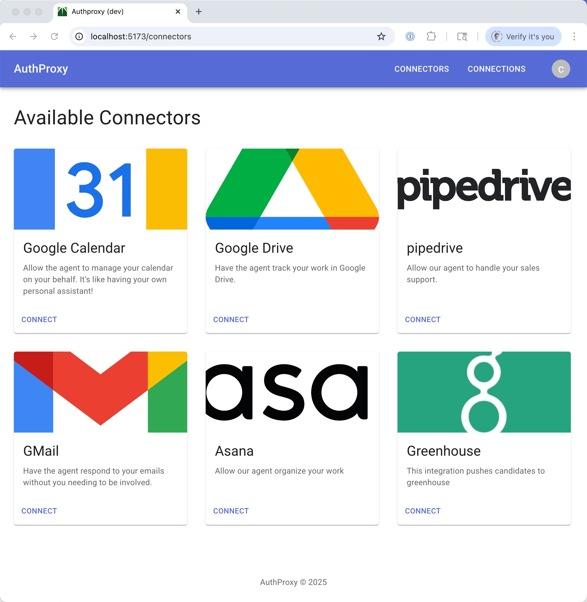

# AuthProxy

AuthProxy is an open-source, embeddable integration platform-as-a-service (iPaaS). It manages the full connection lifecycle to third-party systems, allowing your application to call external APIs through an authenticating proxy while keeping credentials centralized, auditable, and secure.

## How It Works

AuthProxy acts as an HTTP proxy between your application and external APIs. When your application sends a request through AuthProxy, it looks up the connection's stored credentials, injects the appropriate authentication (OAuth2 bearer token, API key, etc.), forwards the request, and logs the interaction for auditability. Token refresh happens automatically and transparently.

## Core Concepts

- **Connectors** define how to authenticate with a specific external service (OAuth2, API key, or no auth). Connector definitions are immutable once published and support versioned rollout.
- **Connections** are runtime instances of authenticated sessions, storing encrypted credentials owned by actors and scoped to namespaces.
- **Namespaces** provide hierarchical, dot-separated grouping (e.g., `root.team-alpha.project-1`) for multi-tenant access control.
- **Actors** represent users or service accounts with namespace-scoped permissions. JWTs can carry a subset of an actor's permissions for least-privilege access.
- **Labels** are Kubernetes-style key-value metadata on all resources, enabling lightweight integration with your host application's data model.
- **Application-level encryption** ensures all sensitive data (OAuth tokens, API keys, connector definitions) is encrypted before reaching any data store, with support for per-namespace keys, external key providers, and automatic key rotation with re-encryption.
- **Request logging** captures comprehensive metadata and optionally full request/response bodies for auditability and debugging.

## Resources

* [GitHub Repository](https://github.com/rmorlok/authproxy)
* [Marketplace UI Storybook](./storybook/marketplace/)
* [Admin UI Storybook](./storybook/admin/)

## Architecture Diagrams

* [OAuth2 Connection Flow](./oauth_flow.mmd)
* [Marketplace Portal Session Flow](./marketplace_portal.mmd)
