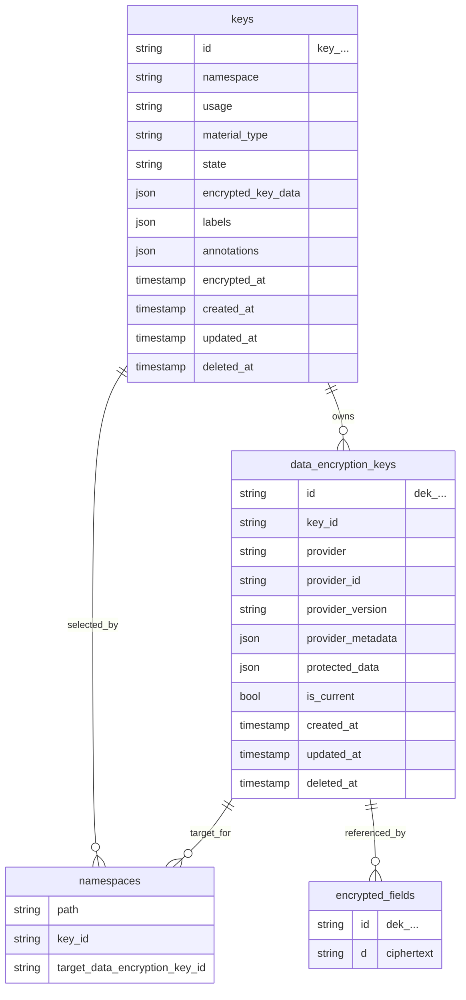
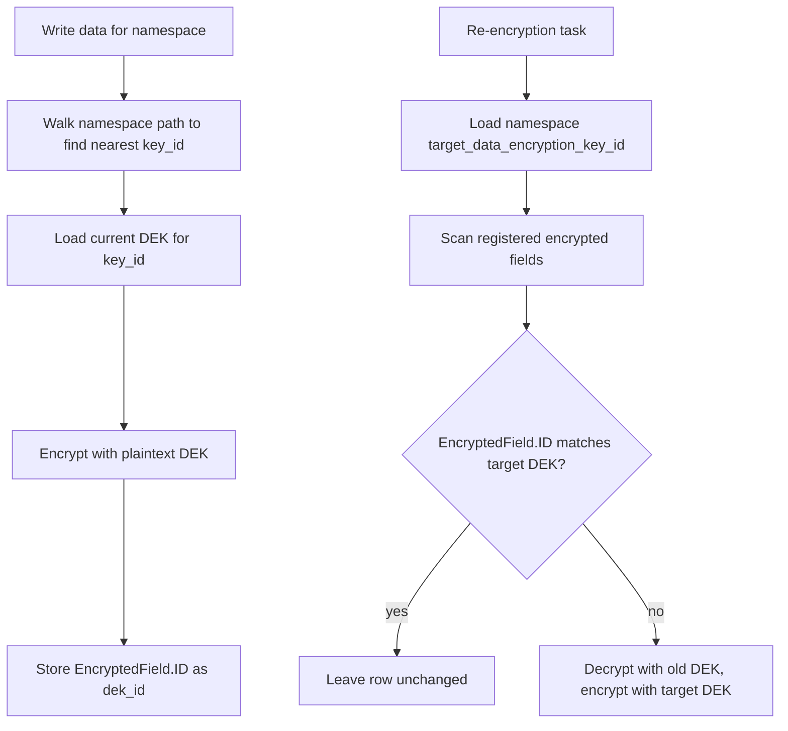

# Unified Key Model Migration

This document is the design and operations contract for the key model migration
tracked by [#605](https://github.com/rmorlok/authproxy/issues/605). The feature
branch for the full migration is `codex/key-model-migration`.

## Branching

- The long-lived branch is `codex/key-model-migration`.
- The long-lived PR targets `main` and stays in draft until the migration is complete.
- Child PRs branch from `codex/key-model-migration` and target `codex/key-model-migration`.
- After all child PRs land and the full migration is validated, the long-lived PR merges to `main`.

## Migration Stance

This migration is not backwards compatible. No production environment is running
the current encryption model, so implementation PRs may use forward migrations to
rename, drop, or recreate tables. Demo and development environments can be
destroyed and recreated when this branch merges.

For demo and development environments, the expected rollout is:

1. Destroy the existing database and Redis state.
2. Recreate the environment from the merged branch.
3. Let startup migrations create `keys`, `data_encryption_keys`, and namespace
   target DEK columns from scratch.
4. Let startup key sync generate the first current DEK for each active
   data-encryption key before serving encrypted-data paths.

Do not attempt to preserve old `encryption_keys` or `encryption_key_versions`
rows in those environments.

## Why The Model Changes

The legacy model evolved from one global AES key into three database layers:

- `encryption_keys`
- `encryption_key_versions`
- `data_encryption_keys`

That shape makes cloud KMS support look like a special case of key versions. The
target model is a simpler envelope-encryption model:

- `keys` tracks the logical keys AuthProxy knows about.
- `data_encryption_keys` tracks the DEKs that encrypt stored application data.
- Provider versions remain provider metadata on DEKs, not database rows.

## Terminology

| Term | Meaning |
| --- | --- |
| Key | A logical key record in `keys`, using a `key_` id. |
| DEK | A data encryption key in `data_encryption_keys`, using a `dek_` id. |
| Wrapping key | Provider-managed material used to protect a DEK. It may live in KMS, a secret manager, an environment variable, a file, or config. |
| Provider version | Version metadata from the wrapping provider. It is stored on the DEK so AuthProxy can detect stale wrapping. |
| Target DEK | The current DEK a namespace should use for new writes and re-encryption. |

## Target Data Model



### `keys`

`keys` replaces `encryption_keys` as the general key registry. It is not limited
to data encryption; future key usages can include public keys used to validate
JWT signatures.

Initial required fields:

- `id`: uses the `key_` prefix. The global key becomes `key_global`.
- `namespace`: namespace ownership and inheritance boundary.
- `usage`: why the key exists. The initial usage is data encryption.
- `material_type`: the kind of backing material, such as symmetric, public,
  private, or external provider-managed material.
- `state`: lifecycle state, initially active or disabled.
- `encrypted_key_data`: encrypted provider configuration for data-encryption
  wrapping keys. Future non-secret public-key records do not need to use this
  field if their material is intentionally public.

The migration should rename API, core, SDK, Terraform, and route language from
`encryption_key` to `key`.

### `data_encryption_keys`

`data_encryption_keys` becomes the runtime encryption material table. A DEK is
the key used by AES-GCM to encrypt application data in the database.

Each DEK belongs to exactly one `keys.id` through `key_id`. The DEK row stores
the protected key material and enough provider metadata to determine whether it
is still wrapped with the latest provider material.

Required behavior:

- `id` uses the `dek_` prefix.
- `key_id` references `keys.id`.
- `protected_data` stores wrapped or encrypted DEK material, never plaintext.
- `provider`, `provider_id`, `provider_version`, and `provider_metadata` record
  the wrapping provider state used to protect the DEK.
- `is_current` selects the DEK used for new writes under that key.

Plaintext DEKs may be cached in memory by the encrypt service, but plaintext DEK
material must not be stored in the database.

### Removed Table

`encryption_key_versions` goes away. Provider versions are not AuthProxy key
versions. They are wrapping metadata on each DEK.

## Encrypted Field Format

`encfield.EncryptedField` keeps the same JSON shape:

```json
{"id":"dek_abc123","d":"base64-encoded-ciphertext"}
```

The meaning of `id` changes:

- Removed model: `id` was an `encryption_key_versions.id` value, usually `ekv_...`.
- Target model: `id` is a `data_encryption_keys.id` value, always `dek_...`.

This keeps encrypted fields self-describing while making the database DEK row the
unit of encryption, cache lookup, and re-encryption.

## Namespace Resolution

Namespaces continue to choose a logical key by inheritance, but the column names
change:

- `encryption_key_id` becomes `key_id`.
- `target_encryption_key_version_id` becomes `target_data_encryption_key_id`.

Resolution flow:



Changing a namespace target DEK drives the same re-encryption behavior that key
versions drive today: rows in that namespace are checked and moved to the target
DEK when needed.

## Provider Model

The provider abstraction should separate logical key metadata from DEK
generation and wrapping:

- Secret-backed providers can expose wrapping material to AuthProxy. AuthProxy
  generates a strong random DEK, wraps or encrypts it with that provider-backed
  material, and stores the protected DEK.
- KMS-style providers keep wrapping material outside AuthProxy. AuthProxy asks
  the provider to generate a DEK when the provider has a native data-key API.
- When a provider cannot generate data keys, AuthProxy generates a strong random
  DEK and asks the provider to wrap or encrypt it.
- All providers must be able to unwrap or decrypt an existing DEK so AuthProxy
  can decrypt data and rewrap stale DEKs.

The provider interface introduced by implementation PRs should support these
operations:

- Describe the latest wrapping metadata for a key.
- Generate a DEK using provider-native data-key generation when available.
- Wrap an AuthProxy-generated DEK when native generation is unavailable.
- Unwrap an existing protected DEK.
- Report enough metadata to decide whether an existing DEK is wrapped by the
  latest provider material.

## DEK Lifecycle

### Generation And Rotation

A dedicated DEK generation process owns creating new DEKs. It walks active data
encryption keys and applies the configured DEK rotation policy.

Required behavior:

- Ensure each active data-encryption key has a current DEK.
- Rotate DEKs according to configuration.
- Prefer provider-native DEK generation when supported.
- Fall back to AuthProxy-generated strong randomness when native generation is
  unavailable.
- Mark the generated DEK current and leave older DEKs available for decryption.

### Rewrap Sync

The old "sync key versions to the database" task changes purpose. It no longer
manifests provider versions as rows. Instead, it inspects DEKs and checks whether
each current and retained DEK is wrapped using the latest provider material.

Required behavior:

- Load DEKs for each key.
- Compare stored provider metadata against the provider's latest wrapping
  metadata.
- If a DEK is stale, unwrap it, rewrap it with latest provider material, and save
  the updated protected data and metadata.
- Keep the DEK id stable during rewrap so encrypted fields do not need to change.

### Cache Sync

The encrypt service cache continues to exist, keyed by DEK id.

Cache entries should map:

```text
dek_id -> plaintext DEK bytes and metadata needed for encryption/decryption
```

## Operating The Model

There are two independent rotation workflows. Keeping them separate is the point
of the unified model:

- **Wrapping-key rotation** changes the provider-managed key encryption key
  (KEK) or secret value that protects DEKs. The DEK ids stay the same.
- **DEK rotation** creates a new `dek_...` row and makes it current for future
  writes. Existing encrypted fields are moved to that DEK by re-encryption.

### Rotating Wrapping Keys

Use this workflow when rotating AWS KMS keys, Google Cloud KMS CryptoKeys,
HashiCorp Vault Transit keys, secret-manager versions, environment-backed
secrets, or file-backed wrapping material.

1. Rotate or update the wrapping material in the provider.
2. Keep old provider material available for decrypt or unwrap until AuthProxy has
   rewrapped every retained DEK.
3. Run or wait for `encrypt:sync_keys_to_database`.
4. Confirm `data_encryption_keys.provider_version` and
   `data_encryption_keys.provider_metadata` reflect the latest provider material.
5. After all DEKs for the logical key are rewrapped, retire the old provider
   material according to the provider's own recovery/deletion policy.

Wrapping-key rotation should not change `data_encryption_keys.id` and should not
trigger application-data re-encryption by itself. The sync task unwraps each
stale DEK, wraps the same plaintext DEK with current provider material, and saves
updated wrapping metadata on the same row.

Provider notes:

- AWS KMS uses `GenerateDataKey` for new DEKs and KMS `Encrypt` / `Decrypt` for
  explicit wrap and unwrap. AWS KMS keys have delayed deletion windows; use a
  new key or alias when testing key advancement.
- Google Cloud KMS uses `GenerateRandomBytes` for provider-generated DEK bytes,
  then wraps with `Encrypt`. The stored metadata includes the CryptoKeyVersion
  used for wrapping.
- Vault Transit uses `datakey/plaintext` for new DEKs and Transit
  `encrypt` / `decrypt` for explicit wrap and unwrap. Rotate the Transit key
  with `transit/keys/<name>/rotate`.
- Secret-backed providers expose wrapping bytes to AuthProxy. Keep the old
  secret version readable until sync has rewrapped retained DEKs.

### Rotating DEKs

Use this workflow when the actual data-encryption key should change, such as a
routine cryptoperiod rotation or a tenant isolation change.

Configure policy under `system_auth.data_encryption_keys`:

```yaml
system_auth:
  data_encryption_keys:
    ensure_current: true
    rotation_interval: 2160h # 90 days
```

Operational steps:

1. Set `ensure_current` to `true` so every active data-encryption key has a
   current DEK.
2. Set `rotation_interval` to the desired cryptoperiod. The default is 90 days;
   `0` disables age-based rotation.
3. Run or wait for `encrypt:generate_data_encryption_keys`.
4. Run or wait for `encrypt:sync_keys_to_database` so namespace
   `target_data_encryption_key_id` values advance by inheritance.
5. Run or wait for `encrypt:reencrypt_all` to move stored application fields to
   the namespace target DEK.
6. Retain old DEKs until scans show no encrypted fields reference their `dek_`
   ids. Removing retired DEKs before that point makes those fields
   undecryptable.

The normal worker schedule runs DEK generation and key sync every 15 minutes,
and full re-encryption every 30 minutes.

### Namespace Key Changes

Changing a namespace's `key_id` changes which logical key owns future
encryption. After sync resolves a new `target_data_encryption_key_id`, the
re-encryption task decrypts fields that still reference an older DEK and writes
them with the namespace target DEK. Child namespaces inherit the nearest
ancestor `key_id` unless they set their own.

### Operational Checks

For a healthy deployment:

- Every active data-encryption key has exactly one current DEK.
- Every namespace resolves to a non-deleted `target_data_encryption_key_id`.
- Encrypted fields store `{"id":"dek_...","d":"..."}` and no longer reference
  `ekv_...` ids.
- Provider-backed DEKs retain provider metadata sufficient for unwrap and stale
  wrapping detection.
- Old wrapping material and old DEKs remain available until rewrap and
  re-encryption are complete.

## API And Generated Artifacts

Public naming changes from encryption keys to keys:

- Route family: `/encryption-keys` becomes `/keys`.
- Request and response fields: `encryption_key_id` becomes `key_id`.
- Namespace fields: `target_encryption_key_version_id` becomes
  `target_data_encryption_key_id`.
- JS SDK, Terraform provider, OpenAPI, generated docs, and tests follow the new
  names.

## Integration Testing

Provider implementation PRs must add integration tests for the KMS providers in
the project:

- AWS KMS
- Google Cloud KMS
- HashiCorp Vault Transit

The provider tests should prove:

- DEK creation works using provider-native generation when available.
- Fallback generation plus provider wrapping works when native generation is not
  available.
- Existing DEKs can be unwrapped for decryption.
- A stale DEK can be rewrapped with updated provider metadata while keeping the
  same `dek_` id.
- Encrypted application data uses `dek_` ids and remains decryptable after
  provider rotation and DEK rewrap.

AWS KMS integration tests require an existing symmetric KMS key because KMS keys
cannot be deleted immediately after creation. Set `AUTH_PROXY_AWS_KMS_KEY_ID_V2`
to a second accessible key ID or alias to exercise metadata advancement and
rewrap under new provider material.

Google Cloud KMS integration tests require an existing symmetric encryption
CryptoKey. Google Cloud KMS does not expose an AWS-style `GenerateDataKey` API,
so AuthProxy uses `GenerateRandomBytes` for provider-generated DEK bytes and
then wraps the DEK with `Encrypt`; the DEK row stores the CryptoKeyVersion used
for wrapping.

HashiCorp Vault Transit integration tests run against a Vault server with a
Transit mount. The test creates a unique Transit key, generates a DEK with
`datakey/plaintext`, rotates the Transit key, verifies that sync rewraps the same
DEK id, and verifies decrypt through a fresh encrypt-service cache.

See [integration_tests/README.md](../integration_tests/README.md) for provider
credentials, IAM/policy requirements, and focused run commands.

## Superseded KMS Project

The older `project:kms` issue set is closed and superseded by this migration:

- [#100](https://github.com/rmorlok/authproxy/issues/100) - original KMS support
  request
- [#581](https://github.com/rmorlok/authproxy/issues/581) - generalized KMS key
  protection
- [#582](https://github.com/rmorlok/authproxy/issues/582) - AWS KMS support
- [#583](https://github.com/rmorlok/authproxy/issues/583) - Google Cloud KMS
  support
- [#584](https://github.com/rmorlok/authproxy/issues/584) - Vault Transit support
- [#585](https://github.com/rmorlok/authproxy/issues/585) - KMS operations docs
- [#598](https://github.com/rmorlok/authproxy/issues/598) - DEK generation and
  rotation policy

Use [#605](https://github.com/rmorlok/authproxy/issues/605) and its child issues
as the source of truth for the unified key model.

## Implementation Order

The child issues under #605 are intended to land in this rough order:

1. Establish the branch and this design contract.
2. Replace the database schema and core naming from encryption keys to keys.
3. Make DEKs the runtime encryption material.
4. Introduce provider generation, wrap, unwrap, and metadata abstractions.
5. Move encrypt service caching, namespace targeting, and re-encryption to DEKs.
6. Replace key-version sync with DEK rewrap sync.
7. Remove all remaining key-version code and generated artifacts.
8. Add KMS provider implementations and integration tests.
9. Update operational docs.
