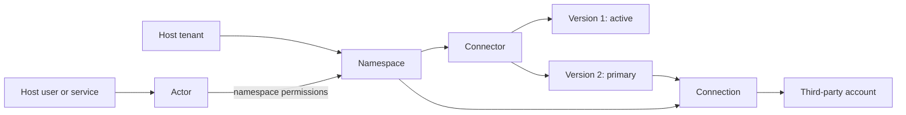
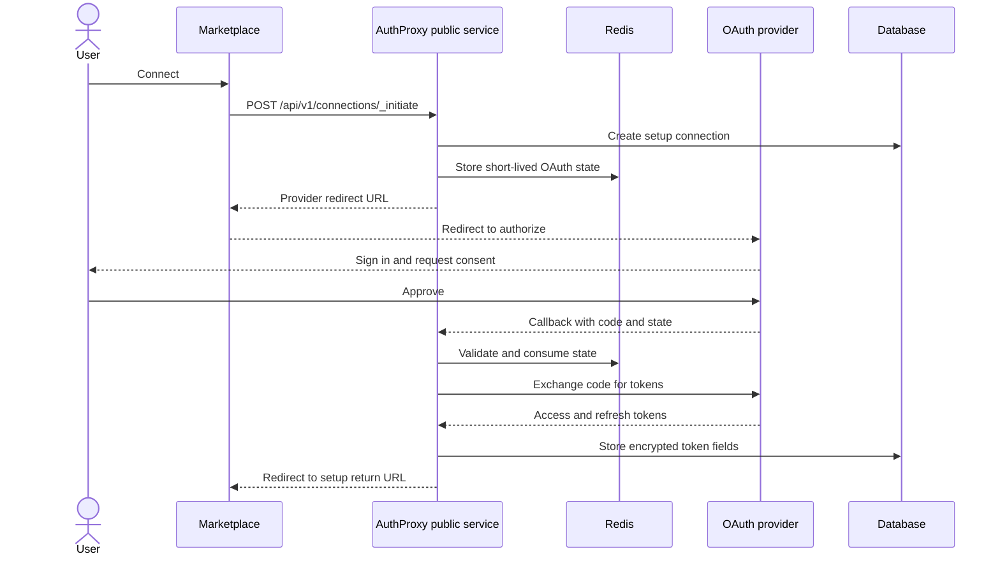

AuthProxy separates third-party integration definitions, credential instances,
and caller identity. That separation is what makes one connector reusable
across many tenants without sharing credentials or access.



## Connectors and versions

A **connector** is the reusable definition for a third-party system. It can
describe:

- OAuth2, API-key, or unauthenticated access
- OAuth scopes and provider endpoints
- forms and redirects used during setup
- probes that verify connection health
- request authentication placement and rate-limit behavior

The connector id remains stable across versions. Each version is a complete
snapshot of the definition and has one of four states:

| State | Meaning |
|---|---|
| `draft` | Editable work that is not offered for new connections. |
| `primary` | The published version selected for new connections. |
| `active` | A previously primary version still used by existing connections. |
| `archived` | A retired version that is no longer available for new connections. |

Publishing a new primary version moves the previous primary to `active`.
Existing connections remain bound to their recorded version until they are
migrated; publishing does not silently reinterpret stored credentials.

For connector-authored setup behavior, see [Connector setup
flow](/integration/connector-setup-flow/) and [Connector
predicates](/integration/connector-predicates/). Administrative retirement
behavior is covered by [Connector lifecycle
operations](/operations/connector-lifecycle/).

## Connections

A **connection** is one configured instance of a connector. It records:

- the connector id and version
- its namespace
- encrypted OAuth tokens, API keys, and setup configuration
- setup and lifecycle state
- an independent `healthy` or `unhealthy` signal
- labels and annotations

Lifecycle and health answer different questions. A connection can be
`configured` but `unhealthy`, for example after a provider revokes its refresh
token. The Marketplace can then guide the user through reauthentication without
changing the connection's identity.

Connection lifecycle states are `setup`, `configured`, `disabled`,
`disconnecting`, and `disconnected`.

When a caller uses `POST /api/v1/connections/{id}/_proxy`, AuthProxy checks
`connections:proxy` permission against the connection's namespace before it
loads credentials. The raw streaming route, `/_proxy_raw`, uses the same
permission.

## OAuth connection flow

For an OAuth connector, AuthProxy owns the authorization round trip and token
exchange. The host application and Marketplace never receive the provider
tokens.



The stored state binds the browser round trip to the actor, connector,
connection, and return destination. Connector setup may continue with
post-authorization forms or provider-backed resource selection before the
connection becomes `configured`.

## Namespaces

A **namespace** is a dot-separated path rooted at `root`:

```text
root
root.tenants
root.tenants.tnt_42
root.tenants.tnt_42.users.usr_7
```

Use namespaces for boundaries that must affect authorization or cryptographic
isolation, not merely for display grouping. A permission on
`root.tenants.tnt_42.**` can cover the tenant namespace and every descendant.

Connectors are namespace-scoped. A connection may be created in the connector's
namespace or one of its children. This makes a connector defined at
`root.tenants` reusable for connections isolated under individual tenant
namespaces. The actor needs read access to the connector's namespace and create
or update access to the target connection namespace; those permission matchers
may be different.

Namespace segments support letters, numbers, `_`, and `-`, but a segment cannot
begin with `-`. If a host id contains `/`, `@`, or other unsupported characters,
map it to a stable namespace-safe key rather than using a mutable display name.

## Actors and permissions

An **actor** represents a caller: an end user, application service, operator, or
automation. Its host-facing identity is the pair:

```text
(actor namespace, external_id)
```

`external_id` should be the host application's immutable user or service id,
not an email address. The same external id may exist in different actor
namespaces.

Actor permissions combine a namespace matcher, resources, verbs, and optional
resource ids. For example:

```json
{
  "namespace": "root.tenants.tnt_42.**",
  "resources": ["connections"],
  "verbs": ["create", "list", "get", "proxy"]
}
```

A JWT may carry narrower request-level permissions. Those restrictions are
intersected with the actor's stored permissions; a token cannot grant access
the actor does not already have.

Permission namespace matchers can also use actor data such as
`root.tenants.{{labels.tenant_key}}.**`. If a referenced value is missing or
does not render a valid namespace segment, the permission does not match.

## Modeling connection ownership

Connections do not have an actor-owner foreign key. Choose a namespace model
that expresses the ownership your product needs:

| Host behavior | Suggested connection namespace |
|---|---|
| Everyone in a tenant shares one installation | `root.tenants.tnt_42` |
| Each user has private credentials | `root.tenants.tnt_42.users.usr_7` |
| A team shares credentials inside a tenant | `root.tenants.tnt_42.teams.team_a` |

Permissions enforce the boundary. Labels such as
`app.example.com/installation-id=ins_123` make the connection easy to find, but
a label alone is not an authorization boundary.

## Labels and annotations

Labels connect this resource model to the host application's data model. They
can identify tenant ids, installation ids, environments, or product features,
and are included in request-event label snapshots. Namespace and connector
labels also carry forward to connections.

Annotations hold non-selectable metadata and do not propagate. See [Labels and
annotations](/concepts/labels-and-annotations/) for formats, propagation timing, and
selector examples.

## Next steps

- [Map host tenants and users](/integration/host-application/)
- [Embed the Marketplace](/integration/marketplace/)
- [Make requests through a connection](/sdks/proxying/)
