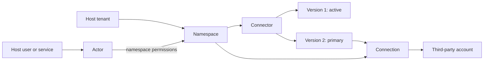
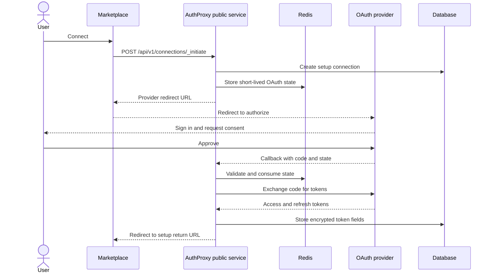

AuthProxy separates third-party integration definitions, credential instances,
and caller identity. This leads to the following core resources in the application:

* Namespaces
* Actors
* Connectors
* Connections


```mermaid
flowchart LR
    HostTenant["Host tenant"] --> NS["Namespace"]
    HostUser["Host user or service"] --> Actor["Actor"]
    Actor -->|"namespace permissions"| NS
    NS --> Connector["Connector"]
    Connector --> V1["Version 1: active"]
    Connector --> V2["Version 2: primary"]
    V2 --> Connection["Connection"]
    NS --> Connection
    Connection --> Provider["Third-party account"]
```
## Namespaces

Namespaces are the grouping entity for all resources. Every resource belongs to a
namespace and permissions are defined against namespaces.

A **namespace** is a dot-separated path rooted at `root`:

```text
root
root.tenants
root.tenants.tnt_42
root.tenants.tnt_42.users.usr_7
```

Use namespaces for boundaries that must affect authorization or cryptographic
isolation. Because AuthProxy does not have a direct conccept of resource
ownership, namespaces can be used to implement whatever ownership model the host
application wants. For example, `usr_7`'s connections could be created in
`root.tenants.tnt_42.users.usr_7` as suggested above, and then the actor would
be given permissions on those connections via ACL.

It is possible to grant permissions on child namespaces via globs. A permission 
on `root.tenants.tnt_42.**` can cover the tenant namespace and every descendant.

Connectors are namespace-scoped. A connection may be created in the connector's
namespace or one of its children. This makes a connector defined at
`root.tenants` reusable for connections isolated under individual tenant
namespaces. The actor needs read access to the connector's namespace and create
or update access to the target connection namespace; those permission matchers
may be different.

Namespace segments support letters, numbers, `_`, and `-`, but a segment cannot
begin with `-`. If a host id contains `/`, `@`, or other unsupported characters,
map it to a stable namespace-safe key rather than using a mutable display name.
The final segment is also returned as the namespace's `name`.

## Actors and permissions

An **actor** represents a caller to an AuthProxy API: an end user, application service, 
operator, or automation. Its host-facing identity is the pair:

```text
(actor namespace, externalId)
```

`externalId` is AuthProxy's way of dynamically connecting actors to the calling 
entity in the host system. It should be the host application's immutable user 
or service id. The same external id may exist in different actor
namespaces. Actors can either by synced via the API or dynamically created based
on the metadata defined in the JWT authenticating a request. This allows for
dynamic bootstrapping of actors as needed from the host system.

Actors have permissions that combine a namespace matcher, resources, verbs, 
and optional resource ids. For example:

```json
{
  "namespace": "root.tenants.tnt_42.**",
  "resources": ["connections"],
  "verbs": ["create", "list", "get", "proxy"]
}
```

In the above example, the actor has the `create`, `list`, `get`, `proxy` verbs for
connections in the `root.tenants.tnt_42` namespace or any child of that namespace.

In addition to having ACLs for a given actor, a given JWT can carry narrower 
request-level permissions. Those restrictions are intersected with the actor's 
stored permissions; a token cannot grant access the actor does not already 
have. This type of restriction can be used for cases where you want to further restrict an
actors permissions, for example as part of a JWT being leveraged on the actor's behalf.

Permission namespace matchers can also use actor data such as
`root.tenants.{{labels.tenant_key}}.**`. If a referenced value is missing or
does not render a valid namespace segment, the permission does not match. This allows
the host system to define standard templates for permissions rather than having to
fully customize the permissions for each request.

## Connectors and versions

A **connector** is the reusable definition for a third-party system. It can
describe:

- OAuth2, API-key, or unauthenticated access
- OAuth scopes and provider endpoints
- forms and redirects used during setup
- probes that verify connection health
- request authentication placement and rate-limit behavior

The connector ID, name, namespace, labels, annotations, and timestamps belong
to the logical connector and are shared by every version. Renaming a connector
therefore changes the name projected by all versions without rewriting their
encrypted definitions. Each version is a complete snapshot of the definition
and has its own version ID, number, and one of four states:

| State | Meaning |
|---|---|
| `draft` | Editable work that is not offered for new connections. |
| `primary` | The published version selected for new connections. |
| `active` | A previously primary version still used by existing connections. |
| `archived` | A retired version that is no longer available for new connections. |

Publishing a new primary version moves the previous primary to `active`.
Existing connections remain bound to their recorded version until they are
migrated; publishing does not silently reinterpret stored credentials.

For connector-authored setup behavior, see [Connector setup
flow](/integration/connector-setup-flow/) and [Connector
predicates](/integration/connector-predicates/). Administrative retirement
behavior is covered by [Connector lifecycle
operations](/operations/connector-lifecycle/).

## Connections

A **connection** is one configured instance of a connector. It records:

- the connector id and version
- its immutable ID and mutable name
- its namespace
- encrypted OAuth tokens, API keys, and setup configuration
- setup and lifecycle state
- an independent `healthy` or `unhealthy` signal
- labels and annotations

Lifecycle and health answer different questions. A connection can be
`configured` but `unhealthy`, for example after a provider revokes its refresh
token. The Marketplace can then guide the user through reauthentication without
changing the connection's identity.

Connection lifecycle states are `setup`, `configured`, `disabled`,
`disconnecting`, and `disconnected`.

When a caller uses `POST /api/v1/connections/{id}/_proxy`, AuthProxy checks
`connections:proxy` permission against the connection's namespace before it
loads credentials. The raw streaming route, `/_proxyRaw`, uses the same
permission.

## OAuth connection flow

For an OAuth connector, AuthProxy owns the authorization round trip and token
exchange. The host application and Marketplace never receive the provider
tokens.


```mermaid
sequenceDiagram
    actor User
    participant UI as Marketplace
    participant AP as AuthProxy public service
    participant State as Redis
    participant Provider as OAuth provider
    participant DB as Database

    User->>UI: Connect
    UI->>AP: POST /api/v1/connections/_initiate
    AP->>DB: Create setup connection
    AP->>State: Store short-lived OAuth state
    AP-->>UI: Provider redirect URL
    UI-->>Provider: Redirect to authorize
    Provider-->>User: Sign in and request consent
    User->>Provider: Approve
    Provider-->>AP: Callback with code and state
    AP->>State: Validate and consume state
    AP->>Provider: Exchange code for tokens
    Provider-->>AP: Access and refresh tokens
    AP->>DB: Store encrypted token fields
    AP-->>UI: Redirect to setup return URL
```

The stored state binds the browser round trip to the actor, connector,
connection, and return destination. Connector setup may continue with
post-authorization forms or provider-backed resource selection before the
connection becomes `configured`.

## Modeling connection ownership

Connections do not have an actor-owner foreign key. Choose a namespace model
that expresses the ownership your product needs:

| Host behavior | Suggested connection namespace |
|---|---|
| Everyone in a tenant shares one installation | `root.tenants.tnt_42` |
| Each user has private credentials | `root.tenants.tnt_42.users.usr_7` |
| A team shares credentials inside a tenant | `root.tenants.tnt_42.teams.team_a` |

Permissions enforce the boundary. Labels such as
`app.example.com/installation-id=ins_123` make the connection easy to find, but
a label alone is not an authorization boundary.

## IDs and names

Every durable resource has two identifiers with different purposes:

- The **ID** is generated by AuthProxy, never changes, and remains in resource
  URLs and foreign-key references. Store it when another system needs a durable
  reference.
- The **name** is the human-readable identifier shown in lists and search. A
  create request may supply it; otherwise it defaults to the generated ID.
  Rename a resource with its ID-addressed `PATCH` endpoint. Renaming never
  changes its URL or references.

Names are intended as a way to define an identifier for a specific resource
up-front, so that the resource can be referenced by declarative configurations
(e.g. YAML files that define the resources and are synced against the API).

For actors, connectors, connections, keys, and rate limits, a live name is
unique for that resource type within one namespace. The same name can exist in
another namespace or on another resource type. Names are case-sensitive, and
deleting a resource releases its name for reuse. A conflicting create or rename
returns HTTP `409` without changing either resource.

Non-namespace names are 1–63 characters. They start and end with a letter or
number and may contain letters, numbers, `.`, `_`, and `-` in between. This
accepts generated AuthProxy IDs; it is intentionally broader than a Kubernetes
DNS name.

Namespaces are the exception. Their ID is the full path, and their read-only
name is derived from the final segment: `acme` for `root.tenants.acme`.
Namespace/path rename is not supported.

## Labels and annotations

Labels connect AuthProxy's resource model to the host application's data model. They
can identify tenant ids, installation ids, environments, or product features,
and are included in request-event label snapshots. Namespace and connector
labels also carry forward to connections.

Annotations hold non-selectable metadata and do not propagate. See [Labels and
annotations](/concepts/labels-and-annotations/) for formats, propagation timing, and
selector examples.

## Next steps

- [Map host tenants and users](/integration/host-application/)
- [Embed the Marketplace](/integration/marketplace/)
- [Make requests through a connection](/sdks/proxying/)
