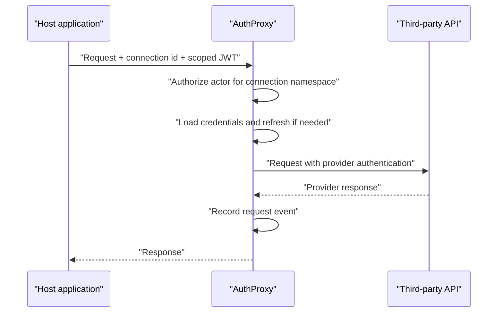

AuthProxy is a connection platform that sits between your application and
third-party APIs. Your application identifies a connection and the request it
wants to make; AuthProxy authorizes the caller, supplies the connection's
credentials, refreshes them when necessary, forwards the request, and records
the result.

The provider credential stays inside AuthProxy.

## One request through AuthProxy

AuthProxy is not a unified business API. The host application still knows the
provider's URLs and payloads; AuthProxy owns the connection and authentication
lifecycle around those calls.

## Model at a glance

| Concept | Meaning |
|---|---|
| **Connector** | A definition of how to connect to one third-party system, including authentication, setup steps, scopes, and health probes. |
| **Connector version** | An immutable published snapshot of a connector. New definitions are released as new versions so existing connections remain predictable. |
| **Connection** | A namespace-scoped instance of a connector containing encrypted credentials and setup state. |
| **Namespace** | A hierarchical authorization and isolation boundary such as `root.tenants.acme`. |
| **Actor** | A user or service identity that authenticates to AuthProxy and receives namespace-scoped permissions. |
| **Labels** | Selectable metadata used to map AuthProxy resources to host entities and add dimensions to request events. |
| **Annotations** | Non-selectable metadata for descriptions or other values that should not drive queries. |

These objects are related, but they are not interchangeable. In particular, a
connection belongs to a namespace rather than directly to an actor. Actors gain
access to connections through permissions on that namespace. This supports both
tenant-shared connections and private per-user connections.

See [The core resource model](/concepts/core-model/) for the detailed relationships and
[Labels and annotations](/concepts/labels-and-annotations/) for metadata propagation and
selectors.

## Responsibilities

| Component | Owns |
|---|---|
| **Host application** | User authentication, tenant membership, business rules, provider-specific request payloads, and the product experience. |
| **AuthProxy** | Connector definitions, connection setup, credential encryption and refresh, authorization, proxying, lifecycle state, and request events. |
| **Third-party provider** | Provider accounts, consent, tokens, API behavior, and upstream rate limits. |

This separation lets the host add integrations without distributing provider
credentials across application services or rebuilding OAuth and API-key
lifecycle handling for every provider.

## Next steps

- [Understand connectors, connections, namespaces, and actors](/concepts/core-model/)
- [Plan the host application integration](/integration/)
- [Understand request-event data](/operations/app-metrics/)
