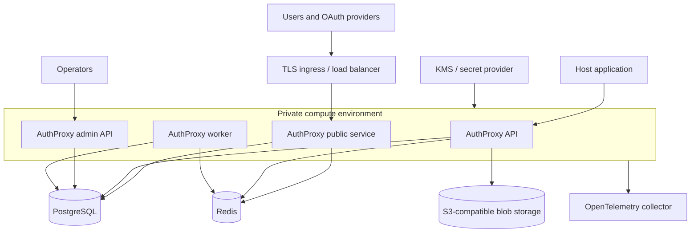

The customer-facing deployment package is the AuthProxy Helm chart. The
repository also contains Kustomize overlays for the hosted demo and disposable
pull-request environments; they are useful examples, but they are not a general
production distribution.

## Recommended production topology

For a durable installation:

- use PostgreSQL rather than SQLite;
- use an external Redis service for sessions, tasks, OAuth round trips, and
  rate-limit state;
- use persistent S3-compatible storage if full request or response bodies are
  recorded;
- terminate TLS at a trusted ingress or load balancer;
- inject JWT, actor, database, Redis, and encryption material through Secrets;
- keep the API and Admin service private unless a documented use case requires
  public access; and
- export telemetry to an operator-managed collector.

AuthProxy services can run in one process or separately. The chart defaults to
one Deployment running the enabled services. Install separate releases with
different `services.*.enabled` values when independent scaling or network
boundaries are required.

## Choose a deployment path

| Path | Use it for | Guide |
|---|---|---|
| Helm OCI chart | Customer, staging, and production Kubernetes installs | [Install with Helm](/deployment/helm/) |
| Kustomize overlays | The project's hosted demo and disposable PR demos | [Demo Kustomize layouts](/deployment/kustomize/) |
| Container image | Docker, custom schedulers, or a custom Kubernetes package | [Container images](/deployment/container-images/) |
| Project EKS/Terraform stack | Reproducing the maintainers' AWS demo infrastructure | [EKS runbook](/deployment/eks-runbook/) |

## Production decisions

Before deployment, decide:

1. which service endpoints are internet-facing;
2. how host identities become actors and namespace permissions;
3. where credentials, JWT keys, and encryption wrapping material live;
4. whether request/response bodies are recorded and how long they are retained;
5. how schema migrations and application rollouts are coordinated;
6. how backups cover PostgreSQL and any blob store;
7. which labels are safe to project into telemetry; and
8. how key, database, and signing-key rotations are tested.

Continue with the [security review checklist](/security/) and
[operations overview](/operations/) before calling an environment
production-ready.
