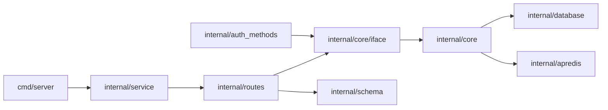

AuthProxy is a Go backend with React UIs, a TypeScript client SDK, deployment
packages, and a separate integration-test module.

## Request path

`internal/core` owns hydrated business behavior on top of the database and
Redis. Other packages should depend on `internal/core/iface`, not directly on
the concrete core package. This keeps authentication methods, routes, and tests
from creating package cycles.

## Services

All services use the `cmd/server` entry point and can run together or
independently:

| Service | Default port | Responsibility |
|---|---:|---|
| `public` | 8080 | OAuth callbacks, Marketplace assets, browser sessions |
| `api` | 8081 | Application-facing resource and proxy APIs |
| `admin-api` | 8082 | Administrative API and Admin UI assets |
| `worker` | 8083 health | Asynchronous and periodic work |

Service assembly lives in `internal/service/`. HTTP route handlers live in
`internal/routes/` and should delegate business decisions to core interfaces.

## Major packages

| Path | Purpose |
|---|---|
| `internal/apauth/` | Request authentication, actor/session validation, JWTs, and auth tasks |
| `internal/auth_methods/` | Connector credential methods such as OAuth2, API key, and no auth |
| `internal/schema/` | Public resource, configuration, auth, and shared contract types |
| `internal/database/` | SQLite/Postgres persistence and migrations |
| `internal/app_metrics/` | Request events, resource snapshots, metrics queries, and blob recording |
| `internal/apasynq/` | Testable Asynq client/server boundary |
| `internal/workflows/` | Durable go-workflows runtime and registrations |
| `internal/encrypt/` and `internal/encfield/` | Key resolution, AES-GCM fields, and re-encryption |
| `internal/httpf/` | Mockable, instrumented outbound HTTP clients |
| `internal/aptelemetry/` | Shared OpenTelemetry bootstrap and label projection |
| `internal/request_log/` | Structured HTTP logging and redaction |

Read the local `AGENTS.md` before changing database or schema ownership. The
schema tree enforces these boundaries:

- REST resources belong in `internal/schema/resources/...`.
- Configuration syntax belongs in `internal/schema/config`.
- JWT and permission types belong in `internal/schema/auth`.
- Shared primitives belong in `internal/schema/common`.
- Resource packages must not import `internal/schema/api`; API envelopes
  compose resources from the outside.

## Frontend and clients

| Path | Purpose |
|---|---|
| `ui/marketplace/` | Embeddable end-user connector and connection UI |
| `ui/admin/` | Operator UI |
| `sdks/js/` | `@authproxy/api` TypeScript client used by both UIs |
| `cmd/cli/` | `ap` CLI for JWTs, signed requests, UI login, and proxying |
| `plugins/grafana/` | AuthProxy app-metrics Grafana data source |

## Deployment and tests

| Path | Purpose |
|---|---|
| `deploy/charts/` | Customer-facing AuthProxy and cluster-bootstrap Helm charts |
| `deploy/kustomize/` | Hosted demo and disposable PR-environment overlays |
| `deploy/terraform/` | Project AWS/EKS infrastructure |
| `integration_tests/` | Provider-backed tests in a separate Go module |
| `dev_config/` | Local server, storage, key, and observability configuration |

## Testability conventions

- Use `apctx.GetClock(ctx)` instead of `time.Now()` in code under test.
- Open SQL connections through the instrumented database helpers.
- Use `internal/httpf` rather than constructing unmockable HTTP clients.
- Use in-memory OpenTelemetry exporters; unit tests must not dial a collector.
- Keep SQLite and PostgreSQL schema behavior aligned.
- Register durable workflows and activities under versioned names before
  removing earlier definitions.

Run focused tests while iterating, then `./scripts/preflight.sh` before commit.
