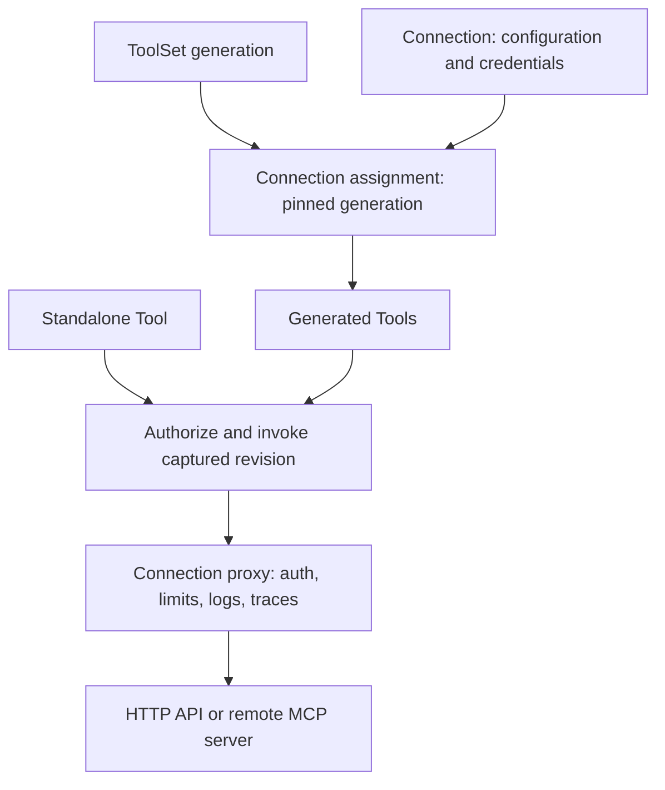

AuthProxy will expose named, schema-described operations through existing
connections. An agent can discover and invoke permitted operations without
receiving upstream credentials or permission to make arbitrary proxy requests.
Tool definitions can construct an HTTP request declaratively, execute JavaScript
that makes several requests, or call a tool on a remote MCP server.

This design records the product decisions agreed through three clarification
rounds on October 3–4, 2026. Repository references were checked against `main`
at `d9daebe4`. Standards and industry research was checked on October 3–4, 2026.
The behavior below is the proposed implementation contract; exact field and
command names remain subject to implementation review. Examples use fake IDs.

## Scope and decisions

| Area | Decision |
| --- | --- |
| Tool authoring | Trusted administrators define tools, execution code, and permission mappings. Agents consume them. |
| Execution | One Tool belongs to one connection. JavaScript may make multiple requests through that connection. |
| Authorization | Any one declared tool verb can authorize invocation on the connection. The `proxy` verb is neither required nor implicitly granted. |
| ToolSets | Multiple ToolSets can attach to a connection, each pinned independently to a published generation. |
| Rollout | Publishing leaves existing assignments pinned. Individual migration actions move one connection's ToolSet assignment. Bulk orchestration remains a host responsibility. |
| Selection | A namespace scope plus connection label selector determines membership. The default scope is the ToolSet namespace and all descendants. |
| Removal | Event-triggered reconciliation and a periodic repair loop eventually remove assignments that no longer match. |
| OpenAPI | Each generation imports an immutable document snapshot. Refresh prepares a new draft snapshot for publication and migration. |
| MCP | A live catalog is discovered separately through each connection. Catalog refresh does not create ToolSet generations. |
| Results | Preserve structured JSON and rich content, including text, images, audio, and resource references. |
| Execution lifetime | Bounded request/response calls with cancellation. Interactive continuations and durable asynchronous tool execution are deferred. |
| Templates | Preserve typed JSON values and apply explicit encoding. Connection configuration is available to both Mustache and JavaScript. |
| Destinations | Preserve the existing proxy's supported URL/host/header behavior. This feature does not introduce a mandatory destination allowlist. |
| Agent identity | The host supplies a scoped JWT. The sandbox does not need a signing key. |
| Framework | Provide a Python LangChain/LangGraph adapter. TypeScript framework integration is deferred. |
| Standalone updates | Standalone Tool updates take effect atomically and immediately for subsequent invocations. |

AuthProxy acts as an MCP **client** when importing remote tools. Serving MCP to
agents is explicitly outside this iteration. Also excluded are cross-connection
scripts, tool-to-tool workflow orchestration, user-authored untrusted code,
automatic canary promotion, and admin/marketplace UI changes. Resource APIs,
`ap`, `ap-agent`, and the Python adapter provide the initial interfaces.

## Research and terminology

The closest CLI precedent is [Merge Agent Handler's CLI](https://docs.merge.dev/merge-agent-handler/build/cli/merge-cli):
search, retrieve selected schemas, and execute, with compact output choices.
[Nango agent sessions](https://nango.dev/docs/guides/agent-sessions) distinguish
connection selection, tool permissions, and discovery; their separately enabled
proxy can reach operations beyond the selected tools. These support bounded
discovery and the separate tool/proxy permission boundary in this design.

[Composio toolkits](https://docs.composio.dev/docs/toolkits) group callable tools
and use connected accounts for execution.
[AWS AgentCore Gateway](https://docs.aws.amazon.com/bedrock-agentcore/latest/devguide/gateway-core-concepts.html)
provides a precedent for adapting OpenAPI APIs and remote MCP tools behind one
interface. AuthProxy's distinguishing implementation choice is to materialize
connection-bound resources through its namespace, ACL, and generation model.
Neither comparison implies that these products share AuthProxy's resource or
rollout semantics.

Use **Tool** for an operation and **ToolSet** for a collection that supplies
operations to matching connections. The initially proposed `ToolChain` name
suggests sequencing; this design does not define a workflow chain. `ToolSet` is
a project naming choice, not an MCP or OpenAPI resource standard.
Use `inputSchema` and `outputSchema` for the JSON Schemas, following MCP.

MCP and OpenAPI do not fundamentally block this model, but neither is just a
catalog of JSON-to-JSON functions. Their compatibility boundaries are specified
below rather than hidden behind a claim of universal import support.

## Resource and execution model



The assignment, called a **binding** internally, records which generation is
installed for a `(toolSetId, connectionId)` pair. It is not a new authorable
resource in this iteration. Expose its status and migration actions through the
connection API. This avoids requiring users to manage the controller's records
while still making pinned generations, failures, and catalog freshness visible.

Connections are namespace-scoped in the current resource model; they are not
intrinsically owned by one Actor. Actors and scoped JWTs determine access.
Generated and standalone Tools live in their connection's namespace. A
standalone Tool cannot refer to a connection in a different namespace.

### Tool identity and ownership

Add `kind: Tool`, collection `tools`, and ID prefix `tol_`. Its spec combines a
connection reference with a reusable definition:

- `description`, `inputSchema`, optional `outputSchema`, and `verbs`;
- typed behavioral `hints`, such as `readOnly`, `destructive`, and `idempotent`;
- exactly one authored executor: `proxyHttp` or `javascript`;
- optional execution limits and metadata for discovery.

Generated Tools may additionally use internal, validated `openapiOperation` or
`mcpCall` executors. These are compiler/controller outputs, rejected on
standalone create/update. Do not convert MCP calls into author-editable JSON-RPC
body templates or reduce OpenAPI serialization to Mustache strings.

Tool status includes a monotonically increasing `revision`, readiness
conditions, and, for generated Tools, `managedBy` with the ToolSet reference,
applied generation, and stable source key. Tool revisions are not published
generations; omit `metadata.generation` on Tools. The public usage descriptor
is separate from the full management resource and never includes executable
source or resolved connection configuration.

A generated Tool's logical identity is keyed by ToolSet ID, connection ID, and
source key. Explicit templates require a stable `key`. OpenAPI uses
`operationId` when supplied, otherwise a canonical method/path key; MCP uses
the exact upstream tool name. Changing a display name does not change identity.
Changing a source key is removal plus addition, with a new generated identity
and, for imported tools, a new canonical verb. Renaming an upstream operation
requires an explicit stable-key override to preserve its identity.

Generated resource names combine a bounded ToolSet/template stem and a stable
identity suffix to remain unique within the connection namespace. Detect name
normalization collisions. Usage descriptors keep a concise display name and
connection name alongside the immutable Tool ID. Do not make agents infer the
account from an ambiguous tool name such as `search`.

Standalone Tools support ordinary metadata/spec CRUD. Updates validate and
compile a complete replacement, then atomically publish a new revision under
the same Tool ID. Generated definitions and their management metadata are
controller-owned; reject direct mutation or individual deletion with a conflict
that identifies the owning ToolSet. Customize them in the parent definition,
or create an independently named standalone Tool.

### ToolSet shape and selection policy

Add `kind: ToolSet`, collection `toolsets`, and ID prefix `tls_`. Follow
Connector conventions for `spec.release`, `spec.definition`, generation
endpoints, and draft/primary/active/archived states.

Keep `spec.connectionSelector` on the **logical ToolSet**, shared across its
generations. It contains `namespace` and `matchLabels`. The default namespace
matcher is `<toolset namespace>.**`, using the existing namespace matcher
semantics, which include that namespace itself. An explicit matcher must stay
within the ToolSet's namespace subtree; broader installation requires placing
the ToolSet in a common ancestor. This supports `root.product` definitions and
`root.product.user-1` connections without sibling-namespace privilege expansion.

Require a selector object. An explicitly empty `matchLabels: {}` means all
eligible connections within the namespace scope; omission of the entire
selector is invalid. Initial object selectors support ANDed exact matches.
Compile them to the existing label matcher. Existing inherited labels may be
selected; document their eventual propagation. Kubernetes set operators and
`matchExpressions` are not silently accepted.

Selection changes affect membership across installed generations through
reconciliation. They do not migrate still-matching bindings. The generation's
definition contains the source, tool templates, import filters, defaults, and
permission mappings. Updating these requires a draft and publication. This
separation prevents publication from accidentally acting as a bulk migration.

Update selection only through the logical ToolSet endpoint. Generation mutation
endpoints reject selector changes, and generation responses project the current
shared logical selector. Register selector-only patches as non-generation
changes in the resource registry/apply policy; applying an old explicit
generation must not restore a historical selector implicitly.

## Authoring examples

The examples show the proposed syntax. Stored references use AuthProxy's
existing typed `ObjectReference`; CLI name resolution may fill these fields.

### Standalone HTTP Tool

```yaml
apiVersion: authproxy.net/v1alpha1
kind: Tool
metadata:
  name: create-event
  namespace: root.product.user-1
  labels:
    provider: example-calendar
spec:
  connectionRef:
    apiVersion: authproxy.net/v1alpha1
    kind: Connection
    id: cxn_01example0000001
  description: Create an event in the selected calendar.
  verbs: ["tool:calendar.create"]
  inputSchema:
    type: object
    properties:
      calendarId: {type: string, minLength: 1}
      title: {type: string}
      includeDeclined: {type: boolean}
    required: [calendarId, title, includeDeclined]
    additionalProperties: false
  outputSchema:
    type: object
    properties:
      id: {type: string}
    required: [id]
  proxyHttp:
    method: POST
    url: "https://{{cfg.apiHost}}/v1/calendars/{{path.params.calendarId}}/events"
    headers:
      Content-Type: application/json
      X-Tenant: "{{cfg.tenant}}"
    bodyJson:
      title: {$value: params.title}
      include_declined: {$value: params.includeDeclined}
    response:
      transformJavascript: "({ id: response.body.id })"
      errors:
        - statuses: [404]
          code: CALENDAR_NOT_FOUND
          message: The calendar was not found.
        - statuses: [429]
          code: RATE_LIMITED
          message: The provider rate limit was reached.
          retryable: true
```

`cfg.apiHost` and `cfg.tenant` come from the connection's configuration,
including values collected during preconnect/setup steps. `path` is an encoded
view of parameters; `$value` inserts a JSON value without converting it to a
string. These contexts are specified below.

### Standalone JavaScript Tool

```yaml
apiVersion: authproxy.net/v1alpha1
kind: Tool
metadata:
  name: resolve-team-members
  namespace: root.product.user-1
spec:
  connectionRef:
    apiVersion: authproxy.net/v1alpha1
    kind: Connection
    id: cxn_01example0000001
  description: Resolve a team and return its members.
  verbs: ["tool:team.members", "tool:readonly"]
  inputSchema:
    type: object
    properties:
      team: {type: string, minLength: 1}
    required: [team]
    additionalProperties: false
  javascript: |
    async function execute(params, context) {
      const base = `https://${context.cfg.apiHost}`;
      const lookup = await fetch(
        `${base}/v1/teams?name=${encodeURIComponent(params.team)}`
      );
      if (!lookup.ok) {
        throw new ToolError("TEAM_LOOKUP_FAILED", "Could not resolve team", {
          upstreamStatus: lookup.status
        });
      }
      const team = await lookup.json();
      const members = await fetch(
        `${base}/v1/teams/${encodeURIComponent(team.id)}/members`
      );
      if (!members.ok) {
        throw new ToolError("MEMBERS_LOOKUP_FAILED", "Could not read members", {
          upstreamStatus: members.status
        });
      }
      return { team: team.name, members: await members.json() };
    }
```

Both requests use the same bound connection. `fetch` supplies the familiar
request/response interface while the host routes every request through
AuthProxy's authenticated proxy. Credentials are not JavaScript variables.

### Explicit ToolSet

```yaml
apiVersion: authproxy.net/v1alpha1
kind: ToolSet
metadata:
  name: calendar-tools
  namespace: root.product
spec:
  connectionSelector:
    namespace: root.product.**
    matchLabels:
      provider: example-calendar
  release:
    desiredState: draft
  definition:
    source:
      explicit:
        tools:
          - key: list-calendars
            metadata:
              name: list-calendars
              labels:
                capability: calendars
            spec:
              description: List calendars available to this account.
              verbs: ["tool:calendar.list", "tool:readonly"]
              inputSchema:
                type: object
                properties: {}
                additionalProperties: false
              hints:
                readOnly: true
              proxyHttp:
                method: GET
                url: "https://{{cfg.apiHost}}/v1/calendars"
```

Exactly one of `source.explicit`, `source.openapi`, or `source.mcp` is allowed.
Explicit template specs reuse `ToolDefinition` and omit `connectionRef`.
Template metadata permits name, labels, and annotations, not IDs, namespace,
generation, ownership, or timestamps. Publication compiles every template.

### Imported ToolSets

An OpenAPI source can be inline or fetched during import. It is frozen into an
artifact owned by the draft generation, with its digest and diagnostics:

```yaml
source:
  openapi:
    document:
      url: https://api.example.com/openapi.json
    operations:
      includeOperationIds: [listCalendars, createEvent]
    server:
      url: "https://{{cfg.apiHost}}"
permissionMappings:
  - match:
      sourceKeys: [listCalendars]
    addVerbs: ["tool:calendar.list", "tool:readonly"]
```

An MCP source specifies the endpoint template and refresh policy. The same
published source can yield different catalogs under different connections:

```yaml
source:
  mcp:
    endpoint: "https://{{cfg.apiHost}}/mcp"
    transport: streamableHttp
    refreshInterval: 5m
    tools:
      excludeNames: [admin_reset]
permissionMappings:
  - match:
      sourceKeys: [list_calendars]
    addVerbs: ["tool:calendar.list"]
```

Imported tools always receive a canonical verb derived from the immutable
ToolSet ID and source key, such as `tool:tls_01example0000001:list_calendars`.
Use a bounded readable key plus a digest suffix if normalization would collide.
Do not include connection ID, display name, generation, or catalog revision in
this verb. ACL resource-ID restrictions distinguish connections, while a grant
can remain stable across their catalog refreshes and migrations.

Permission mappings add aliases to the canonical verb. Explicit Tools instead
declare their verbs directly. Mapping matches are against stable source keys,
with optional explicitly configured key patterns; a broad mapping deliberately
covers future matching tools. Provider hints and HTTP methods never create
trusted aliases automatically.

## Publication, migration, and reconciliation

### Published generations

ToolSet identity, name, namespace, labels, annotations, and connection selection
are logical properties. Definitions follow the existing Connector generation
lifecycle: at most one draft, a primary for new assignments, older active
generations that remain usable, and archived generations that cannot receive
new assignments or migrations. Publishing validates the complete definition;
OpenAPI publication also requires a successfully compiled snapshot. An MCP
generation can publish without a sample connection because each connection
supplies its own authenticated catalog.

Publishing a new primary does not change any existing binding, including one
whose current generation is older than primary. New matching, configured
connections install primary. If no primary exists, reconciliation records that
installation is waiting rather than assigning a draft. Disconnected or deleted
connections cannot execute tools; unconfigured connections may be reported as
pending but do not trigger authenticated discovery until ready.

Refresh an OpenAPI source into the editable draft. If none exists, clone the
latest definition into a draft first. A failed refresh keeps the previous
successful snapshot and attaches import diagnostics; it never modifies a
published snapshot. A successful refresh whose digest is unchanged is a no-op
for source content. Publication and individual migration are still explicit.

### Individual migration

Provide one action targeting a connection, ToolSet, and target generation.
Require an existing live binding and a primary or active target generation of
that ToolSet. The action returns a durable workflow/task reference, following
connector migration conventions. This background management workflow does not
introduce asynchronous *tool invocation*.

Prepare the target inventory outside a database transaction: compile explicit
templates, resolve an OpenAPI snapshot, or discover MCP tools using the target
source configuration and the same connection. Validate the complete candidate
and trusted verb mapping. Atomically switch the binding generation and its
active inventory only after preparation succeeds. Failure leaves the old
inventory active and reports the failure on migration status.

Migration preserves Tool IDs for surviving source keys, adds new keys, and
removes absent keys. An earlier active generation is a valid rollback target.
Rollback restores AuthProxy definitions and mappings; it cannot undo upstream
side effects or restore an earlier remote MCP implementation/catalog. There
are no JavaScript migration hooks or upstream calls beyond necessary discovery
in this iteration.

The host chooses cohorts and calls this individual action repeatedly, as it
does for connectors. Do not add a bulk rollout controller, percentage stages,
automatic health promotion, or a coupled connector/ToolSet migration here.
A ToolSet and connector generation can be migrated independently. If a ToolSet
requires particular connector configuration, validate it before activation and
return an actionable incompatibility error. Current configuration and proxy
readiness are checked again at invocation.

### Membership and catalog jobs

Enqueue reconciliation after ToolSet selection changes, primary publication,
connection creation/configuration completion, label propagation, connection
deletion/disconnection, and ToolSet deletion. Add a periodic sweep to repair
missed events. Reuse Asynq, Redis leadership, and injectable clocks; do not
depend on in-memory event delivery for correctness.

The membership reconciler performs these operations:

1. Compute desired membership from the logical selector and current persisted
   connection labels within its namespace scope.
2. Create a missing eligible binding against primary and prepare its inventory.
3. Leave the generation of an existing matching binding unchanged.
4. Disable and soft-delete a nonmatching binding and its generated inventory.
5. Leave independently authored Tools and other ToolSets' bindings untouched.

Selector removal is eventually consistent, not an immediate ACL revocation
mechanism. Current ACL restrictions remain enforced at invocation. Deleting a
ToolSet or connection makes its tools immediately non-invokable through the
parent state check; asynchronous cleanup removes their materialized records.
Temporary connection authentication/health problems affect readiness and refresh
status without erasing definitions solely because a probe failed.

MCP refresh jobs operate per binding with a configurable interval, jitter,
backoff, and manual refresh action. Poll using that connection's credentials;
never share one credential's catalog across connections. Record last attempt,
last success, source digest, catalog revision, error, and freshness condition.
A complete successful enumeration atomically replaces the active catalog:
additions receive canonical verbs and configured aliases; changed definitions
receive new Tool revisions; removals become unavailable. A now-invalid tool is
disabled with diagnostics instead of retaining an obsolete active definition.

Failed or incomplete pagination retains the last complete catalog and marks it
stale. It must not imply deletion. A stale catalog does not assert that a tool
still exists upstream: invocation may return an upstream unknown-tool error,
which schedules refresh. Relevant connection-configuration or authentication
identity changes trigger rediscovery. Each catalog carries a context identity
covering its rendered endpoint, source configuration, connector generation,
relevant connection configuration, and authentication-identity epoch. An
explicit reauthentication or credential replacement advances that epoch;
ordinary token renewal for the same identity does not. Known granted-scope
changes also invalidate it.

Admission requires the catalog context to match the current connection context.
An endpoint/tenant/identity change makes the old catalog unavailable until
discovery succeeds for the new context; do not use an old tool schema or alias
mapping against a new provider surface. Retaining a stale executable catalog
after refresh failure is allowed only within the same context. An in-flight
refresh against the previous context cannot publish over the new one. No failure
causes fallback to another connection or reuse of its catalog.

### Atomicity and stale work

Every binding has an internal epoch/revision. Reconciliation and refresh jobs
capture binding ID, epoch, applied generation, selector-policy revision, and
relevant connection-context revision. Recheck them before committing. A stale
job must abandon its candidate and requeue if appropriate; it cannot undo a
migration, recreate a removed assignment, or activate a catalog fetched under
old configuration. Serialize competing refreshes through the same comparison.

Commit with an atomic compare-and-increment of the relevant revision, not a
read followed by an unconditional write. Activation, successful catalog
publication, migration, removal, and context invalidation advance it; a losing
job discards its candidate. At migration commit, also recheck that the target
still belongs to the ToolSet and remains primary/active, both parents are live,
and the binding is still the expected live assignment. Preparation cannot
authorize activation into a target that was archived while discovery ran.

Persist logical Tool identity tombstones within a binding. A source key that
reappears under that binding restores its prior Tool ID with a new revision.
If a binding itself was removed and later re-created, create a new binding and
new Tool IDs; its canonical imported verbs remain stable because they are
based on ToolSet ID and source key. Stable verbs are identities, not grants.

## Invocation and JavaScript contract

### Admission and execution snapshot

Resolve a Tool ID to one consistent snapshot: executor, schemas, aliases, error
mapping, Tool revision, parent generation/catalog, and copied connection
configuration. Check live parent/binding state and authorize that snapshot
against the connection. Never authorize old aliases and then reread newer code.
Validate input before making any outbound request.

An optional `expectedRevision` detects a descriptor that changed since discovery.
Mismatch produces `TOOL_REVISION_CHANGED` before execution, with instructions
to refresh the descriptor. Omission executes the current revision. An atomic
standalone update or catalog switch affects new admissions immediately;
already admitted executions finish their captured definition and configuration.
Credentials may still refresh through the existing proxy lifecycle.

All HTTP calls use `iface.Connection` and the existing proxy/httpf orchestration
so auth injection, OAuth refresh behavior, rate limits, request events,
redaction, and telemetry remain centralized. The tool invocation path performs
the tool ACL check and calls the internal proxy; it does not call the public
`_proxy` route and does not demand that route's `proxy` permission.

Keep ordinary transport cancellation tied to the inbound context. Bound total
execution time, request count, response bytes, input/output bytes, and JavaScript
stack depth. Proposed starting limits are 60 seconds total, 20 outbound requests,
1 MiB input JSON, and 8 MiB aggregate decoded response/result content, with
operator-configured ceilings and smaller per-tool overrides. Encoded envelopes
need a separate limit that accounts for base64 expansion. These are tuning
defaults, not protocol limits. Each pagination request counts against the tool's
budget; internal credential recovery remains governed by proxy policy.

Do not introduce general automatic retries of tool invocations. The existing
proxy's credential-recovery retry remains in place and must be documented for
multi-step tools. A failed second request does not roll back the first request.
`retryable` is advice, not proof that replay is safe; retain separate information
about whether execution may already have produced side effects.

### Input schemas and context

Use JSON Schema 2020-12 as the native dialect, with object-rooted inputs. Compile
and cache validators per definition revision. Support local `$defs`/`$ref`,
disable runtime network reference resolution, and bound validation complexity.
Do not silently coerce types, strip unknown fields, or apply schema `default`
values as runtime mutations. Defaults must be authored in request construction
or code. Validate successful structured output when `outputSchema` exists;
error results are not validated against the success schema.

Each invocation receives immutable JSON-compatible copies of:

| Context | Meaning |
| --- | --- |
| `params` | Validated caller input. |
| `cfg` | Current connection configuration, including preconnect/setup values such as tenant and API host. |
| `labels`, `annotations` | Connection metadata, following current context conventions. |
| `connection` | Safe identity fields needed for execution, including ID and namespace. |
| `tool` | ID, revision, and source generation/catalog identifiers. |

JavaScript receives these through `context`; `params` is its first argument.
Keep existing `cfg`, `labels`, and `annotations` globals available to reused
connector libraries. They refer to the same copied context. Neither credentials
nor signing keys are injected. Mutating a JavaScript object does not persist
connection configuration. Privileged authors can access configuration values;
discovery, errors, and default invocation logging must not disclose that map.

### Mustache and typed requests

Introduce a tool-specific renderer instead of changing existing OAuth/setup
Mustache behavior globally. Tool templates retain Mustache sections and dotted
lookups, disable HTML escaping, reject missing references, and reject partials
that could load server-local files. Triple braces have no additional privilege;
encoding is an explicit context operation rather than HTML escaping.

- `{{params.name}}` and `{{cfg.tenant}}` insert scalar text. Invalid header
  characters and malformed final URLs are rejected before sending.
- `{{path.params.id}}` and `{{path.cfg.tenant}}` use path-segment encoding.
  A value containing `/` remains one segment. A corresponding `query` encoded
  view is available for intentionally hand-written query strings.
- `{{json.params.value}}` produces a complete JSON literal, including quotes
  for strings. A raw `bodyTemplate` can therefore contain
  `{"include_declined": {{json.params.includeDeclined}}}` without losing types.
- `{$value: params.value}` in a structured JSON body inserts the referenced
  JSON value. Reserve this exact single-key form; `{$literal: ...}` escapes a
  literal object that would otherwise look like a directive.

Structured `query` values use scalar or repeated-value encoding through the
request encoder; do not pre-encode them. Structured body objects recursively
render string templates and typed directives. Permit exactly one body mode:
`bodyJson`, `bodyTemplate`, `bodyRaw`, `form`, or `multipart`. `bodyTemplate`
declares its media type; parse it as JSON when JSON is declared. `bodyRaw` uses
bounded base64 in the JSON/YAML contract. Multipart binary parts also use
bounded base64, never server filesystem paths. Ordinary multipart and form
encoding share the same implementation with OpenAPI imports.

Expose URL, method, headers, and body capabilities supported by the existing
proxy. Tenant hostnames can come from `cfg`, and parameter-based host changes
remain possible when the trusted author allows them. A `Host` override is
supported only to the extent the underlying proxy supports it; do not promise
new routing semantics merely by adding a template field. Existing deployment
egress policy still applies. Keep authentication header/query precedence under
the proxy rather than allowing templates to replace injected credentials.

### JavaScript host

Build a tool execution host around the existing Goja dependency. Goja supplies
the language engine, while AuthProxy must supply the event loop, asynchronous
I/O, and bounded cancellation. Its [runtime documentation](https://github.com/dop251/goja)
specifies single-goroutine runtime access and host-provided asynchronous
facilities. An in-process trusted-code runtime is not a hard memory-isolated
tenant sandbox; untrusted code execution remains outside this design.

Require one callable `async function execute(params, context)`. Provide:

- A connection-bound `fetch(url, init)` with method, headers, JSON/text/binary
  body support, `ok`, `status`, `headers`, `json()`, `text()`, and bounded
  `arrayBuffer()` response access. This is a documented subset of Web Fetch,
  not Node.js compatibility. HTTP error statuses resolve responses as normal;
  transport failures reject. Timeout/cancellation also interrupts pending I/O.
- `URL`, `URLSearchParams`, text/base64 helpers, and a structured diagnostic
  logger. No modules, package loading, environment, filesystem, subprocess,
  database, arbitrary network clients, or other-connection handles.
- `ToolError(code, message, details)` and a `toolResult(...)` host helper for
  rich content. No automatic conversion of arbitrary thrown objects into public
  errors containing privileged context.

Reuse compiled connector helper libraries where applicable, then compile the
tool entry point and run each invocation in a fresh VM. Reserve host-global
names and reject collisions. Marshal asynchronous completions onto one runtime
goroutine; never access Goja values from HTTP worker goroutines. Interrupt the
VM on timeout and cap host-side allocations and I/O. Do not execute author code
with real network access during publication validation.

JSON-compatible ordinary returns become `structuredContent`. Strings also
produce a text block; objects/arrays need not be duplicated as serialized text
inside the canonical envelope. Reject `undefined`, cyclic values, functions,
non-finite numbers, or other non-JSON values as output translation errors.
`toolResult(...)` returns explicit typed blocks and optional structured content.

An HTTP response transform is a pure JavaScript expression evaluated with
`params`, copied connection context, and
`response = { status, headers, body, mediaType }`. JSON bodies are decoded;
text remains text; binary is represented explicitly. It has no network access.
Its result follows the same return conversion. Status mappings run before a
success transform; by default any non-2xx HTTP response becomes a tool error.
Exact status rules take precedence over class/default rules. Conflicting rules
are rejected on validation.

## Rich results and errors

The invocation action response contains a transport-neutral `ToolResult` in
`status.result`. This inner envelope has the following shape:

```json
{
  "toolId": "tol_01example0000001",
  "revision": 7,
  "invocationId": "tiv_01example0000001",
  "isError": false,
  "structuredContent": {"id": "event-42"},
  "content": [],
  "metadata": {
    "connectionId": "cxn_01example0000001",
    "toolSetGeneration": 2,
    "catalogRevision": 9
  }
}
```

`structuredContent` can hold any JSON value. Absence is different from JSON
`null`. Preserve MCP's text, image, audio, resource-link, and embedded-resource
blocks in a versioned content union, including media types and supported
annotations. Binary blocks use base64 within the configured limits. HTTP JSON
becomes structured content, finite text becomes a text block, images/audio can
be typed blocks, and other binary becomes an embedded blob resource with media
type and an invocation-scoped URI. A generated URI identifies inline content;
it does not promise a new download endpoint.

Preserve upstream resource URIs without fetching them automatically or claiming
that AuthProxy can dereference them. Output handling must not introduce a
second, unauthenticated network path. Retain bounded upstream extension
metadata under an explicit provider field after redaction; do not treat it as
AuthProxy instructions or authorization. The Python adapter decides what
content its installed framework/model can render while retaining the full
envelope as an artifact. This is rich-result preservation, not interactive
MCP Apps support.

Errors use `isError: true` plus a public `error` object with `code`, `message`,
optional safe `details`, `retryable`, and `executionState` (`notStarted`,
`mayHaveExecuted`, or `completed`). For MCP calls the original error content is
preserved as well. Diagnostic stacks and unsanitized upstream bodies belong in
protected logs, not automatically in model-facing messages.

| Failure | API treatment |
| --- | --- |
| Invalid auth, denied access, malformed action, unknown/invisible Tool | Existing HTTP 401/403/400/404 error contract; no upstream execution. Use 404 for unauthorized ID lookup to avoid disclosing existence. |
| Descriptor revision mismatch | HTTP 409 `TOOL_REVISION_CHANGED`; execution has not started. |
| Invalid tool input or unavailable capability/connection | HTTP 200 `ToolResult` error with `executionState: notStarted`. |
| Provider status mapping, JavaScript `ToolError`, MCP `isError` | HTTP 200 `ToolResult` error with safe details and execution state. |
| Upstream transport/protocol failure or timeout after admission | `ToolResult` error if the response can still be delivered; preserve uncertainty about side effects. |
| Successful upstream call followed by schema/projection/size failure | `OUTPUT_INVALID` or `OUTPUT_TOO_LARGE`; mark possible/completed execution and never retry automatically. |
| Unexpected AuthProxy failure before a result can be formed | Existing HTTP 5xx error contract. |

Reserve stable platform codes including `INPUT_INVALID`, `CONNECTION_UNAVAILABLE`,
`UPSTREAM_AUTH_FAILED`, `UPSTREAM_FAILED`, `UPSTREAM_PROTOCOL_ERROR`,
`UNSUPPORTED_CAPABILITY`, `EXECUTION_LIMIT_EXCEEDED`, `OUTPUT_INVALID`, and
`OUTPUT_TOO_LARGE`. Custom administrator-defined codes cannot shadow reserved
platform codes. A client projection failure is a client error after invocation,
not a second tool attempt. Do not silently truncate successful structured data
or discard rich blocks to make a result appear valid.

## Import compatibility

### OpenAPI and Swagger

Recognize Swagger/OpenAPI 2.0 and OpenAPI 3.0.x, 3.1.x, and 3.2.x through
3.2.1. Pin tested versions and parser dependencies in implementation. Accepting
a document version is not a promise to compile every feature in that version.
Produce structured, operation-level diagnostics with the source location and
reason. An explicitly selected unsupported operation blocks publication until
excluded or repaired; broad imports may skip unsupported operations only when
the administrator explicitly enables that policy and can inspect the report.

The compiler produces a normalized operation plan, not an executable string
template. It must preserve these semantics:

| Concern | Required behavior |
| --- | --- |
| Identity | One operation is method plus path. Validate duplicate `operationId` values; deterministic fallback keys and explicit overrides cover missing/renamed IDs. |
| Parameters | Keep path, query, header, cookie, and body parameters distinct, even when their names collide. Use a namespaced input object such as `path`, `query`, `headers`, and `body`. |
| Serialization | Implement declared `style`, `explode`, `allowReserved`, and Swagger `collectionFormat`; reject ambiguous/undefined combinations instead of guessing. |
| Servers | Respect operation/path/global precedence and relative URLs. Import configuration selects servers and binds variables; a deliberate override can use connection `cfg` at invocation. |
| Request codecs | JSON, finite text, form-urlencoded, and ordinary multipart fields/files use the shared typed encoder. A file parameter is bounded base64 with media type and filename metadata, not a local pathname. |
| Schemas | Normalize Swagger and OAS 3.0 schema semantics deliberately. Preserve OAS 3.1/3.2 JSON Schema dialect information and handle request/response `readOnly`/`writeOnly` differences. |
| Responses | Select by actual status and media type, including default/range responses and empty bodies. Preserve JSON `null` separately from absent content. |
| Security | Resolve operation overrides and OR alternatives/AND combinations. An explicit mapping must show how the selected connection satisfies the chosen scheme(s). Unsupported combinations are import errors. |
| References | Bundle resolved references into the generation snapshot. Validators and invocations perform no network `$ref` fetching. |

For OAS 3.2, discover `additionalOperations` and implement supported
`querystring` whole-query codecs rather than treating the document as 3.1.
Flag affected operations if these codecs are unavailable. Callback/webhook
receiver creation, streaming `itemSchema` execution semantics, nested/positional
multipart, and automatic XML object serialization are deferred. XML may still
be sent or received as opaque finite text. Rich binary responses are supported
through the common result model rather than discarded.

For operations with several successful response variants, retain the original
status/media schema mapping in the execution plan. Derive `outputSchema` as a
valid union only where it describes the returned structured value faithfully;
otherwise omit it and expose response-variant information in full descriptors.
An output schema is optional. Do not invent a JSON object wrapper for every
provider response merely to manufacture one schema.

OpenAPI source acquisition accepts inline content or a URL, with an optional
`document.fetchConnectionRef` for an authenticated specification endpoint.
That source connection is separate from the target connections receiving
tools. Check administrative authority to use it, keep credentials out of the
snapshot, and do not forward its credentials to unrelated external references.
Support administrator-supplied reference bundles; external fetches occur only
during explicitly configured import. Record document URI, source version,
digest, resolved bundle, normalization version, and diagnostics.

These requirements follow the official [Swagger 2.0 specification](https://spec.openapis.org/oas/v2.0.html),
[OAS 3.0 schema rules](https://spec.openapis.org/oas/v3.0.4.html#schema-object),
[parameter serialization](https://swagger.io/docs/specification/v3_0/serialization/),
and [OAS 3.2.1](https://spec.openapis.org/oas/v3.2.1.html).
Snapshot and rollout policy are AuthProxy decisions, not OpenAPI requirements.

### Remote MCP

The initial tested protocol matrix is **2026-07-28** and **2025-11-25**, using
remote Streamable HTTP. Support both JSON and SSE response forms. Defer stdio,
the deprecated separate HTTP+SSE transport, and untested protocol revisions.
Use a maintained MCP SDK where it meets this matrix, but verify actual behavior
rather than assuming a dependency implements the latest protocol.

For 2026-07-28, implement stateless request/version/capability handling and the
specified `MCP-Protocol-Version`, `Mcp-Method`, `Mcp-Name`, and `Mcp-Param-*`
headers. Compile and validate `x-mcp-header` parameter mirroring, including
allowed paths/types, header-name uniqueness, missing/null handling, safe
integers, and sentinel encoding. Invalid replacement definitions are excluded
with diagnostics. A `HeaderMismatch` triggers definition refresh and the
protocol-prescribed handling after revalidation and authorization; it is not
a reason to downgrade versions or replay an ambiguous completed call.

For 2025-11-25, perform initialization, capability negotiation, initialized
notification, session-ID handling, and the documented session-expiry behavior.
Session state is scoped to the binding and connection authentication context.
Reinitializing an expired session does not justify replaying a call that may
already have executed. Current and older versions differ in lifecycle and
structured-output constraints; isolate these differences in protocol adapters.

The current [MCP tools schema](https://modelcontextprotocol.io/specification/2026-07-28/schema#tool)
requires object-rooted input schemas and allows any JSON structured output;
older structured results are object-shaped. Preserve the upstream version's
valid result in the common rich envelope. Use JSON Schema 2020-12 by default,
and reject an unsupported declared dialect explicitly. Full JSON Schema
support must not be confused with support for runtime network references.

Discovery uses `tools/list` with all opaque-cursor pages. Bound pages, items,
bytes, and total time, and detect repeated cursors. Keep exact upstream names
for `tools/call`; local display/name normalization must not change that routing
key. Import descriptions, schemas, and behavioral hints as provider metadata,
then apply the pinned administrator filters and permission mappings.

Advertise only implemented capabilities. Do not advertise elicitation,
sampling, roots, Tasks, or interactive continuations. Recognize an unsupported
`input_required` response and return `UNSUPPORTED_CAPABILITY`; it is not a
successful result. Tools declaring required unsupported execution modes are
marked unavailable and excluded from executable discovery. Optional task-mode
tools may run synchronously. Unexpected unsupported server requests receive
the appropriate protocol error, without executing host-side actions.

Distinguish HTTP authentication/transport failures, JSON-RPC errors, and
`isError: true` tool results. Parse recognized JSON-RPC errors even when carried
by HTTP 400. HTTP 200 alone does not imply a successful tool call. Preserve
rich blocks even when an error has no successful structured output.

The MCP client needs a connection-scoped streaming HTTP transport. The current
buffered `ProxyRequest` and response-writer-oriented `ProxyRequestRaw` are not
themselves an MCP session client. Extract/reuse their credential application,
instrumented transport, and recovery orchestration behind an internal request
API returning a response body the MCP adapter can consume and close. Keep the
public proxy ACL unchanged; catalog jobs are trusted internal operations and
tool calls use the tool ACL.

Configure the connection's auth for the MCP endpoint itself. A SaaS API token
is not automatically valid for the provider's MCP resource. Preserve OAuth
resource/audience semantics and token recovery through the connector. Automatic
MCP OAuth discovery/onboarding is deferred; documented manual connector setup
is the initial path. Provider identity changes must trigger catalog rediscovery.

The protocol sources are the [current HTTP transport](https://modelcontextprotocol.io/specification/2026-07-28/basic/transports/streamable-http),
[2025 transport](https://modelcontextprotocol.io/specification/2025-11-25/basic/transports),
[tool errors](https://modelcontextprotocol.io/specification/2026-07-28/server/tools#error-handling),
[pagination](https://modelcontextprotocol.io/specification/2026-07-28/server/utilities/pagination),
and [authorization](https://modelcontextprotocol.io/specification/2026-07-28/basic/authorization).
Per-connection refresh, revision fencing, and stale-catalog retention are
AuthProxy policies layered on those protocols.

## Authorization and agent discovery

### Invocation permission

For every invocation request, the effective predicate is:

```go
for _, verb := range tool.Verbs {
    if requestAuth.Allows(connection.Namespace, "connections", verb, connection.ID) {
        return true
    }
}
return false
```

`Allows` intersects the actor's permissions and the JWT restrictions **for the
same verb**. Do not compute “actor allows any alias” and “JWT allows any alias”
separately: an actor allowed A and a JWT restricted to B must not gain a tool
exposing A+B. The same predicate applies to trusted administrators: their
administrative authority comes from ordinary grants, and a scoped JWT still
narrows those grants. There is no new administrator bypass or CLI flag that
escapes token restrictions.

For example, either `tool:team.members` or `tool:readonly` authorizes the
example Tool, subject to connection namespace/ID restrictions. There is no
mandatory `tools:invoke` permission layered on top. Existing wildcard matching
is exact `*`; `tool:*` is not currently a prefix wildcard and this design does
not introduce one.

New imported source keys receive new canonical verbs and are not executable
without a matching grant. A preexisting `*` grant or explicit broad alias rule
may intentionally cover them. ToolSet generation changes can also change alias
assignments, which is why definitions and mappings are trusted administration.
These rules do not establish that an upstream operation is intrinsically safe.

Keep CRUD permissions separate from invocation. Restrict Tool/ToolSet authoring
to trusted administrative actors under existing authentication and resource
permissions. Assigning `tool:readonly` to executable code is a delegation of
authority, not ordinary user-editable labeling.

### Usage descriptors

Add a discovery service with `search`, `describe`, and minimal `connections`
views. It evaluates the same invocation predicate against current connection
and Tool snapshots. An invocation grant also permits reading the public usage
descriptor and minimal connection identity needed to call that Tool. It does
not grant full Tool resource reads, JavaScript source, connection configuration,
credentials, or unrelated connection inventory.

Unauthorized Tools are absent from lists/search, counts, facets, and schema
lookup. Authorization filtering happens before visible ranking/counts and
pagination. Recheck on invocation even after discovery. Bind cursors and
descriptor caches to principal, JWT scope, query, and catalog context so one
agent cannot see another's results. Do not share an unfiltered semantic index
result with the caller before ACL filtering.

Default search returns a bounded page of ready, permitted Tools. An explicit
`includeUnavailable` option can show permitted tools needing reauthentication
or another supported recovery action, with an accurate state. Do not claim an
unhealthy probe proves execution impossible; use known lifecycle/auth/runtime
readiness and explain degraded health separately. Search results never expose
unauthorized Tools merely to say that access was denied.

Compact descriptors contain Tool ID/revision, name, one-line description,
connection ID/name, ToolSet identity where applicable, readiness, and trusted
behavioral hints with provenance. Full descriptors add schemas, examples, and
bounded usage guidance. Search offers `schema=none|compact|full`, defaulting to
`none`, a small default limit (five), an explicit maximum, and a continuation
cursor. `compact` removes verbose descriptions/examples but preserves validation
constraints; `full` returns the unchanged schema. Any additional abbreviation
must be marked as a non-executable preview that requires `describe`. Search
returns one page; the explicit Python `load_tools` helper described below
traverses all pages to load the complete selected set. Minimal connection
summaries include server-computed `canProxy` using the current actor/JWT
intersection; connection visibility through a tool grant alone does not imply
proxy capability.

Start with deterministic server-side search over names, descriptions, labels,
and bounded keywords, combined with connection/ToolSet/label filters. Use a
portable query/ranking abstraction for SQLite and PostgreSQL. Do not require
an embedding service or LLM to operate AuthProxy. A later semantic index can
implement the same authorized search contract without changing invocation.

Accept an optional `labelSelector` using the existing
[label-selector syntax](/concepts/labels-and-annotations/#label-selectors).
Apply it server-side to Tool labels, including the bound connection's
system-owned identity label `apxy/cxn/-/id=<connection-id>`, before pagination.
This label is derived from the actual connection binding for both standalone
and generated Tools and cannot be overridden by authored or imported metadata.
Selectors narrow the authorized set; they never grant access. This lets clients
select a connection's Tools through the same label-filtering mechanism as any
other Tool grouping.

### Metadata conventions

Use existing small labels for selection and grouping. Provide documented
recommended keys such as `provider`, `capability`, and `domain`; use the
reserved `apxy/` prefix only for system-written provenance labels. Provider
annotations cannot overwrite AuthProxy-owned fields.

Keep names, descriptions, JSON Schemas, verbs, and typed behavioral hints in
first-class fields. Reserve annotations such as
`agent.authproxy.net/usage`, `agent.authproxy.net/keywords`, and
`agent.authproxy.net/examples` for optional prose or encoded JSON with explicit
validation and size bounds. Inherited tool-template metadata is copied to
generated Tools; expose connection metadata only through an approved descriptor
projection, not arbitrary annotation dumps.

Track hint provenance (`administrator` versus `provider`). MCP annotations and
imported descriptions are untrusted descriptive data. They can help ranking
and rendering, but do not change ACLs, execute code, or override client
instructions. Long metadata is loaded by `describe`, not repeated in every
search result.

## REST and CLI surfaces

All routes below are proposed under `/api/v1`. Resource schemas belong in
`internal/schema/resources`; action, discovery, and invocation DTOs belong in
`internal/schema/api`, with existing v1alpha1 transports.

| Surface | Purpose and authorization |
| --- | --- |
| `/tools`, `/tools/{id}` | Management CRUD/list; `tools` conventional verbs. Generated records reject writes. |
| `/toolsets`, `/toolsets/{id}` | Management CRUD/list; `toolsets` conventional verbs. |
| `/toolsets/{id}/generations[/{generation}]` | Connector-style generation read/create/update/publication; `toolsets:list/generations`, `create`, or `update` as appropriate. |
| `POST /toolsets/{id}/_refreshSource` | Refresh OpenAPI into a draft; `toolsets:update`. |
| `GET /connections/{id}/toolsets` | Installed binding status; management `connections:get` and visible parent ToolSets. |
| `POST /connections/{id}/_migrateToolSetGeneration` | Migrate one installed ToolSet; `connections:update` plus access to the target published ToolSet generation. |
| `POST /connections/{id}/_refreshToolSet` | Refresh one MCP binding catalog; management `connections:update` plus ToolSet access. |
| `GET /agent/connections` | Minimal permitted connection summaries inferred from tool grants or an explicit proxy grant. |
| `GET /agent/tools` | Search/list usage descriptors using the effective invocation predicate. |
| `GET /agent/tools/{id}` | Describe one permitted Tool; no management `tools:get` required. |
| `POST /tools/{id}/_invoke` | Invoke through a matching connection tool verb. |

Generation migration/refresh actions target the Connection and carry a typed
ToolSet reference in `spec`; they do not make the binding a public CRUD
resource. ToolSet deletion immediately disables its generated execution, then
reconciles cleanup. Namespace deletion must include these new resources in
the same dependency/cleanup policies as existing resources.

Invocation uses a typed action request:

```yaml
apiVersion: authproxy.net/v1alpha1
kind: ToolInvoke
metadata:
  target:
    apiVersion: authproxy.net/v1alpha1
    kind: Tool
    id: tol_01example0000001
spec:
  expectedRevision: 7
  arguments:
    team: engineering
```

The action response places the `ToolResult` described above in `status.result`;
inapplicable generation/catalog metadata is omitted. Clients unwrap that result
for their normal invocation interface. The result itself is an endpoint DTO,
not a new stored resource. HTTP errors before result formation keep the existing
error envelope. Never echo resolved `cfg` or tokens into the action response.

Update the [canonical permission reference](/security/permission-resources-and-verbs/)
in the implementation PRs that add these checks. This proposal does not add
unimplemented verbs to the current-product table. Tool verb usage should be
discoverable through the management descriptor, without registering every
dynamic verb in a static enum.

### `ap`

Extend the resource registry and shared CLI plumbing for Tool and ToolSet
list/get/create/update/delete/apply, generation operations, and invocation.
Current `ap` has generalized apply and limited list commands, so conventional
CRUD support is implementation work, not something assumed already complete.
Reuse the registry instead of creating a second resource decoder. Require
typed connection references so apply can order dependencies correctly.

Proposed examples:

```bash
ap apply -f calendar-tools.yaml
ap get toolsets calendar-tools --namespace root.product
ap get tools --connection cxn_01example0000001
ap invoke tol_01example0000001 --input @arguments.json
ap invoke tol_01example0000001 --input @arguments.json -o 'jsonpath={.structuredContent.id}'
ap toolsets migrate calendar-tools --connection cxn_01example0000001 --generation 3
ap toolsets refresh-source calendar-tools --namespace root.product
ap toolsets refresh calendar-tools --connection cxn_01example0000001
```

Extract the existing kubectl-compatible JSONPath/Go-template printer into a
shared internal package. Parse output expressions before issuing the mutation
or invocation. Apply invocation projection to the unwrapped `ToolResult`, not
an undocumented mixture of action envelope and provider body. Support JSON,
YAML, JSONPath, JSONPath-as-JSON, and the existing Go-template modes. Read
arguments from a file/stdin or explicit JSON; schema validation remains on
the server. `ap apply` cannot independently overwrite generated Tools.

### `ap-agent`

Ship a separate Go binary under `cmd/ap-agent`, sharing transport, input, and
output libraries with `ap`. It consumes an API URL and a scoped JWT supplied
by the host, for example `AUTHPROXY_URL` plus `AUTHPROXY_TOKEN` or
`AUTHPROXY_TOKEN_FILE`. Define clear precedence, read a token file for each
command so the host can rotate it, and never print the token. Do not add an
interactive login flow, token issuer, or signing key requirement to this CLI.
An expired token yields a structured error for the host to handle.

The initial command vocabulary is small:

```bash
ap-agent connections list
ap-agent tools search 'find calendar events' --limit 5
ap-agent tools describe tol_01example0000001
ap-agent tools invoke tol_01example0000001 --input @arguments.json --expected-revision 7
ap-agent tools invoke tol_01example0000001 --input @arguments.json --result-file /tmp/result.json
ap-agent tools invoke tol_01example0000001 --input @arguments.json -o 'jsonpath={.structuredContent.id}'
```

Machine-readable JSON is the default stdout format; an explicit projection can
emit another format or a scalar. Diagnostics go to stderr. Stable exit
codes distinguish successful results, tool errors, auth/availability failures,
and local usage/projection errors. Error JSON includes whether invocation may
already have run. Do not retry a mutation because printing or projection failed.
Help text is concise and command-local; provide a machine-readable command
schema for hosts that need it.

Discovery defaults to compact bounded pages and requires explicit schema
expansion. Invocation output defaults to the complete result, subject to the
server's size limit. Before invoking, `--result-file` validates the destination
and reserves a file with restrictive permissions; it rejects an existing path
unless `--overwrite` is explicit. It writes the full result and prints a compact
manifest with path, byte count, result status, and content types. Write failures
after execution still report that the operation may have completed. This lets
agents inspect or project large results without
placing base64 media in model context. Optional stdout limits must report
oversize output explicitly rather than silently truncating data; the agent
must not infer that a failed print means the upstream operation failed.

Share the existing connection-scoped proxy capabilities, including one-shot
curl/wget and streaming proxy modes, but expose them as available only with an
explicit `connections:proxy` grant. Server enforcement remains authoritative.
The proxy path can operate even where no Tool exists if that separate grant
permits it. Typical tool-only JWTs cannot use it. Neither the command name nor
a local flag can widen the token's scope.

## Python LangGraph integration

Add a small Python package, provisionally `authproxy-tools`, containing an
instance-based REST client and optional LangChain integration extra. Keep
configuration per instance; do not copy the JavaScript SDK's process-global
client into a multi-tenant Python service.

Expose async search, describe, and invoke methods plus a loader returning
LangChain `StructuredTool` objects. Support async execution directly and a
documented synchronous client path for synchronous applications. Bind Tool ID,
expected revision, connection identity, and credential provider in the wrapper;
the model only supplies validated tool arguments. Tokens may be supplied by
an application callback to support rotation and per-run identity.

```python
from authproxy_tools import AuthProxyClient
from authproxy_tools.langchain import load_tools
from langgraph.prebuilt import ToolNode

client = AuthProxyClient(
    base_url="https://authproxy.example.com",
    token_provider=host_scoped_token,
)
tools = await load_tools(client)
tool_node = ToolNode(tools)
```

This is proposed package syntax. The application also binds the same returned
tools to its model and connects the ToolNode into its graph. By default,
`load_tools(client)` loads all Tools available to the client's JWT
under the effective actor/JWT invocation permissions, across all connections
and ToolSets. It traverses every authorized discovery page and obtains the full
schemas needed to construct the wrappers. It must not silently return only the
first search page or a truncated subset; pagination or schema-loading failures
are reported as errors. The loader requests `includeUnavailable=true` and
preserves readiness metadata so temporarily unavailable permitted Tools are
included too; invocation still enforces availability and returns the existing
availability error when appropriate.

The signature is `load_tools(client, *, label_selector=None)`. The optional
`label_selector` further restricts the loaded set and is forwarded
as the discovery API's `labelSelector` on every page. Omitting it, passing
`None`, or passing an empty string applies no label restriction. A selector
matching no authorized Tools returns an empty list; an invalid selector raises
an error. Use the existing connection identity label to load only one
connection's Tools:

```python
tools = await load_tools(
    client,
    label_selector="apxy/cxn/-/id=cxn_01example0000001",
)
```

Other Tool labels can be selected or combined using the same syntax, such as
`capability=calendar,domain=productivity`. Connection filtering does not require
a separate `connection_ids` loader argument. Applications that want progressive
discovery can use the client's paginated search/describe/invoke methods or the
meta-tools below instead of loading the full set up front.

Map name, description, input JSON Schema, tags, metadata, and error handling to
[LangChain StructuredTool](https://reference.langchain.com/python/langchain-core/tools/structured/StructuredTool).
Use `content_and_artifact` to provide model-facing supported rich content and
retain the full `ToolResult` as the artifact. Render `structuredContent` into
model-facing content whenever no equivalent content block conveys it, including
JSON `null`, empty objects, and empty arrays. An artifact alone is not visible
to the model. Convert `isError: true` to `ToolMessage(status="error")` with safe
error content, execution state, and the full result artifact; a normal tuple
return does not encode error status. The adapter must retain tool-call IDs
through the framework integration to construct these messages correctly. If
the installed framework cannot render a block,
provide an explicit placeholder/reference and retain the original artifact;
never silently discard it. Arbitrary framework metadata is not automatically
model-visible, so put essential usage instructions in descriptions/schemas.

Provide search/describe/invoke meta-tools for progressive discovery, plus
explicit refresh for selected native tool wrappers. Discovery does not execute
a found tool automatically. A dynamic native-tool integration must update both
the model's bound tool list and its execution registry, following
[LangChain's dynamic-tool contract](https://docs.langchain.com/oss/python/langchain/tools#dynamic-tool-selection).
The initial helper can use the generic invoke meta-tool instead of silently
registering new functions mid-run. Enforce server authorization on every call
and handle `TOOL_REVISION_CHANGED` before presenting a refreshed schema.

Use stable, provider-compatible function names derived from a readable name
and short Tool-ID suffix; retain original names in metadata. Tool IDs distinguish
multiple accounts and overlapping ToolSets. Pin and test supported Python,
LangChain, and LangGraph versions in the package; no MCP client library is
required downstream because this adapter uses AuthProxy's REST API.

## Storage and package changes

Use SQLite and PostgreSQL migrations with the same logical schema. The main
records are:

| Record | Durable contents |
| --- | --- |
| `tool_sets` | Logical ID/name/namespace, labels/annotations, selection policy and revision, deletion state. |
| `tool_set_generations` | Draft/publication state, immutable published definition, source artifact reference/digest, validation/import status. |
| `tool_set_bindings` | Unique live `(toolSetId, connectionId)`, applied generation, epoch, active inventory revision, migration/refresh conditions. |
| `tools` | Logical ID/name/namespace, connection, optional binding/source key, metadata, active definition revision, soft deletion. |
| `tool_revisions` | Executable plan/source, schemas, aliases, source generation/catalog references, definition digest. |
| Source/catalog artifacts | Bundled OpenAPI snapshots and normalized per-binding MCP catalogs, digests, provenance, and diagnostics. |

Keep active definition revisions immutable. Database transactions update active
pointers and materialized search data together. Enforce live namespace/name
uniqueness and binding/source-key uniqueness. Add indexes for namespace,
connection, binding, labels, and active state; keep canonical verb projections
available for efficient authorization candidate filtering. Full search must
still use the exact request-level predicate before returning results.

Reuse encrypted-definition storage and namespace encryption conventions for
authored source and artifacts that can contain privileged URLs/configuration.
Register encrypted columns with the re-encryption registry in both database
providers. Public descriptor fields may be materialized separately for search,
but never materialize resolved `cfg` or credentials. Define bounded retention
for obsolete revisions/catalog artifacts while retaining active references and
the audit identity/digest of executed revisions. Soft deletion must prevent
unique-key collisions without losing within-binding restoration identity.

A tool invocation ID (`tiv_`) correlates the result, logs, and outbound request
events. It is not a durable execution/task resource. Record definition revision,
binding/generation/catalog, actor, outcome, duration, and outbound request IDs
in the existing observability/audit paths. Full arguments, configuration, and
results are not logged by default. Per-outbound request redaction remains active.
Document any retained payload behavior alongside current request logging.

| Existing area | Proposed extension |
| --- | --- |
| `internal/schema/resources`, `registry`, `manifest`, `apid` | Tool/ToolSet contracts, validation, schema files/tests, typed references, registry entries, prefixes, generation policy. |
| `internal/schema/api`, `api/v1alpha1`, `api/openapi` | Usage descriptors, invocation/actions, binding/import diagnostics, Swagger-only projections. |
| `internal/database` | Tables/interfaces/builders, matching provider migrations, transactions, encrypted-column registration, mocks. |
| `internal/core` and `core/iface` | CRUD, definition compilation, discovery predicate, invocation orchestration, per-binding migration and reconciliation. |
| `internal/apjs`, `aptmpl` | Separate tool runtime, cancellation, typed rendering, response transforms; retain existing connector behavior. |
| New `internal/tools` subpackages | HTTP plan/encoder, OpenAPI compiler, MCP adapter, result/error normalization; depend on `core/iface`, not concrete core. |
| `internal/proxy`, `httpf` | Reusable internal streaming response transport for MCP, connection-bound host I/O, invocation correlation. |
| `internal/routes`, service registration | Management/discovery/action routes on appropriate existing API services; no new MCP server or service port. |
| `internal/apasynq`, core tasks/workflows | Membership sweep, per-binding MCP refresh, individual migration, missed-event repair. |
| `internal/cli`, `cmd/cli`, `cmd/ap-agent` | Shared API/input/output/credential plumbing, management commands, compact agent commands. |
| New `sdks/python` | REST client, optional LangChain/LangGraph adapter, packaging and compatibility tests. |

Extend existing `RequestInfo`/trace context with Tool/invocation correlation.
Keep user tool HTTP calls on the existing proxy request-type policy so rate
limits and accounting do not silently change. Classify internal catalog traffic
explicitly, with its own bounded scheduling and identifiable purpose. Any new
request-type enum must update the common schema and validation in one change.

Use the existing telemetry configuration and instrumented wrappers. Add one
invocation span with child HTTP spans, plus bounded outcome/runtime/source
metrics and refresh/migration counters. Tool IDs, connection IDs, arbitrary
verb strings, and invocation IDs must not become default metric dimensions.
Label projection still goes through `aptelemetry.LabelProjector`; adding a Tool
does not justify re-merging arbitrary labels into metrics. Tests use in-memory
exporters and injected clocks.

## Implementation sequence and acceptance

Implement in reviewable stages against this complete design:

1. **Contracts and persistence:** Tool/ToolSet schemas, IDs, registry/apply
   integration, generation lifecycle, bindings/revisions, matching database
   migrations, management permissions, and canonical permission-reference
   updates. Include standalone immediate-update semantics and managed-write
   rejection.
2. **Execution and discovery:** HTTP construction, connection `cfg`, typed
   templates, JavaScript host, rich results/errors, per-alias authorization,
   usage descriptors, and bounded search. Deliver one explicit end-to-end
   ToolSet with tool-only JWT invocation.
3. **Lifecycle:** Selection events/sweep, default descendant scope, stable
   identity, per-binding atomic inventories, individual migration/rollback,
   deletion cleanup, and revision fencing.
4. **Importers:** OpenAPI document normalization/snapshots/refresh and the tested
   remote MCP transport matrix, per-connection live discovery, protocol errors,
   and capability diagnostics. Run fixture suites before advertising a format
   or protocol version as supported.
5. **Clients and documentation:** `ap` CRUD/generations/invoke/projection,
   scoped-JWT `ap-agent`, Python REST and LangGraph package, examples, generated
   API contracts, and current-product documentation once behavior ships.

No phase grants tool-only actors the existing proxy verb as a shortcut.
Readiness to ship the full feature includes the following tests:

- **Authorization:** either alias suffices only within actor/JWT intersection;
  disjoint aliases do not combine; namespace/connection restrictions hold;
  tool grants reveal descriptors but not source/config; proxy remains denied;
  unauthorized results cannot leak through counts, cursors, caches, or errors.
- **Rendering/runtime:** tenant configuration reaches Mustache and JavaScript;
  typed booleans/null/arrays survive; path/query/JSON escaping and missing values
  behave consistently; multiple requests use one connection; timeout, thrown
  errors, output-schema failure, byte limits, and cancellation preserve outcome
  uncertainty; response projection cannot make network calls.
- **Reconciliation:** new bindings pin primary; publication leaves existing pins;
  multiple ToolSets coexist; default subtree selection works; lost matches are
  removed; standalone Tools survive unrelated cleanup; stale refresh/migration
  jobs cannot resurrect removed definitions; complete inventory switches are
  atomic on SQLite and PostgreSQL.
- **Versioning:** standalone updates affect subsequent admissions, not running
  snapshots; `expectedRevision` prevents stale-schema execution; per-source
  identity survives migration and within-binding disappearance/reappearance;
  failed target preparation leaves the current generation untouched.
- **OpenAPI:** Swagger/OAS versions, duplicate/missing operation IDs, server
  overrides, local/reference bundles, security alternatives, parameter styles,
  body codecs, media/status variants, empty versus null responses, rich binary,
  and explicit unsupported-feature diagnostics.
- **MCP:** both protocol versions, initialization where applicable, mandatory
  mirroring, JSON/SSE, pagination limits, per-credential catalogs, added/changed/
  removed/invalid tools, partial refresh failure, error layers, rich blocks,
  unsupported interaction, and session recovery without blind invocation replay.
- **Clients:** scoped-JWT rotation/expiry, compact pagination and full describe,
  stdout/stderr and exit-code contracts, argument files/stdin, JSONPath parsed
  before invocation, full rich-result file output, Python tenant isolation,
  complete default Python loading across authorized pages/connections/ToolSets,
  optional label selection including protected connection identity labels on
  standalone and generated Tools, exclusion of matching unauthorized Tools,
  inclusion of permitted unavailable Tools with readiness metadata, empty
  selections, invalid selectors, and explicit loading failures, ToolNode
  integration, model-visible JSON-only results, error message status, artifact
  preservation, and stale-wrapper refresh.

Use fake HTTP/MCP servers and captured specification fixtures for deterministic
tests; do not depend on live third-party credentials. Add telemetry tests using
in-memory exporters. Run repository preflight, documentation build, targeted Go
and database tests, and Python packaging/integration checks as the corresponding
implementation stages land.

## Tradeoffs retained for later work

This design intentionally provides no remote behavior freeze: an MCP server or
HTTP API can change independently of AuthProxy's published definitions. A live
catalog describes the last complete observation under that connection, not a
guarantee about the next call. Versioned AuthProxy contracts and explicit ACLs
make those changes attributable without pretending to control the provider.

Trusted authoring permits an in-process JavaScript host and existing proxy
destination policy. Expanding authorship to untrusted users would require a
separate isolation and egress design. Multi-request tools have partial-effect
semantics; durable workflows, compensation, interactive continuations, and
exactly-once execution are future work.

Bulk rollout improvements should be designed jointly with Connector rollouts.
A future MCP server can adapt the canonical descriptors and rich results,
but must add its own downstream protocol/authentication and interaction
contracts. A future TypeScript framework adapter or semantic search provider
can reuse the REST contract. None is required to complete this iteration.
