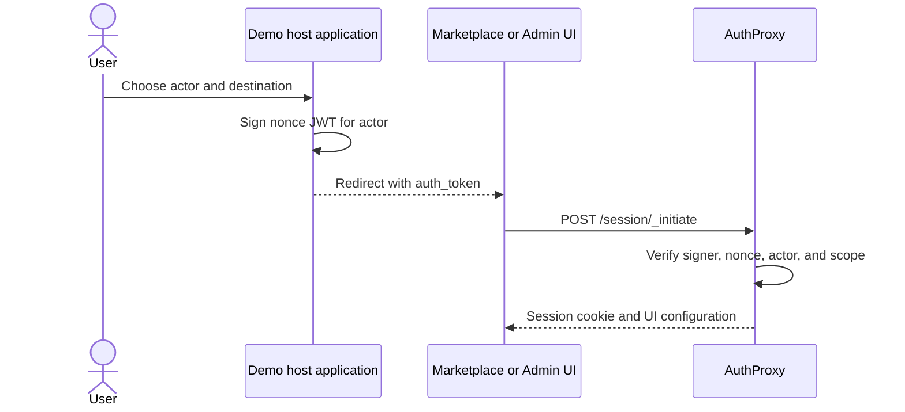

Use the public demo to see AuthProxy's end-user, administrator, and
observability surfaces without installing anything.

Start at [demo.authproxy.net](https://demo.authproxy.net/). The environment is
shared and may be reset, so never enter real credentials, customer data, or
other private information.

## How the demo sign-in works

AuthProxy is designed to use the host application's identity. The demo has no
host product, so the **Demo Shell** stands in for one:

1. You choose an example actor and a destination.
2. The shell signs a short-lived, one-time JWT identifying that actor.
3. The browser is redirected to the Marketplace or Admin UI with the token.
4. AuthProxy validates the signature and exchanges the token for a UI session.

`demo-admin`, `demo-user`, and `fresh-user` demonstrate distinct host
identities. Connection data is shared and changes as visitors use the demo, so
do not rely on any identity having a permanently empty or populated account.

See [host application integration](/integration/host-application/) for the
production version of this handoff.

## Marketplace

Open the Marketplace through the
[Demo Shell](https://demo.authproxy.net/) or visit the
[Marketplace directly](https://marketplace.demo.authproxy.net/) if you already
have a demo session.

The seeded catalog demonstrates five connector patterns:

| Connector | What to try |
|---|---|
| No auth | See a catalog entry that needs no credential. |
| API key | Enter `demo-api-key`; the test provider accepts only this intentionally fake key. |
| Basic OAuth | Complete a normal authorization-code connection. |
| OAuth with tenant selection | Enter a pretend tenant before the OAuth redirect. |
| OAuth with resource configuration | Authorize first, then choose fake provider resources discovered through the new connection. |

### Create a fake OAuth account

The OAuth examples connect to a dedicated `go-oauth2-server` test deployment,
not Google, GitHub, or another real provider. Start any OAuth connector and use
either:

- seeded account `demo-oauth-user@example.test` with password
  `demo-password`; or
- **Register** on the provider login page to create your own disposable
  account.

The provider is reached as part of the connector flow; its hostname is not a
standalone demo homepage. Accounts and tokens exist only to exercise OAuth
behavior in this test environment.

## Admin UI

Choose **Demo admin** and **Admin UI** in the Demo Shell.

The Admin UI exposes namespaces, actors, connectors and immutable connector
versions, connections, request events, background tasks and workflows,
encryption keys, and rate limits.

## Grafana

[Open Grafana](https://demo.authproxy.net/grafana) with anonymous viewer
access. The workspace includes:

- an [AuthProxy app-metrics dashboard](https://demo.authproxy.net/grafana/d/authproxy-app-metrics-demo/authproxy-app-metrics?orgId=1&from=now-1h&to=now)
  for resource counts, request volume, errors, duration, and request metadata;
- [Grafana Explore](https://demo.authproxy.net/grafana/explore?orgId=1); and
- AuthProxy, Prometheus, Tempo, and Loki data sources.

Activity is shared and time-dependent. Generate a connection or proxy request,
then adjust the dashboard time range if a panel is empty.

## Next steps

- [Learn the core model](/concepts/)
- [Embed AuthProxy in a host application](/integration/)
- [Run AuthProxy locally](/development/quick-start/)
