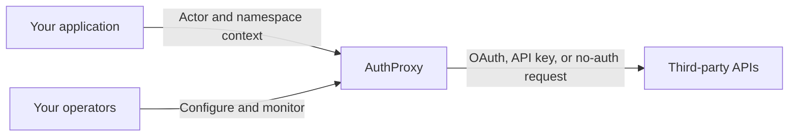

import { CardGrid, LinkCard } from '@astrojs/starlight/components';

## One integration boundary

## Choose your path

<CardGrid>
  <LinkCard
    title="Add integrations"
    href="/integration/"
    description="Map host users and tenants, embed the Marketplace, and make proxied requests."
  />
  <LinkCard
    title="Deploy and operate"
    href="/deployment/"
    description="Install AuthProxy, configure its dependencies, and monitor production traffic."
  />
  <LinkCard
    title="Review security"
    href="/security/"
    description="Evaluate trust boundaries, permissions, encrypted credentials, and logging risk."
  />
  <LinkCard
    title="Evaluate the architecture"
    href="/concepts/"
    description="Understand connectors, connections, actors, namespaces, and the build-versus-buy boundary."
  />
</CardGrid>

## Start with a working system

<CardGrid>
  <LinkCard
    title="Explore the hosted demo"
    href="/getting-started/demo/"
    description="Use fake accounts, connect an app, inspect the Admin UI, and explore Grafana."
  />
  <LinkCard
    title="Run AuthProxy locally"
    href="/development/quick-start/"
    description="Clone the repository and start the full stack with Docker Compose."
  />
  <LinkCard
    title="Make a proxied request"
    href="/sdks/proxying/"
    description="Send an authenticated request through a connection without handling its credentials."
  />
  <LinkCard
    title="Install with Helm"
    href="/deployment/helm/"
    description="Deploy AuthProxy to Kubernetes and connect production dependencies."
  />
</CardGrid>
