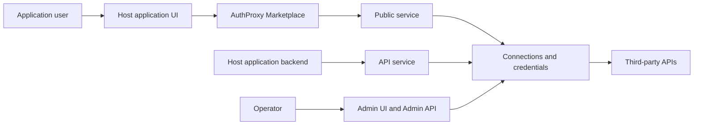

An AuthProxy integration has two paths: users establish and manage connections
through the Marketplace, while application backends make provider requests
through the API. Administrative provisioning stays on a separate trusted path.

The browser never needs the third-party credential. The Marketplace sends
connection-lifecycle requests to the Public service using an AuthProxy session;
the host backend sends scoped, authenticated proxy requests to the API service.

## Integration decisions

Decide these mappings before writing UI code:

| Question | Recommended starting point |
|---|---|
| What identifies a user? | The host's immutable user id becomes the actor `external_id`. |
| What isolates tenants? | Give each tenant a stable child namespace under a common parent. |
| Are credentials shared? | Put shared connections at the tenant or team namespace; put private connections in a user child namespace. |
| How are installations found? | Store the AuthProxy connection id, add a host installation-id label, or do both. |
| Who signs browser handoff tokens? | A host backend that holds a private key trusted by AuthProxy. Never sign in browser code. |
| Who may administer connectors? | A separate operator or provisioning identity, not an end-user Marketplace session. |

See [Host application integration](/integration/host-application/) for the identity and
tenancy model.

## Typical implementation

1. **Create the namespace model.** Provision stable tenant, team, or user
   namespace paths.
2. **Provision actors.** Map host identities to AuthProxy actors and assign the
   minimum namespace permissions they require.
3. **Publish connectors.** Operators manage connector definitions and versions;
   application users consume the primary versions.
4. **Add the Marketplace entry point.** The host authenticates the user and
   performs the one-time JWT handoff described in [Marketplace
   integration](/integration/marketplace/).
5. **Record the connection mapping.** Store the returned `cxn_...` id in the
   host installation record or attach a selectable host id label.
6. **Proxy backend requests.** Send provider-specific HTTP requests through the
   connection with a narrowly scoped AuthProxy JWT. See [Proxying
   requests](/sdks/proxying/).
7. **Operate the integration.** Use request events, telemetry, health, and
   lifecycle actions rather than exposing provider tokens to application
   services.

## Connector behavior versus host behavior

Keep reusable provider behavior in the connector:

- OAuth endpoints, scopes, and token refresh
- API-key placement
- setup forms and provider redirects
- health probes and connector-specific 429 handling

Keep product behavior in the host:

- who may install an integration
- whether a connection is user, team, or tenant scoped
- which product feature uses a connection
- provider-specific business requests and response handling

Conditional setup steps, scopes, and probes are documented in [Connector
predicates](/integration/connector-predicates/). Full setup-flow authoring is covered by
[Connector setup flow](/integration/connector-setup-flow/).

## Operational hooks

- Use [labels and annotations](/concepts/labels-and-annotations/) to join
  resources and request events to host entities.
- Use [application metrics](/operations/app-metrics/) for request-event
  queries and dashboards.
- Use [telemetry](/operations/telemetry/) for infrastructure traces,
  metrics, and logs.
- Add product-side protection with [rate limits](/operations/rate-limits/).

## Next steps

- [Map actors, tenants, and installations](/integration/host-application/)
- [Implement the Marketplace SSO handoff](/integration/marketplace/)
- [Choose a proxy request pattern](/sdks/proxying/)
