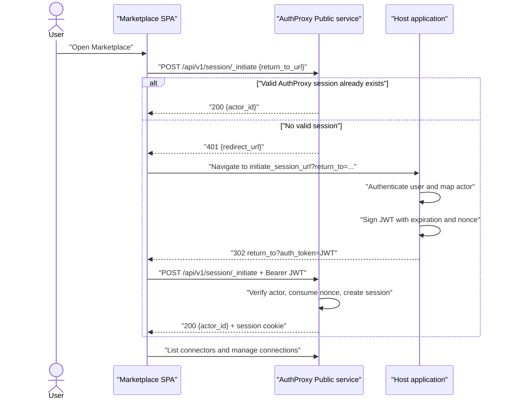

The AuthProxy Marketplace is a ready-made React application where users browse
connectors, establish OAuth or API-key connections, resume setup, reauthenticate
unhealthy connections, and disconnect installations.


The host application authenticates the user. The Marketplace does not need a
second login screen; it exchanges a short-lived, one-time JWT from the host for
an AuthProxy browser session.

## Deployment modes

| Mode | Configuration | Use when |
|---|---|---|
| Same origin | Set `public.static: {}` to serve the compiled Marketplace from the Public service. | You want the simplest cookie and CORS behavior. |
| Separate SPA origin | Set `marketplace.base_url` to the Marketplace origin and point its `VITE_PUBLIC_BASE_URL` at the Public service. | You deploy or brand the frontend independently. |

For a separate origin, AuthProxy derives a credentialed CORS policy from
`marketplace.base_url`. Deploy both origins over HTTPS and configure cookie
attributes for the browser context. Same-origin hosting is the safer default
when a separate frontend deployment is not required.

## SSO handoff



The configured `host_application.initiate_session_url` receives a `return_to`
query parameter. After authenticating the user, the host redirects to that URL
with an `auth_token` query parameter. The Marketplace moves the token into the
`Authorization: Bearer` header when it calls the session endpoint.

If authentication succeeds, the Public service consumes the nonce and creates
a server-side session. Later Marketplace calls use the session cookie and XSRF
protection instead of repeatedly exposing the JWT.

## Configure the handoff

For a separately hosted Marketplace:

```yaml
public:
  base_url: https://authproxy.example.com
  https: true
  cookie:
    same_site: none

host_application:
  initiate_session_url: https://app.example.com/auth/authproxy

marketplace:
  base_url: https://integrations.example.com
```

The host endpoint follows this logic:

```text
require an authenticated host session
read return_to
reject return_to unless it matches an exact Marketplace allowlist
map the host user and tenant to an AuthProxy actor and namespace
sign an AuthProxy JWT for the Public service with a short expiration and nonce
redirect to return_to with auth_token=<jwt>
```

The signing key remains in the host backend. Register its public key or trusted
signing configuration with AuthProxy. The actor identified by the token must
already exist unless the trusted token includes the full actor claim for
just-in-time provisioning; see [Host application
integration](/integration/host-application/#provision-actors).

## Security requirements

- Authenticate the host session before signing anything.
- Allowlist complete Marketplace return destinations; do not implement an open
  redirect.
- Use a short expiration and a nonce. AuthProxy accepts each nonce only once.
- Scope the JWT audience and permissions to the Public Marketplace flow.
- Keep signing keys and provider credentials out of browser code.
- Use HTTPS. The handoff token briefly appears in a query parameter and must not
  be reusable.
- Keep `public.enable_proxy` disabled unless browser-to-provider proxying is an
  explicit requirement; it is disabled by default.
- Do not use the demo identity picker as production authentication. It is only
  a stand-in host that demonstrates the JWT exchange.

## Local development

The CLI can stand in for the host application:

```bash
ap login-redirect --port 8889
ap sign-marketplace-login-url --actorId alice
```

`login-redirect` implements the `return_to` handoff locally, while
`sign-marketplace-login-url` prints a Marketplace URL containing a one-time
token. See the [CLI reference](/development/cli/#ap-login-redirect).

After SSO is working, connector-authored forms, redirects, data sources, and
verification steps are controlled by the [Connector setup
flow](/integration/connector-setup-flow/).

## Next steps

- [Model host users and tenants](/integration/host-application/)
- [Author connector setup](/integration/connector-setup-flow/)
- [Observe Marketplace requests](/operations/app-metrics/)
