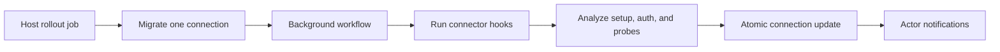

Connector version migrations move an existing connection from one published
version of a connector to another version of the same connector. The migration
workflow runs one connection at a time, applies connector-authored hooks,
performs automatic setup/auth analysis, updates the connection atomically, and
queues any active notifications the actor should see. Use this page when you are
authoring a connector change, planning a rollout, or reviewing how AuthProxy
protects stored credentials during an upgrade.

Bulk rollout is intentionally a host concern. Hosts can call the single
connection endpoint for each connection they want to move and track the
returned task ids.



## Connector YAML

A connector version can define shared JavaScript and optional migration hooks:

```yaml
javascript: |
  function migrateUp() {
    return {
      config: {
        set: {
          sync_mode: "standard"
        }
      }
    };
  }

  function migrateDown() {
    return {
      config: {
        unset: ["sync_mode"]
      }
    };
  }

migrations:
  up:
    javascript: migrateUp()
  down:
    javascript: migrateDown()
```

The `migrations.up.javascript` and `migrations.down.javascript` values are
JavaScript expressions. AuthProxy validates expression syntax when the
connector definition is validated, but it does not execute migration hooks
until a connection migration workflow crosses that version.

Hooks run in the same deterministic connector JavaScript environment as
[predicates](/integration/connector-predicates/) and
[setup data-source transforms](/integration/connector-setup-flow/). They
receive:

| Variable | Shape | Description |
|---|---|---|
| `cfg` | object | The connection configuration collected by setup steps. |
| `labels` | object | User-owned connection labels visible to connector JavaScript. |
| `annotations` | object | Connection annotations. |

Hooks cannot call network, database, or host application APIs.

## Hook Ordering

When migrating upward, AuthProxy runs each target-side `up` hook in order:

- `v1 -> v3`: run `v2.up`, then `v3.up`.

When migrating downward, AuthProxy runs each source-side `down` hook in reverse
order:

- `v3 -> v1`: run `v3.down`, then `v2.down`.

If any hook fails, the workflow fails without persisting partial hook output.
Rollback is the same workflow pointed at an earlier connector version.

## Hook Output

Migration hooks return a JSON-like object. Every section is optional:

```javascript
return {
  config: {
    set: {
      workspace_id: "default"
    },
    unset: ["legacy_workspace"]
  },
  labels: {
    set: {
      "host.example/sync": "enabled"
    },
    unset: ["host.example/legacy"]
  },
  annotations: {
    set: {
      "host.example/migrated-by": "connector-v2"
    },
    unset: ["host.example/review"]
  },
  notifications: {
    set: [
      {
        key: "review-required",
        level: "warning",
        title: "Connection needs review",
        message: "Review this connection before using the new connector version.",
        action_url: "/connections/cxn_123?action=configure",
        metadata: {
          reason: "workspace mapping changed"
        }
      }
    ],
    unset: [
      {
        key: "review-required"
      }
    ]
  }
};
```

`config.set` values may be strings, numbers, booleans, arrays, or objects.
`labels` and `annotations` use string values and must pass the same validation
as normal connection updates. See [labels and annotations](/concepts/labels-and-annotations/)
for the ownership model. System-owned labels under `apxy/*` are not
connector-owned and cannot be set by hooks.

Connector-authored notifications are keyed per connection. A hook can unset a
previous notice by returning the same `notifications.unset[].key`.

## Automatic Analysis

After hooks run, AuthProxy compares the source and target connector definitions
and updates the migration candidate:

- Target-only setup fields with JSON Schema defaults are filled automatically.
- Missing required configure fields set `setup_step_id` so the actor can resume
  setup.
- Missing required preconnect fields or required OAuth scope changes leave the
  connection configured but unhealthy, requiring re-authentication.
- Optional new fields and optional OAuth scopes do not require user action.
- OAuth client, token endpoint, or refresh input changes trigger a refresh
  attempt when the auth method supports refresh. Auth methods without refresh
  treat this as a no-op.
- If the migration is not blocked by required setup or re-authentication,
  AuthProxy runs the target connector's enabled probes once after the version
  switch.

The workflow writes the connector version, encrypted configuration, labels,
annotations, setup state, health state, and notification changes in one
transaction.

## Notifications

Notifications are high-level actor-visible conditions, not per-field change
logs. The built-in migration analysis queues at most one required-action
notification per connection:

- Re-authentication required: `/connections/{id}?action=reauth`
- Setup required: `/connections/{id}?action=configure`

Re-authentication is more severe than setup because the re-authentication flow
will also lead the actor through any required setup steps. If a connection
already has an active re-authentication notification, a migration reuses the
same deterministic key instead of creating a duplicate.

The notification API is:

```http
GET /api/v1/notifications?include_viewed=true
POST /api/v1/notifications/{id}/_viewed
POST /api/v1/notifications/_viewed
```

`GET /notifications` returns actor-filtered active notifications with `viewed`,
`can_action`, and `action_url` when the actor is allowed to perform the action.
Clients should only follow `action_url` when `can_action` is true.

## API

Start a single connection migration with:

```http
POST /api/v1/connections/{id}/_migrate_version
Content-Type: application/json

{
  "target_version": 3,
  "timeout_seconds": 600
}
```

The response binds the workflow task to the caller:

```json
{
  "task_id": "tsk_...",
  "connection_id": "cxn_...",
  "source_version": 1,
  "target_version": 3
}
```

The endpoint rejects no-op migrations, cross-connector targets, draft or
archived targets, invalid timeouts, and concurrent migrations for the same
connection.
