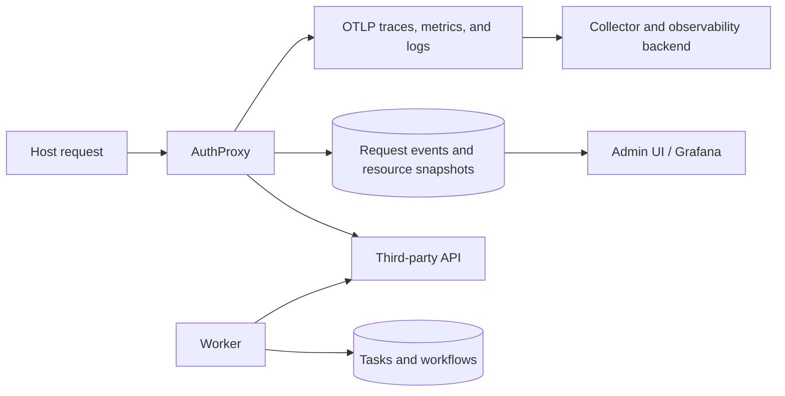

Operations span application-level request history, OpenTelemetry signals,
background work, connection lifecycle, and the stores behind them.

## Observability and audit

- [Application metrics](/operations/app-metrics/) — request-event metadata, resource
  snapshots, query dimensions, and aggregations.
- [Telemetry](/operations/telemetry/) — OpenTelemetry traces, metrics, logs, sampling,
  and label projection.
- [Blob storage](/operations/blob-storage/) — inspect full request/response payloads in
  MinIO or S3 when recording is enabled.
- [RedisInsight](/operations/redis-insight/) — inspect local Redis state during
  development.

Application metrics and OpenTelemetry complement each other. Request events are
AuthProxy domain records suited to audit and per-connection investigation;
OpenTelemetry describes service and dependency behavior across a distributed
system.

## Control and lifecycle

- [Rate limits](/operations/rate-limits/) — proactive namespace-scoped policies and
  connector-level handling of provider 429 responses.
- [Background tasks](/operations/background-tasks/) — run the worker and inspect queues.
- [Connector lifecycle](/operations/connector-lifecycle/) — disconnect or archive a
  connector version and monitor the resulting task.

## Production baseline

Before accepting traffic:

- configure readiness checks for every enabled service and dependency;
- choose retention for request-event rows, body blobs, task history, and
  telemetry;
- keep full body recording off unless its debugging or audit value outweighs
  the sensitive-data risk;
- restrict high-cardinality telemetry labels with allowlists;
- monitor OAuth refresh failures, upstream 429s, proxy latency, worker queues,
  and storage availability;
- test database and blob-store restores; and
- document key, signing-key, database, and provider credential rotation.

See [deployment](/deployment/) for topology and
[security](/security/) for the review checklist.
