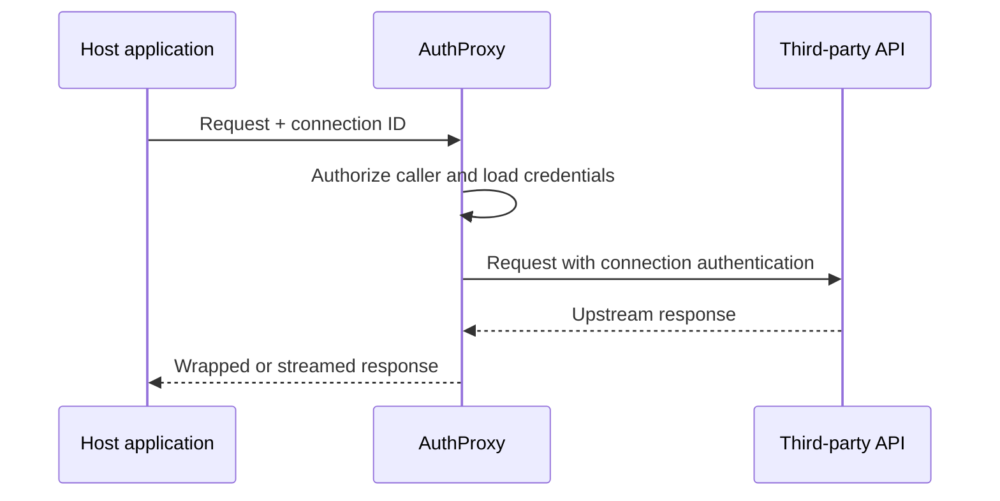

AuthProxy is HTTP-first. Any application that can make an HTTP request can manage resources and send requests through a connection. The repository also includes a JavaScript/TypeScript client and an `ap` command-line client.

## Choose an interface

| Need | Use |
|---|---|
| Manage AuthProxy resources from JavaScript or TypeScript | [`@authproxy/api`](/sdks/javascript/) |
| Send a normal JSON or other buffered request through a connection | The [wrapped proxy endpoint](/sdks/proxying/#wrapped-proxy) from any HTTP client, or the shared client exported by `@authproxy/api` |
| Stream uploads, downloads, or server-sent events | The [raw proxy endpoint](/sdks/proxying/#streaming-raw-proxy), normally through `ap proxy` |
| Explore or script an environment from a terminal | The [`ap` CLI](/development/cli/) |

The JavaScript SDK currently provides the broadest typed client surface in this repository. Other languages can call the same HTTP APIs directly.

## Authentication

Calls to AuthProxy require an AuthProxy session or JWT. This authenticates the caller to AuthProxy; it is not the credential for the third-party API.

When an application proxies through a connection, it sends the connection ID and the upstream request. AuthProxy authorizes the caller, loads the connection's encrypted credentials, applies them to the upstream request, and manages refresh or rotation behavior for the connector's authentication method.

For proxy requests, the caller needs the `connections:proxy` permission for the target connection. Scope application tokens to only the namespaces, resources, verbs, and resource IDs they require.

## Proxying model

The host application never needs the third-party OAuth token or API key. See [Proxying requests](/sdks/proxying/) for both request formats and runnable examples.
