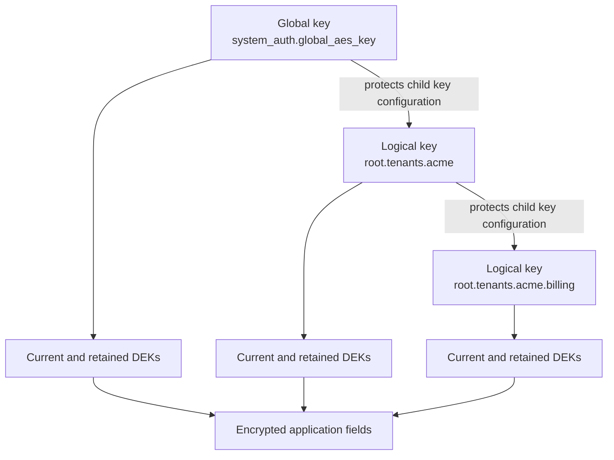

AuthProxy uses application-level envelope encryption for sensitive stored
values. The service encrypts a value with a data-encryption key (DEK), stores
only protected DEK material in the database, and records the DEK id beside the
ciphertext. Plaintext credentials exist in the AuthProxy process only when they
must be used or transformed.

This design reduces the value of an isolated database, Redis, or blob-store
snapshot. It does not protect against compromise of the running AuthProxy
process, its key-provider identity, or an authorized API that returns decrypted
data.

## What Is Encrypted

Sensitive fields protected by the encryption service include:

- OAuth access and refresh tokens;
- API-key credential blobs;
- connector definitions and connection configuration;
- configured actor key data;
- OAuth round-trip state and encrypted session-cookie identifiers; and
- full HTTP request/response records when full capture is enabled.

Full request records are serialized and encrypted for their namespace before
being written to filesystem, memory, S3, or another configured blob backend.
High-level request-event records are redacted and stored separately.

Resource ids, namespaces, labels, annotations, timestamps, request-event
metadata, and key/DEK ids are not secret ciphertext fields. Do not put secrets
in labels, annotations, resource names, paths, or correlation ids.

## Encrypted Field Format

Encrypted database fields use this self-describing JSON form:

```json
{"id":"dek_abc123","d":"base64-encoded-ciphertext"}
```

- `id` identifies the `data_encryption_keys` row needed to decrypt the value.
- `d` contains a randomly generated 12-byte nonce followed by AES-GCM
  ciphertext and its authentication tag, encoded as base64.

AES-GCM detects modification of the encrypted payload. Authorization and
database integrity are separate controls; ciphertext authentication does not
replace permission checks or datastore access controls.

## Key Hierarchy



The global key is the root of the hierarchy. Its raw material comes from
configuration and is not stored in the database. Losing it, or permanently
losing access to its provider, can make encrypted data unrecoverable.

Logical keys are stored in `keys`. Each logical key owns one or more rows in
`data_encryption_keys`:

- exactly one DEK is current for new encryption;
- older DEKs remain available to decrypt existing values; and
- plaintext DEKs may be cached in process memory but are never persisted in
  the database.

Key provider configuration for a child logical key is itself encrypted using
its parent key's current DEK.

## Namespace-Scoped Encryption

A namespace can select a logical key with `key_id`. AuthProxy resolves the key
for a write by walking from the resource namespace toward the root:

```text
root.tenants.acme.billing -> root.tenants.acme -> root -> global key
```

The nearest namespace with a key wins. Child namespaces inherit their parent's
key until they select another one. This supports tenant- or application-level
cryptographic separation within a shared deployment.

Namespace key selection controls encryption, not authorization. A caller still
needs permission to access the resource, and selecting a tenant key does not
create an ACL.

## Key Providers

AuthProxy supports two provider patterns:

- **Secret-backed providers** return wrapping bytes to AuthProxy. Examples
  include environment variables, files, AWS Secrets Manager, Google Secret
  Manager, and Vault KV. AuthProxy generates a DEK and protects it with those
  bytes.
- **KMS-backed providers** keep the key-encryption key outside AuthProxy and
  expose generate, wrap, and unwrap operations. AWS KMS, Google Cloud KMS, and
  Vault Transit persist only wrapped DEKs and provider metadata in AuthProxy's
  database.

Inline `value`, generated random bytes, and fake encryption are intended for
development and tests. Production must use durable key material with an
independent recovery plan.

## Rotation

Wrapping-key rotation and DEK rotation are different operations.

### Wrapping-Key Rotation

Rotate wrapping material when advancing a KMS key, Vault Transit key, or
secret-manager version. The sync task unwraps each retained DEK with its
recorded provider version, rewraps the same plaintext DEK with current material,
and updates the protected data and metadata. The `dek_...` id stays stable, so
application fields do not need to be rewritten.

Keep the old provider material readable until every retained DEK is confirmed
rewrapped.

### DEK Rotation

Rotate a DEK when the key that encrypts application data should change. The
generation task creates a new current `dek_...` row, namespace sync advances
each namespace's target DEK, and the re-encryption task moves registered
encrypted fields to that target in batches.

Keep old DEK rows until no encrypted field references them. Removing one early
makes the remaining fields that reference it undecryptable.

The default policy ensures every active data-encryption key has a current DEK
and rotates it after 90 days:

```yaml
system_auth:
  data_encryption_keys:
    ensure_current: true
    rotation_interval: 2160h
```

The normal worker schedule runs DEK generation and key sync every 15 minutes,
and full re-encryption every 30 minutes. The internal
[unified key-model design note](/development/design/key-model-migration/)
contains the detailed data model, migration history, and implementation checks.

## Operational Requirements

- Configure a durable `system_auth.global_aes_key`; do not rely on an
  ephemeral startup key in production.
- Keep fake encryption disabled. With `dev_settings.fake_encryption`, values
  labeled as encrypted are stored as plaintext.
- Restrict KMS and secret-manager identities to the minimum keys and operations
  required for generate, wrap, unwrap, or secret reads.
- Protect key-provider credentials, mounted secret volumes, process memory,
  crash dumps, and diagnostic tooling. AuthProxy must hold plaintext DEKs and
  credentials in memory while using them.
- Monitor DEK generation, key sync, cache readiness, and re-encryption. The
  encryption service blocks encrypted-data operations until initial key sync is
  ready.
- Back up the database and the corresponding key-provider state as one recovery
  set. Test restoration before retiring old provider versions or DEKs.
- Apply datastore encryption at rest, TLS, access controls, retention, and
  backup protection in addition to AuthProxy's application encryption.
- Keep full request recording at `never` unless its debugging or audit value
  justifies the additional sensitive data. See
  [Application Metrics](/operations/app-metrics/).

## Threat-Model Limits

Application encryption does not prevent:

- an authorized actor from retrieving data its permissions allow;
- a compromised AuthProxy process from using in-memory credentials;
- a compromised KMS/secret-manager identity from unwrapping available DEKs;
- secrets from leaking through upstream responses, custom connector logic,
  labels, annotations, application logs, traces, or error messages; or
- traffic interception when TLS and network controls are absent or
  misconfigured.

Treat application encryption as one layer in a defense-in-depth design, not as
a replacement for host, runtime, network, or storage security.
