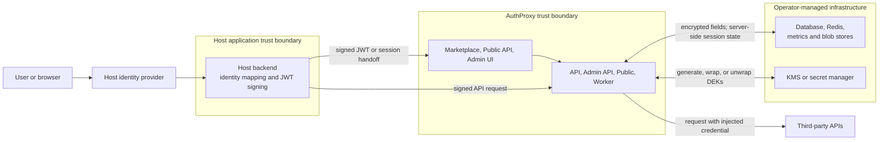

AuthProxy centralizes third-party credentials and the policy for using them. A
host application sends an authorized request to AuthProxy; AuthProxy resolves a
connection, decrypts its credentials in memory, injects them into the outbound
request, and records an audit event. The host application does not need to
store or refresh each provider's credentials itself.

This page describes AuthProxy's security boundaries and the controls a
deployment must supply. It is not a compliance certification or a substitute
for a threat model specific to your environment.

## Security Model at a Glance

- **The host application is the identity source.** It authenticates its users,
  maps them to AuthProxy actors and namespaces, and signs the short-lived JWTs
  used to call APIs or establish browser sessions.
- **AuthProxy enforces authorization.** Permissions match a namespace,
  resource type, verb, and optionally specific resource ids. A token can narrow
  an actor's permissions, but cannot grant more access than the actor has.
- **Credentials are centralized.** OAuth tokens, API-key credentials,
  connector definitions, connection configuration, and other sensitive fields
  are encrypted before durable storage.
- **Keys can be isolated by namespace.** A tenant or application namespace can
  select its own logical key and inherit it through child namespaces.
- **Proxy access is auditable.** Request events record the actor and connection
  context. Optional full request/response capture is encrypted, but it also
  creates a high-sensitivity data set that operators must tightly control.

Read [Authentication and Authorization](/security/authentication-and-authorization/)
and [Encryption](/security/encryption/) for the implementation details.

## Trust Boundaries

Every arrow that crosses a boundary needs an explicit transport, network, and
identity policy. In particular:

- The host signing key belongs on the host backend, never in browser code.
- AuthProxy must be able to reach approved third-party and key-provider
  endpoints, but its other inbound and outbound network paths should be
  restricted.
- Databases, Redis, object storage, backups, and telemetry systems are
  operator-managed security boundaries even when the values AuthProxy writes
  to them are application-encrypted.

## Shared Responsibility

| Area | AuthProxy provides | Host application or operator provides |
|---|---|---|
| User identity | JWT validation, actor lookup, one-time nonce handling, browser sessions | User authentication, MFA and account policy, stable actor mapping, signing-key custody, deprovisioning |
| Authorization | Namespace/resource/verb/resource-id permission checks and token restriction intersection | Least-privilege permission design and review |
| Credentials | Credential injection, OAuth refresh, namespace-scoped application encryption | Connector client secrets, provider policy, upstream scope selection, revocation process |
| Key management | DEK generation, wrapping integration, cache sync, rotation and re-encryption tasks | Durable root key, KMS/secret-manager policy, recovery material, rotation approval and monitoring |
| Transport and network | Configurable service TLS and narrowly separated services | Trusted certificates or ingress TLS, internal transport security, firewall/network policy, private Admin/API exposure, egress controls |
| Storage | Encrypted sensitive fields and encrypted full-request blobs | Database/Redis/blob encryption at rest, TLS, access control, backups, retention and restore testing |
| Audit and telemetry | Redacted request-event metadata and optional encrypted full capture | Who can query/export it, retention, downstream redaction, alerting and incident response |

## Labels Are Not Authorization

Labels and annotations are metadata used for mapping, selection, attribution,
and reporting. A label selector is a query filter, not an access-control check.
Do not use resource labels such as `tenant=acme` as an ACL or assume that
filtering a list protects the underlying resources.

Authorization comes from actor permissions and route-level resource
validation. A permission may explicitly template its namespace from a trusted
actor attribute, including an actor label. In that case, the permission is
still the grant; the referenced identity attribute becomes security-sensitive
input and must be controlled by the host application's identity mapping.

See [Labels and Annotations](/concepts/labels-and-annotations/) for metadata
behavior and [Authentication and Authorization](/security/authentication-and-authorization/)
for the permission model.

## Data Exposure to Consider

Application-level encryption protects an offline store from revealing
plaintext without the corresponding key material. It does not protect data
from a compromised AuthProxy process, an authorized caller, or a compromised
KMS identity while the service is able to decrypt and use credentials.

Some operational metadata remains queryable without decrypting credential
fields, including resource ids, namespaces, labels, timestamps, request paths,
status codes, and sizes. Treat labels, paths, correlation ids, and annotations
as potentially sensitive metadata and do not put secrets in them.

Full request/response recording defaults to `never`. If enabled, the payload is
namespace-encrypted before blob storage, but an authorized viewer can still
retrieve the plaintext. Minimize capture, size limits, retention, and viewer
permissions. See [Application Metrics](/operations/app-metrics/).

## Security Review Checklist

### Identity and Authorization

- [ ] The host application is the authoritative identity source and uses
  stable, non-reassignable actor ids.
- [ ] Host and actor signing keys are stored only in backend secret storage;
  browsers and mobile clients never receive them.
- [ ] UI handoff tokens have a short expiration, a service audience, and a
  one-time nonce.
- [ ] Actor permissions are reviewed per persona; broad `root.**`, `*`
  resource, and `*` verb grants are exceptional.
- [ ] Token permissions are used to narrow automation and agent access.
- [ ] Resource labels and label selectors are not treated as ACLs.
- [ ] Offboarding covers host access, AuthProxy actor permissions, signing
  keys, active sessions, and third-party credentials.

### Network and Runtime

- [ ] Every public endpoint uses trusted TLS, and AuthProxy is configured to
  recognize HTTPS when TLS terminates at a proxy or ingress.
- [ ] Third-party, datastore, key-provider, and telemetry endpoints use TLS
  appropriate to the deployment's threat model.
- [ ] The Admin API and core API are private unless a documented use case
  requires exposure.
- [ ] `public.enable_proxy` remains disabled unless browser/session clients
  require direct proxy calls.
- [ ] CORS origins, cookie domains, and `SameSite` settings are limited to the
  application origins that need them.
- [ ] Network policy limits datastore, key-provider, telemetry, and third-party
  egress to approved destinations.

### Keys and Storage

- [ ] `system_auth.global_aes_key` uses durable, recoverable production key
  material; fake encryption, inline values, and ephemeral random keys are not
  used in production.
- [ ] KMS/secret-manager identities have only the operations and keys they
  require.
- [ ] Key sync, DEK generation, and re-encryption tasks run and alert on
  failures.
- [ ] Old wrapping material and DEKs are retained until rewrap and
  re-encryption are verified complete.
- [ ] Database, Redis, object storage, telemetry, and backups have independent
  TLS, encryption-at-rest, access, retention, and restore controls.

### Credentials and Audit Data

- [ ] Connector OAuth scopes and API-key permissions are the minimum needed.
- [ ] Provider callback URLs are exact and production/test OAuth clients are
  separated.
- [ ] Full request recording is off unless justified; when enabled, size,
  retention, access, and deletion policies are documented.
- [ ] Logs, traces, labels, annotations, and error messages do not contain
  tokens, keys, passwords, or unnecessary personal data.
- [ ] Credential compromise procedures cover provider revocation, AuthProxy
  disconnection, key rotation, session invalidation, and audit review.
