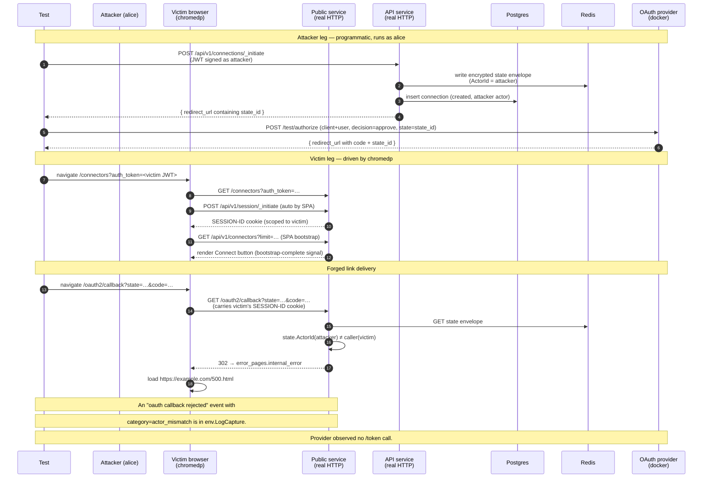

# OAuth2 Callback State Security — Cross-Actor Case

Companion specification for `callback_actor_mismatch_test.go`. Covers
case 5 of #167: an attacker initiates a connection, drives the
provider's authorize step to mint a code, and sends the resulting
`/oauth2/callback?state=…&code=…` URL to a different actor (the
victim). When the victim's browser follows the link, the public
service identifies the victim from their `SESSION-ID` cookie, but the
state record carries the attacker's actor id. State validation must
reject with `actor_mismatch` and redirect to the configured error
page; no token must be exchanged or persisted.

The four direct-HTTP cases (1–4) live in
`callback_state_security_test.go`. The cross-tenant + cross-connection
cases (6–7) are PR 5.

## Threat model

The bug-bounty shape: an attacker partially completes an OAuth flow
under their own session, then sends the *forged callback URL* to a
victim — a phishing link, a chat message, an embedded image, anything
that causes the victim's browser to issue a GET to the proxy's
callback endpoint. The state envelope was minted under the attacker's
actor id; the victim's browser carries the victim's session cookie.
If the proxy did not bind state-to-actor, the callback would attach
the attacker-controlled provider account to the victim's connection
record — a confused-deputy compromise.

## Why chromedp, not direct HTTP

Cases 1–4 hinge on programmatic tampering with the callback URL or
Redis envelope — values a real browser would never produce. Case 5
hinges on *who's calling*: the attacker minted the state under their
own actor id, but the request that delivers the code arrives carrying
the victim's session credentials. That delivery vector is exactly
what a phishing link looks like in the wild, and chromedp + the real
marketplace bootstrap is the closest possible reproduction:

- The victim's browser hits `/connectors?auth_token=<victim JWT>`.
- The marketplace SPA calls `/api/v1/session/_initiate`, which mints
  a `SESSION-ID` cookie scoped to the victim.
- The browser then follows the forged callback URL. The cookie
  travels with the request; the public service identifies the
  caller as the victim.
- State validation reads the envelope, finds the attacker's actor id
  inside, compares against the calling actor (victim), and rejects.

A direct-HTTP path with a JWT signed as the victim would exercise the
same `state.ActorId` check — but it would not mirror the real-world
delivery vector. The chromedp path is what bug-bounty submissions
look like.

## What is asserted

- **Browser lands on the error page.** After the 302 from the proxy,
  the final URL is `error_pages.internal_error` (configured to
  `https://example.com/500.html` in the test config). We use the
  `<h1>Example Domain</h1>` element as the load signal.
- **Exactly one `oauth callback rejected` log event** with
  `category=actor_mismatch` and `state_id` matching the minted state.
  The `actor_id` field on the event reflects the *calling* actor
  (the victim) so a SOC analyst can see who clicked the link.
- **No `oauth2_tokens` row** exists for the connection.
- **Connection state is unchanged** — still `created`, with `setup_step`
  and `setup_error` both nil.
- **Provider observed zero `/token` calls** for the test's client id.
  The token exchange was short-circuited by state validation.

## Components

| Lever                                                       | What it controls |
| ----------------------------------------------------------- | ---------------- |
| `helpers.SetupOptions{StartHTTPServer: true, IncludePublic: true, ServeMarketplaceUI: true, LogCapture: …}` | Real HTTP server + marketplace static assets so chromedp can bootstrap a session. |
| `env.InitiateOAuth2Connection(t, connectorID, returnTo, helpers.WithActor("alice-attacker-…", root))` | Initiates the connection programmatically as the attacker — signs the request with a JWT carrying the attacker's external id. |
| `provider.Authorize(...)` (`/test/authorize`)               | Mints the OAuth code without a browser. The provider doesn't care which proxy actor owns the state — it validates against its own client/user records — so the attacker can drive this leg programmatically. |
| `env.PublicAuthUtil.GenerateBearerToken(ctx, "bob-victim-…", root, allPerms)` | Mints the JWT the victim's browser will present to the marketplace. |
| chromedp navigation to `/connectors?auth_token=<victim JWT>` | Triggers the marketplace SPA's `_initiate` call, which sets the victim's `SESSION-ID` cookie. We wait on the `Connect` button as the bootstrap-complete signal. |
| chromedp navigation to the forged `/oauth2/callback?state=…&code=…` | Delivers the callback under the victim's cookie. The public service identifies the victim; state validation detects the actor mismatch and 302s to the error page. |
| `chromedp.Location(&finalURL)`                              | Reads the URL the browser landed on after the 302. |
| `logCapture.RecordsWithMessage(t, rejectionEventMessage)`   | Surfaces the structured rejection event for assertions. |
| `provider.Requests(EndpointToken, …)`                       | Confirms the token exchange path was never taken. |

## Sequence

## Why we don't pre-create alice / bob

`NewSignedRequestForActorExternalId` signs the JWT with `claims.Actor`
populated. The auth middleware on the receiving service treats this
as a self-asserted actor and upserts on first sight, so the test does
not need to pre-create either actor row.

## Why we rely on `https://example.com/500.html` reachability

The error page redirect's destination URL comes from the test
config's `error_pages.internal_error`. We chose `example.com` because
it is reliably reachable and renders a stable `<h1>Example Domain</h1>`
that chromedp can wait on as a load signal. An alternative — running
a local HTTP stub for the error page — would add machinery without
strengthening any assertion. The test asserts the *final URL*, not
the page content; the `<h1>` wait is just a deterministic page-loaded
gate.
