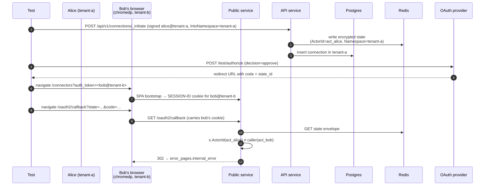
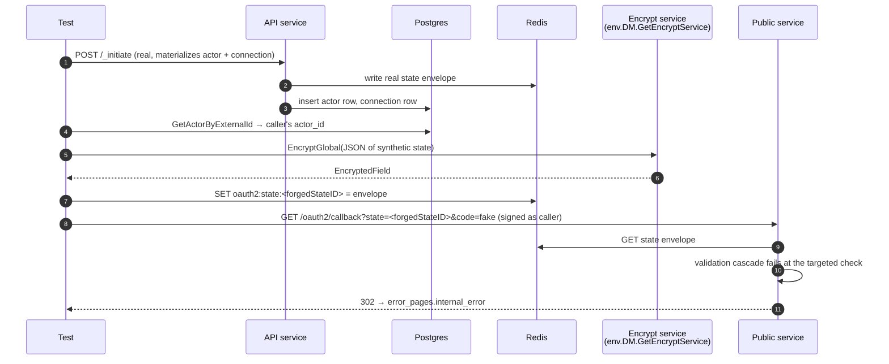

# OAuth2 Callback State Security — Cross-Namespace Cases

Companion specification for `callback_cross_namespace_test.go` and
`callback_namespace_mismatch_test.go`. Together they cover cases 6–7 of
issue #167 — state validation when the calling actor and the state
envelope disagree on namespace, and when the state envelope and the
referenced connection disagree on namespace.

The four direct-HTTP cases (1–4) live in `callback_state_security_test.go`.
The cross-actor case (5) lives in `callback_actor_mismatch_test.go`.

## Threat model

The primary scenario is a multi-tenant AuthProxy deployment: a single
instance manages connections for two customer apps, and each app uses
a child namespace (`root.tenant-a`, `root.tenant-b`) to isolate its
actors. Because actor rows are scoped per `(namespace, external_id)`,
the **same external id can refer to two different users** — each
tenant's "alice" is a distinct actor with a distinct `act_…` id.

What can go wrong, ordered by validation:

1. **Cross-tenant phishing (case 6 primary).** Alice in tenant-a
   initiates a connection, mints a code, and sends the callback URL
   to a victim with the same external id in tenant-b. The state
   envelope carries alice's actor id; the victim's session carries
   their own (different) actor id. State validation rejects with
   `actor_mismatch` — the actor-id check fires before any
   namespace-specific check.

2. **Colliding actor ids across namespaces (case 6 defense-in-depth).**
   Two AuthProxy instances share Redis and happen to allocate the
   same actor id in different namespaces, or a state envelope is
   constructed via a process that picks an actor id colliding with
   the caller. The actor-id check passes, but `s.Namespace !=
   actor.GetNamespace()` fires `namespace_mismatch_actor`. This is a
   guard against the actor-id-uniqueness assumption breaking.

3. **State pointing at a connection in the wrong tenant (case 7).**
   A state envelope claims namespace X (matching the caller's), but
   `state.ConnectionId` points at a connection that lives in
   namespace Y. The actor-id and actor-namespace checks both pass,
   but the connection-namespace check fires
   `namespace_mismatch_connection`. This guards against the
   connection being moved across namespaces, or a forged envelope
   that picks a foreign connection id.

## Validation order in production

`internal/auth_methods/oauth2/state.go:191–242` runs these checks in
sequence, returning on the first failure:

1. `s.ActorId != actor.GetId()` → `actor_mismatch`
2. `s.Namespace != actor.GetNamespace()` → `namespace_mismatch_actor`
3. Load connection from DB
4. `s.Namespace != connection.GetNamespace()` → `namespace_mismatch_connection`

The earliest-failing check is the one that fires. Test 1 below
exercises check 1 in a multi-tenant context; tests 2 and 3 exercise
checks 2 and 4 by injecting synthetic state envelopes that bypass
the earlier checks.

## What is asserted

For every test:

- **Callback is rejected.** The 302 Location header / final browser
  URL is the configured `error_pages.internal_error`.
- **Exactly one `oauth callback rejected` log event** with the
  expected `category` and the synthetic / real `state_id`.
- **No `oauth2_tokens` row** is written for any connection involved.
- **Connection state is unchanged.** `created`, no `setup_step`,
  no `setup_error`.
- **Provider observed zero `/token` calls.** The token exchange
  path was short-circuited by state validation.

## Test 1 — `TestCallbackRejection_CrossNamespace` (chromedp)

Bug-bounty shape, multi-tenant flavor. Drives the victim leg through
chromedp + the marketplace SPA bootstrap so the test mirrors the
attacker-sends-link-to-victim delivery vector.

| Step | Action |
| ---- | ------ |
| Setup | Create namespaces `root.tenant-a-<suffix>`, `root.tenant-b-<suffix>`. |
| Attacker | Alice (external_id = `user-123-<suffix>`) initiates in tenant-a. State has `Namespace=tenant-a`, `ActorId=act_alice`. |
| Provider | `/test/authorize` issues a code under alice's stateId. |
| Victim | Bob (external_id = `user-123-<suffix>`, same as alice) bootstraps via `/connectors?auth_token=<bob>` in tenant-b. Browser holds `SESSION-ID` cookie scoped to bob. |
| Forge | Browser navigates to the cross-tenant callback URL. |
| Reject | Public service identifies bob (act_bob in tenant-b); `s.ActorId (act_alice) != act_bob` → `actor_mismatch`. |

**Why chromedp:** the saved feedback (cross-actor / cross-tenant
tests prefer chromedp) applies — this is the realistic delivery
vector for the bug-bounty submission shape. Direct-HTTP would
exercise the same `state.ActorId` check but wouldn't mirror how the
attack actually shows up.

## Test 2 — `TestCallbackRejection_NamespaceMismatchActor` (synthetic state, direct HTTP)

Defense-in-depth check 2. Exists to verify the guard fires when
`actor_mismatch` would have fired in real life — i.e., to prove
the namespace boundary holds even if the actor-id-uniqueness
assumption breaks.

| Step | Action |
| ---- | ------ |
| Setup | Create namespace `root.tenant-a-<suffix>`. |
| Real initiate | Alice initiates in tenant-a so a real connection row exists. |
| Lookup | Read alice's actor id via `env.Db.GetActorByExternalId(ctx, tenant-a, alice)`. |
| Inject | `env.WriteOAuth2StateForTest` at a fresh `forgedStateID` with `ActorId=alice.Id`, `ConnectionId=conn.Id`, but `Namespace="root.tenant-b-<suffix>"` (lie). |
| Deliver | `env.DeliverOAuth2CallbackAsActor(callback, alice, tenant-a)`. |
| Reject | `s.ActorId == caller.Id` ✓, `s.Namespace ("tenant-b") != caller.Namespace ("tenant-a")` → `namespace_mismatch_actor`. |

**Why direct HTTP:** the scenario hinges on programmatic state
injection — there is no realistic browser-driven path to land a
state with a colliding actor id in a different namespace. Direct
delivery via `DeliverOAuth2CallbackAsActor` exercises the same
production handler chain.

## Test 3 — `TestCallbackRejection_NamespaceMismatchConnection` (synthetic state, direct HTTP)

Defense-in-depth check 4. Verifies the guard catches a state that
agrees with its caller on namespace but points at a connection in a
different tenant.

| Step | Action |
| ---- | ------ |
| Setup | Create namespaces `root.tenant-a-<suffix>`, `root.tenant-b-<suffix>`. |
| Bob's connection | Bob initiates in tenant-b so a real connection row exists in tenant-b. |
| Materialize alice | Alice initiates a throwaway connection in tenant-a so her actor row exists; we discard the connection id. |
| Inject | Synthetic state: `Namespace=tenant-a`, `ActorId=alice.Id`, `ConnectionId=bob.Conn.Id` (in tenant-b). |
| Deliver | `env.DeliverOAuth2CallbackAsActor(callback, alice, tenant-a)`. |
| Reject | `s.ActorId == caller.Id` ✓, `s.Namespace == caller.Namespace` ✓, connection lookup returns bob's connection in tenant-b, `s.Namespace ("tenant-a") != connection.Namespace ("tenant-b")` → `namespace_mismatch_connection`. |

**Why bob's connection isn't modified:** the rejection happens
before any token exchange, so neither alice nor bob accumulates a
token row. The test asserts bob's connection state is unchanged —
proves a forged callback can't taint a victim tenant's connection
data even when the forgery names the victim's connection id.

## Components

| Lever                                                    | What it controls |
| -------------------------------------------------------- | ---------------- |
| `env.Core.CreateNamespace(ctx, "root.tenant-x-…", nil)`  | Pre-creates child namespaces for multi-tenant tests. |
| `env.InitiateOAuth2ConnectionAsActor(t, …, namespace)`   | Initiates as a named actor in a named namespace; sets `IntoNamespace` so the connection lives in the actor's tenant. |
| `env.PublicAuthUtil.GenerateBearerToken(ctx, ext, ns, perms)` | Mints a JWT for any namespace; used to bootstrap the chromedp marketplace session. |
| `env.WriteOAuth2StateForTest(t, OAuth2StateForTest{…}, ttl)` | Encrypts a synthetic state envelope via `env.DM.GetEncryptService().EncryptGlobal` and writes it to Redis at `oauth2:state:<id>`. The shape of `OAuth2StateForTest` mirrors the unexported production `state` struct. |
| `env.DeliverOAuth2CallbackAsActor(t, url, ext, ns)`      | Delivers the callback signed as a specific actor in a specific namespace; mirrors the JWT a real browser session would carry. |
| `logCapture.RecordsWithMessage(t, rejectionEventMessage)` | Surfaces the structured rejection event for category assertions. |

## Sequence — Test 1 (chromedp)

## Sequence — Tests 2 & 3 (synthetic injection)

## Why pre-create namespaces

`env.Db.CreateActor` and downstream operations require the namespace
row to exist. The `_initiate` flow auto-creates ancestor paths for
the connection's target namespace, but tests that directly exercise
multi-namespace setup explicitly call `env.Core.CreateNamespace` to
keep the wiring obvious in the test body.
