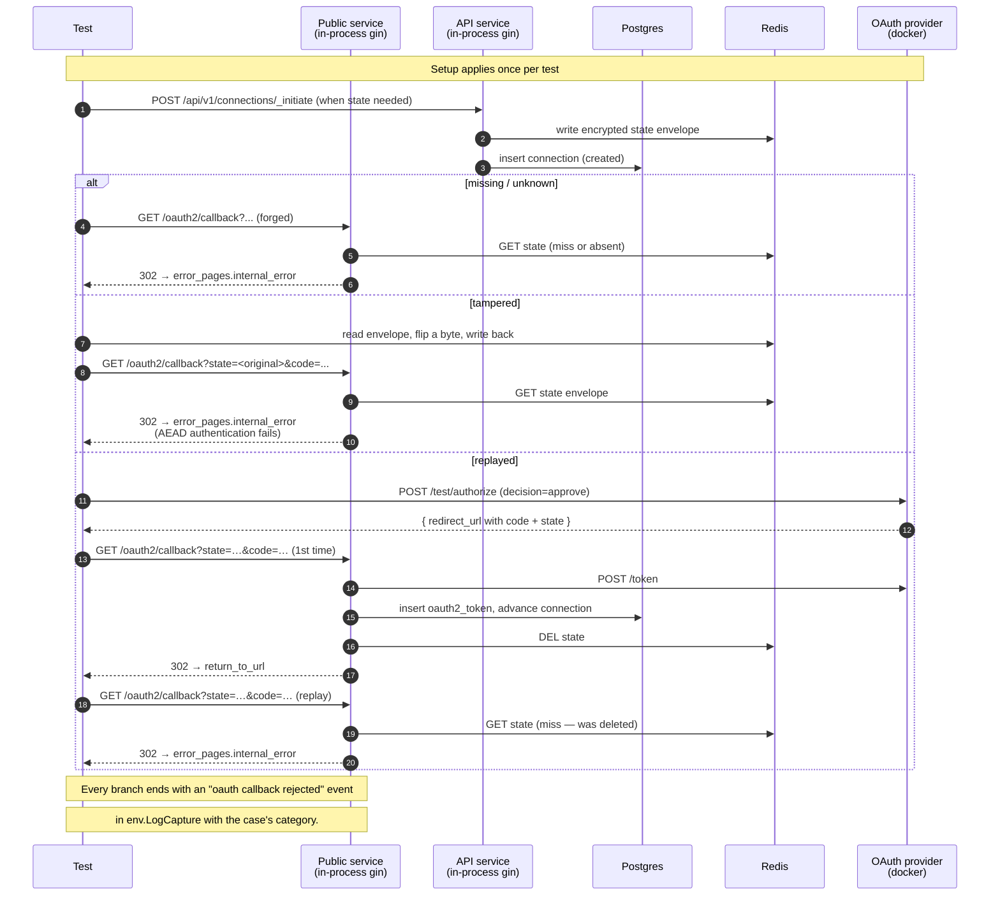

# OAuth2 Callback State Security — Direct-HTTP Cases

Companion specification for `callback_state_security_test.go`. Covers
the four direct-HTTP rejection scenarios from #167:

1. Missing `state`.
2. Unknown `state`.
3. Tampered `state` (Redis value mutated outside the proxy).
4. Replayed `state` (state already consumed by a prior successful callback).

The cross-actor case (5) lives in a separate chromedp-driven test
(#PR 4); the cross-tenant + cross-connection cases (6–7) are PR 5.

## Why direct HTTP, not chromedp

Cases 1–4 hinge on programmatic tampering with the callback URL or the
Redis state envelope — values a real browser would never produce. The
test calls `env.DeliverOAuth2Callback` directly against the public
service's gin handler, which is the same code path the provider's 302
would hit. No browser is needed because the user-interactive part of
the flow (login + consent) is irrelevant: every case rejects before
the token exchange runs. Drives chromedp would only slow the suite
down without strengthening any assertion.

The replayed case (4) does need a successful callback to consume the
state first, but it drives that programmatically through the test
provider's `/test/authorize` endpoint instead of a browser — same
reason. The replay step itself is a second `DeliverOAuth2Callback`
call with the same forged URL.

## What is asserted

For every case:

- **Callback is rejected.** The 302 Location header points at the
  configured `error_pages.internal_error` URL, not the connection's
  return-to URL.
- **No token row.** The connection (where one exists) has zero
  `oauth2_tokens` rows for it.
- **Connection state is unchanged.** Cases that have a connection
  remain in their pre-callback state (`created`, no `setup_step`).
- **Suspicious callback is logged.** A single `oauth callback rejected`
  slog event is emitted with the expected `category` and no sensitive
  values (no raw `state` parameter for the malformed cases, no
  ciphertext for the tampered case). The category comes from PR 1
  (#214).
- **No /token call.** The OAuth provider's `/token` endpoint observes
  zero requests during the rejection — proves the token exchange path
  was short-circuited.

| Test                              | `state` value                          | Category emitted        |
| --------------------------------- | -------------------------------------- | ----------------------- |
| `TestCallbackRejection_MissingState`   | absent                                | `missing_state`         |
| `TestCallbackRejection_UnknownState`   | freshly-generated apid never persisted | `unknown_state`         |
| `TestCallbackRejection_TamperedState`  | persisted, then ciphertext mutated     | `tampered_state`        |
| `TestCallbackRejection_ReplayedState`  | consumed by a prior successful callback | `unknown_state`         |

## Components

| Lever                                    | What it controls |
| ---------------------------------------- | ---------------- |
| `helpers.SetupOptions{LogCapture: …}`    | Plugs a buffered JSON slog handler in at the root logger so the test can read back the rejection event. |
| `env.ForgeOAuth2CallbackURL(state, code)` | Builds a `/oauth2/callback?state=…&code=…` URL the test delivers. |
| `env.DeliverOAuth2Callback(t, url)`      | Issues an in-process GET against `env.PublicGin`. Returns the 302 Location header. |
| Direct Redis access via `env.DM.GetRedisClient()` | Lets the tampered case mutate the encrypted state envelope after `_initiate` writes it. |
| `provider.Authorize(...)` (`/test/authorize`) | Replaces the browser leg in the replayed case — drives login + consent in one call and returns the callback URL the provider would have produced. |

## Sequence

## Per-test setup vs shared

Each test gets its own `helpers.Setup` with a fresh `LogCapture` so
rejection events from one case do not leak into another's assertions.
The per-run isolation pattern (time.Now().UnixNano() suffix on
client/user keys) is shared with the standard-flow test for the same
reason — go-oauth2-server persists clients/users across runs.

## Why no PKCE / no `error=` cases here

PKCE and provider-side `error=...` codes belong to the auth-failure
path (`HandleAuthFailed`), not to state validation. Those are covered
by `user_denial_test.go` and the future PKCE test, not here.
