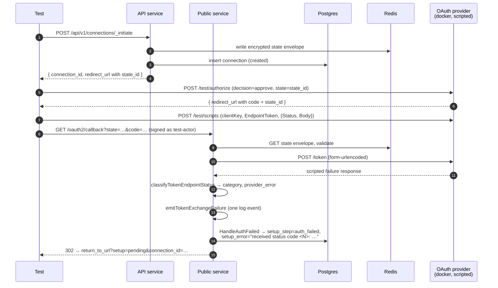

# OAuth2 Callback Token-Exchange Rejection Cases

Companion specification for `callback_token_exchange_failure_test.go`.
Covers non-retryable token-exchange failures: the proxy POSTs to the
provider's `/token` endpoint, the provider responds with a 4xx error or
a malformed body, and the proxy must classify the failure into a stable
category, record `auth_failed` on the connection, and emit a single
`oauth token exchange failed` event.

The transient retry/5xx cases live in
`callback_token_exchange_retry_test.go`. The state / actor / namespace
validation cases (which short-circuit *before* the token exchange ever
runs) live in `callback_state_security_test.go`,
`callback_actor_mismatch_test.go`, and `callback_namespace_mismatch_test.go`.

## Threat model

There is no attacker in this scenario — the proxy is talking to the
real configured provider, the provider rejects the token request, and
the proxy needs to surface that rejection cleanly:

- The user must land somewhere recoverable. The proxy 302s back to the
  connection's `return_to_url` with `setup=pending&connection_id=…` so
  the marketplace UI re-renders the connection in its `auth_failed`
  state and offers retry/cancel.
- No partial credentials must persist. A failed exchange must leave the
  database with no `oauth2_tokens` row for the connection.
- The failure category must be stable. Operators alert on
  `category=…` rather than parsing error strings, so silent renames
  break dashboards. The tests pin the message string and category
  values explicitly.
- Spec-defined provider error codes (RFC 6749 §5.2) get their own
  per-error categories; non-compliant 4xx responses fall into
  `provider_4xx_other` so the failure stays observable even when the
  provider deviates from the spec.

## What is asserted

For every scripted case:

- **302 to `return_to_url?setup=pending&connection_id=<id>`.** The
  proxy did not send the user to `error_pages.internal_error` — that
  is the state-validation failure path, not this one.
- **Exactly one `oauth token exchange failed` event** with the
  expected `category`, `state_id`, and (where applicable)
  `provider_status_code` and `provider_error`.
- **No `oauth2_tokens` row** for the connection.
- **Connection state.** `state=created`, `setup_step=auth_failed`,
  `setup_error` populated. Where a status code is meaningful, the test
  pins the substring `received status code <code>` so a stack-trace
  rewrite that drops the status code from the surfaced error gets
  caught.
- **Exactly one `/token` call observed.** The proxy actually attempted
  the exchange — the failure was not short-circuited upstream.

## Test plan

Validation order (`internal/auth_methods/oauth2/callback.go:156-163`):

```
resp.StatusCode != 200 → classifyTokenEndpointStatus(status, body)
                        → tokenExchangeCategory + provider_error
```

The classifier (`internal/auth_methods/oauth2/token_exchange_failure.go:136-162`)
runs the body through a small JSON parse looking for the RFC 6749 §5.2
`error` field. 5xx is always `provider_5xx` regardless of body (covered
in the transient retry tests). 4xx with a recognized error code dispatches to one of the
named categories; 4xx with no recognized code becomes
`provider_4xx_other`.

| Test | Scripted token endpoint response | Expected category | Provider condition covered |
| ---- | -------------------------------- | ----------------- | -------------------------- |
| `TestTokenExchangeRejection_InvalidGrant` | `400 {"error":"invalid_grant"}` | `invalid_grant` | 1 (code expired), 2 (code reused), 3 (invalid code), 6 (redirect_uri mismatch), 7 (provider invalid_grant) |
| `TestTokenExchangeRejection_InvalidClient` | `401 {"error":"invalid_client"}` | `invalid_client` | 4 (invalid client_id), 5 (invalid client_secret), 8 (provider invalid_client) |
| `TestTokenExchangeRejection_InvalidRequest` | `400 {"error":"invalid_request"}` | `invalid_request` | RFC §5.2 — proxy-side malformed request |
| `TestTokenExchangeRejection_UnauthorizedClient` | `400 {"error":"unauthorized_client"}` | `unauthorized_client` | RFC §5.2 — client not authorized for grant type |
| `TestTokenExchangeRejection_UnsupportedGrantType` | `400 {"error":"unsupported_grant_type"}` | `unsupported_grant_type` | RFC §5.2 — provider doesn't support authorization_code for this client |
| `TestTokenExchangeRejection_InvalidScopeError` | `400 {"error":"invalid_scope"}` | `invalid_scope` | RFC §5.2 — distinct from the `scope_mismatch_test.go` 200-with-narrowed-scope path |
| `TestTokenExchangeRejection_Provider4xxOther` | `403 text/html "Forbidden by WAF"` | `provider_4xx_other` | Non-compliant 4xx (WAF / rate limiter / proxy in front of provider) |
| `TestTokenExchangeRejection_MalformedResponse` | `200` with malformed JSON body | `malformed_response` | Provider returned success status but unparseable body — distinct from 4xx failures |

### Cases folded into a single test under one category

RFC 6749 §5.2 deliberately collapses several distinct authorization-code
failure modes into the single `invalid_grant` error code:

> The provided authorization grant (e.g., authorization code, resource
> owner credentials) or refresh token is invalid, expired, revoked,
> does not match the redirection URI used in the authorization request,
> or was issued to another client.

Because the proxy classifies on `error=invalid_grant` from the body —
not on which underlying condition produced it — the separate "code
expired", "code reused", "invalid code", and "redirect_uri mismatch"
provider conditions are observably indistinguishable on the proxy side.
A single scripted test exercises the classification path; reproducing
each underlying condition against the real test provider would not
strengthen the assertion (the proxy would see the same body either way)
and would drag chromedp / multi-step setup into a path that doesn't
need it.

The same logic folds "invalid client_id" and "invalid client_secret"
into the single `invalid_client` test.

## Why direct HTTP, not chromedp

The user-flow leg (Connect → login → consent) is irrelevant to these
cases — the failure mode is purely server-side at the token endpoint.
Each test uses the go-oauth2-server `/test/*` control plane to
materialize a real state, authorization code, and scripted token
response without booting a browser:

1. Calls `env.InitiateOAuth2Connection(t, …)` to materialize a real
   state envelope in Redis and a real connection row.
2. Calls `provider.Authorize(...)` (`/test/authorize`) to mint a real
   `code` without booting a browser.
3. Calls `provider.Script(clientKey, EndpointToken, ScriptAction{…})`
   to enqueue the desired token-endpoint response.
4. Calls `env.DeliverOAuth2Callback(t, …)` to deliver the callback
   in-process via `env.PublicGin`, exercising the same handler chain
   the public service would on a real browser request.

This is the same pattern `callback_state_security_test.go` uses — only
the failure point differs (state validation there, token endpoint
here).

## Components

| Lever                                                       | What it controls |
| ----------------------------------------------------------- | ---------------- |
| `helpers.SetupOptions{IncludePublic: true, LogCapture: …}`  | Bring up the public service in-process; capture every slog record so the test can pin the failure event. |
| `env.InitiateOAuth2Connection(t, connectorID, returnToUrl)` | Materialize the connection row + Redis state envelope. The default actor (`test-actor` in the root namespace) is fine — these tests don't exercise multi-tenant boundaries. |
| `provider.Authorize(AuthorizeRequest{…, Decision: Approve})`| Mint a real authorization code without booting a browser. The token endpoint is the failure point under test, not the authorize endpoint. |
| `provider.Script(clientKey, EndpointToken, ScriptAction{Status, Body, …})` | Enqueue the next token-endpoint response. Status + Body together let any RFC §5.2 shape be reproduced; `BodyTemplate: BodyMalformedJSON` covers the unparseable-200 case without hand-rolling JSON garbage. |
| `env.DeliverOAuth2Callback(t, callbackURL)`                 | In-process GET to `/oauth2/callback`. Returns the `Location` header — typically `return_to_url?setup=pending&connection_id=…` after an auth failure. |
| `logCapture.RecordsWithMessage(t, tokenExchangeFailureMessage)` | Surface the structured failure events for category + status + provider_error assertions. |
| `provider.Requests(EndpointToken, …)`                       | Confirm exactly one `/token` call hit the provider — proves the failure was at the token endpoint, not earlier. |

## Sequence



## What is *not* covered here

- **5xx / transient failures.** `provider_5xx` is bounded-retry territory
  and is exercised by the retry policy tests with a 5xx-then-success script.
- **State validation failures.** Missing/unknown/tampered/replayed state
  is `callback_state_security_test.go`. Cross-actor / cross-namespace
  is `callback_actor_mismatch_test.go` and
  `callback_namespace_mismatch_test.go`.
- **User denial.** `error=access_denied` on the redirect (no code) is
  `user_denial_test.go` (chromedp-driven).
- **Scope-shape mismatches with a 200 response.** Provider returns a
  success but with a narrower / wider scope than requested:
  `scope_mismatch_test.go`. The `invalid_scope` test here is the
  status-level rejection — distinct path.
- **Internal errors (`tokenExchangeInternalError`,
  `tokenExchangeStateCleanupError`).** These exercise proxy-side bugs
  (config render, secret decryption, post-auth state transition,
  Redis delete failure). Reproducing them from the integration boundary
  requires injecting a fault into proxy infrastructure — covered by the
  unit tests in `internal/auth_methods/oauth2/token_exchange_failure_test.go`.
