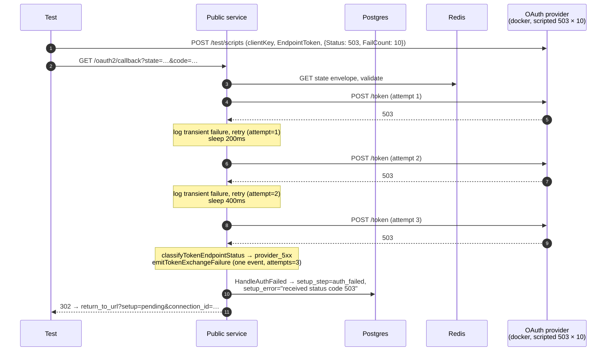

# OAuth2 Callback Token-Exchange Retry / 5xx Cases

Companion specification for `callback_token_exchange_retry_test.go`.
Covers transient token-exchange retry behavior: the proxy POSTs to the
provider's `/token` endpoint, the provider responds with a 5xx, and the
proxy retries up to a small bounded budget before either succeeding or
giving up. The non-retryable rejection cases (4xx + malformed 200) live
in `callback_token_exchange_failure_test.go`.

## What the retry policy is, and why

Source: `internal/auth_methods/oauth2/callback.go:26-38`.

```
tokenExchangeMaxAttempts = 3                       // 1 try + 2 retries
tokenExchangeBackoffStep = 200 * time.Millisecond  // linear: 200ms, 400ms
```

- **3 attempts.** A single bad pod or a quick rolling restart on the
  provider should not surface as a user-visible auth failure. Three
  attempts is enough headroom to ride that out without stretching a
  hard outage into a multi-second wait that the user notices.
- **5xx + transport errors only.** 4xx is the provider classifying the
  request as malformed or unauthorized. Resubmitting the same
  authorization code would only burn the code and produce
  `invalid_grant` on the second call — observably worse than the
  original failure.
- **Linear backoff.** 200ms before retry 1, 400ms before retry 2.
  Short enough that a user staring at the marketplace post-consent
  doesn't notice; long enough that a node-local failover has time to
  settle.
- **Hardcoded.** No connector-level knob. If different connectors need
  different budgets, the constants become a config field — but only
  when there's evidence that they do.

The policy is not RFC-mandated. It exists because the token-exchange
leg is a fixed window (the authorization code lifetime, typically
~60s) and a single transport blip during that window otherwise
propagates straight to the user as auth_failed.

## What is asserted

For every retry case:

- **Attempt count is the load-bearing assertion.** Each test pins the
  number of `/token` calls observed via `provider.Requests(...)`. A
  retry policy that silently regressed to "no retry" would still pass
  most other assertions; the call count is what catches that.
- **Connection lands in the correct terminal state.** Successful retry
  → `state=ready`, no `setup_step`, no `setup_error`, real token row
  persisted. Exhausted retry → `state=created`,
  `setup_step=auth_failed`, `setup_error` containing the provider
  status code.
- **Exactly one structured failure event on exhaustion, none on
  success.** The structured `oauth token exchange failed` event is
  what dashboards key on; emitting it for every transient blip would
  render the alert useless. Per-retry Warn log lines (separate
  message string `"oauth token exchange transient failure;
  retrying"`) are fine — only the rejection event must remain
  one-per-final-failure.
- **`attempts` field on the failure event records exhaustion.** Set to
  `tokenExchangeMaxAttempts` on the exhausted-retry path so dashboards
  can distinguish "we tried 3 times and gave up" from a single
  non-retryable failure. The non-retryable 4xx tests do not pin the
  field — it is populated there too, but the assertion belongs here
  where the exhausted retry budget is the point of the test.
- **302 to `return_to_url?setup=pending&connection_id=<id>` even on
  exhaustion.** Same as the permanent failure path — the user must land
  somewhere recoverable, the marketplace UI re-renders the connection
  in `auth_failed`, and the user can retry/cancel.

## Test plan

| Test | Scripted token endpoint response | Expected outcome | Retry behavior covered |
| ---- | -------------------------------- | ---------------- | -------------------------- |
| `TestTokenExchange_TransientRetrySucceeds` | `503 {"error":"temporarily_unavailable"}` × 2, then default success | `state=ready`, token persisted, **3** `/token` calls, **no** failure event | Transient outage that resolves within budget |
| `TestTokenExchange_TransientRetryExhausted` | `503 {"error":"temporarily_unavailable"}` × 10 (only first 3 consumed) | `state=created`, `setup_step=auth_failed`, **3** `/token` calls, single failure event with `category=provider_5xx`, `attempts=3`, `provider_status_code=503` | Sustained 5xx outage exceeding budget |
| `TestTokenExchange_5xxVariants_AllRetried` | `504 {"error":"gateway_timeout"}` × 10 | Same shape as exhausted with `provider_status_code=504` | Retry policy keyed on 5xx range, not specific code |

### Why `FailCount` instead of fixed-count scripts

`provider.Script(...)` accepts a `FailCount` field that returns the
scripted response that many times before falling through to default
behavior. The success case uses `FailCount: 2` paired with
`tokenExchangeMaxAttempts = 3` so the third attempt naturally hits the
default (real access_token grant) — proving end-to-end that the proxy
made it through the failures and consumed a real success without us
having to script the success body explicitly.

The exhausted/504 cases use `FailCount: 10` instead of a tight match
to the budget. If `tokenExchangeMaxAttempts` ever increases, the
assertion `tokenCallCount() == 3` is what fails — not the script
running out of responses on the wrong attempt and producing a
confusing error.

## Why direct HTTP, not chromedp

Same rationale as the non-retryable token-exchange tests: the
user-flow leg (Connect → login → consent) is irrelevant to these cases
— the failure mode is purely server-side at the token endpoint. Each
test:

1. Calls `env.InitiateOAuth2Connection(t, …)` to materialize a real
   state envelope in Redis and a real connection row.
2. Calls `provider.Authorize(...)` (`/test/authorize`) to mint a real
   `code` without booting a browser.
3. Calls `provider.Script(clientKey, EndpointToken, ScriptAction{…})`
   to enqueue the desired token-endpoint response (with `FailCount`).
4. Calls `env.DeliverOAuth2Callback(t, …)` to deliver the callback
   in-process via `env.PublicGin`, exercising the retry loop end to
   end.

## What is *not* covered here

- **Transport-error retries.** The retry policy retries on transport
  errors (DNS, dial, TLS, read timeout) as well as 5xx, but the
  scripted provider can only synthesize HTTP responses. Transport
  errors are exercised by the unit tests in
  `internal/auth_methods/oauth2/token_exchange_failure_test.go`.
- **Backoff timing assertions.** Tests measure call counts, not
  wall-clock spacing — pinning timing in CI would be flaky and the
  backoff is not observably user-facing.
- **Context cancellation mid-retry.** The retry helper honors
  `ctx.Done()` between attempts (`callback.go:231-235`), but
  reproducing a cancellation between two specific attempts from the
  integration boundary requires a pre-orchestrated race; the helper's
  behavior is asserted by unit tests instead.
- **Non-retryable 4xx and malformed 200 responses.**
  `callback_token_exchange_failure_test.go`.

## Components

| Lever                                                       | What it controls |
| ----------------------------------------------------------- | ---------------- |
| `provider.Script(clientKey, EndpointToken, ScriptAction{Status, Body, FailCount})` | Enqueue the next N token-endpoint responses. `FailCount` decouples "scripted response count" from "retry budget" — a script of 2 paired with budget 3 lands on default success on the final attempt. |
| `provider.Requests(EndpointToken, ClientID)`                | Count actual `/token` calls observed by the provider — the load-bearing assertion that proves the retry loop ran. |
| `logCapture.RecordsWithMessage(t, tokenExchangeFailureMessage)` | Surface the structured failure event so the test can assert presence (exhaustion) or absence (successful retry). |

## Sequence (exhausted retry)


