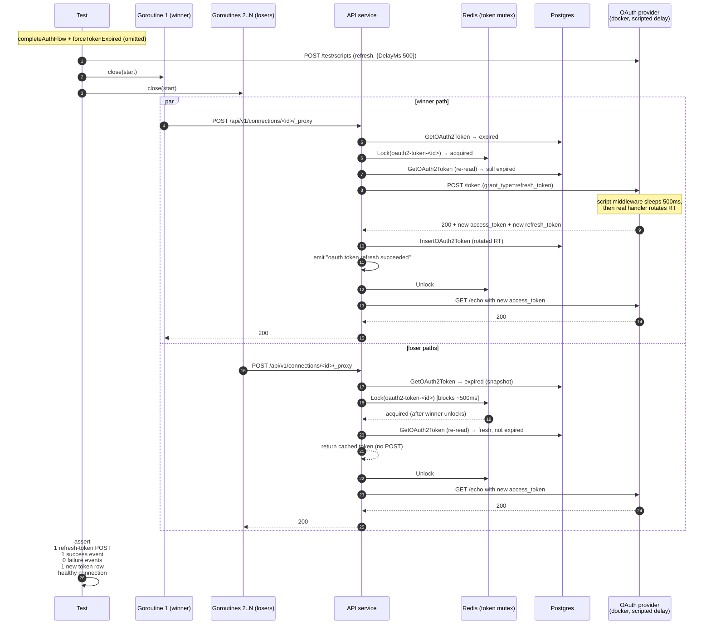

# OAuth2 Concurrent Refresh Safety (scenario 10)

Companion specification for `proxy_refresh_concurrent_test.go`. Covers
issue #171 scenario 10 — the serialization property that protects the
refresh path when N proxy requests detect an expired access token at
the same time.

Scenario 9 (rotation) is PR A and lives in `proxy_refresh_rotation_test.go`
/ `proxy_refresh_rotation_test.md`. The two scenarios are paired in
issue #171 because rotation correctness is the property the
concurrency test exercises end-to-end: the test provider's default
revocation-on-rotation behavior turns "loser POSTed a stale RT" into
an observable 400 invalid_grant failure event.

## What is asserted

For the single test in this file:

- **All N proxy requests return 200.** Every concurrent caller observes
  the *final* valid access token. A loser that escaped the mutex
  would either 401 at `/echo` (stale access token) or fail its own
  refresh against a rotated-away RT.
- **Exactly one `grant_type=refresh_token` POST on the wire.** Counted
  with `refreshGrantRequests(rig)` (filters by endpoint + client). This
  is the central serialization signal: losers re-read the persisted
  token after acquiring the mutex, see the access token is no longer
  expired, and return without POSTing.
- **Exactly one `oauth token refresh succeeded` event.** A second
  success event would mean a loser also refreshed; combined with the
  POST count, this pins the property at both the wire layer and the
  observability layer.
- **No `oauth token refresh failed` event.** If a loser POSTed the
  rotated-away refresh_token after the winner had already rotated it,
  the provider would 400 invalid_grant and the proxy would emit a
  failure event. The absence of any failure event is the
  rotation-doesn't-corrupt-credentials signal.
- **Exactly one new `oauth2_tokens` row.** The active token id has
  advanced past `preToken.Id`, and the decrypted refresh_token plaintext
  differs from the pre-refresh value (test provider's default rotation
  policy is on).
- **Health stays healthy and no transition event is emitted.** A
  permanent refresh failure in a loser goroutine would flip the
  connection unhealthy.

## Concurrency strategy

```
                 ┌─ goroutine 1 ─┐
                 │  goroutine 2  │
   <-start ──────┤      …        ├── DoProxyRequest(connID, /echo)
                 │  goroutine N  │
                 └───────────────┘
```

`close(start)` releases all N goroutines simultaneously so they hit the
expired-token check inside `getValidToken` in a single tight window.
`WaitGroup.Add(N)` + `Wait()` collects results.

`N = 8` is enough to make the race visible against a regressed mutex
without bloating the wall-clock; the test runs in under 8s end-to-end
(dominated by the scripted refresh delay).

## Why a delay-only script action

A `ScriptAction{DelayMs: 500}` (Status=0, Body="") makes the test
provider's script middleware sleep 500ms and then fall through to
the *real* refresh handler. This gives us two properties at once:

- The winner's refresh is slow enough that all N goroutines reach the
  mutex while the winner still holds it — without that delay, the
  refresh would finish so fast the losers would never observe the
  expired token.
- The response is a real provider-issued grant, so the new
  access_token is a valid bearer credential at `/echo`. A scripted
  body would mint a synthetic access_token that `/echo` would 401,
  triggering the proxy's `retry-once-after-refresh` path in
  `ProxyRequest` and double-counting refresh POSTs. PR A documented
  that trap for the rotation tests; the same reasoning applies here.

The script action is consumed only by the *first* request that reaches
the script middleware (the queue is FIFO and `Pop` is mutex-protected).
So under a regressed proxy mutex where N goroutines all POSTed
concurrently, the first would be delayed and the rest would pass
through without delay — the second-to-Nth would then try to refresh
with the pre-rotation RT, and (because the test provider's default
rotation policy revokes the old RT) the provider would return 400
invalid_grant. That manifests as failure events, not just extra
success events, which is exactly the regression signal we want.

## Why `t.Cleanup` doesn't need to restore rotation policy

Unlike the no-rotation test in
`proxy_refresh_rotation_test.go`, this test does not call
`SetRefreshRotation` — it relies on the test provider's default
(rotation on). No cleanup is needed.

## What is *not* covered here

- **Cross-process / multi-API-pod concurrency.** The redis mutex is
  the same lock both in-process goroutines and across-pod refreshers
  would contend on. Integration tests run against a single API
  process, so the cross-process case is covered structurally (same
  redis key, same Lua acquire script) rather than by simulating two
  pods.
- **Mutex acquisition failure.** A redis outage during mutex acquire
  would surface as `tokenRefreshInternalError`. Reproducing this from
  the integration boundary requires injecting a redis fault; the unit
  tests in `internal/auth_methods/oauth2/proxy_test.go` cover the
  internal-error classification.
- **No-rotation concurrency.** When the provider doesn't rotate, the
  serialization property still holds (one POST, one persisted row),
  but the "rotation doesn't corrupt credentials" failure mode
  collapses to "the same RT was POSTed N times harmlessly". Under
  rotation-on the test signal is strictly stronger (a regression
  produces failure events), so we only run the test under default
  rotation policy.
- **Re-entrant refresh from the 401 retry path.** If the upstream
  resource server 401's after a successful refresh, `ProxyRequest`
  forces a second `refreshAccessToken` call. That path is covered by
  `proxy_refresh_test.go`; here the proactive expiry check returns a
  freshly-rotated token that `/echo` accepts, so the 401 retry path
  never fires.

## Sequence



## Components

| Lever                                                              | What it controls |
| ------------------------------------------------------------------ | ---------------- |
| `proxyRefreshRig` + `completeAuthFlow` / `forceTokenExpired`       | Same fixture used by scenarios 6, 7, 8, 9, 13. Drives the standard auth flow to Ready, then advances the access-token expiry into the past via a DB-level forge. |
| `provider.Script(clientKey, EndpointRefresh, ScriptAction{DelayMs: 500})` | Delay-only action. The script middleware sleeps the configured duration and then falls through to the real refresh handler, preserving real-grant semantics (so the new access_token is a valid bearer at `/echo`). |
| `close(start)` barrier + `sync.WaitGroup`                          | Releases all N goroutines simultaneously so they hit the expired-token check inside `getValidToken` in a single tight window. |
| `env.DoProxyRequest(...)` × N                                      | Concurrent proxy calls that all observe the same expired token and contend for the same redis mutex. |
| `refreshGrantRequests(rig)`                                        | Counts `grant_type=refresh_token` POSTs against the provider's recorder — the central serialization signal. |
| `env.DecryptOAuth2RefreshToken(t, token)`                          | Plaintext refresh_token for the pre/post rotation check (AES-GCM nonces make byte-equality on the encrypted column meaningless). |
| `logCapture.RecordsWithMessage(t, …)`                              | Pins exactly one success event, zero failure events, and no health-state-changed transition. |
