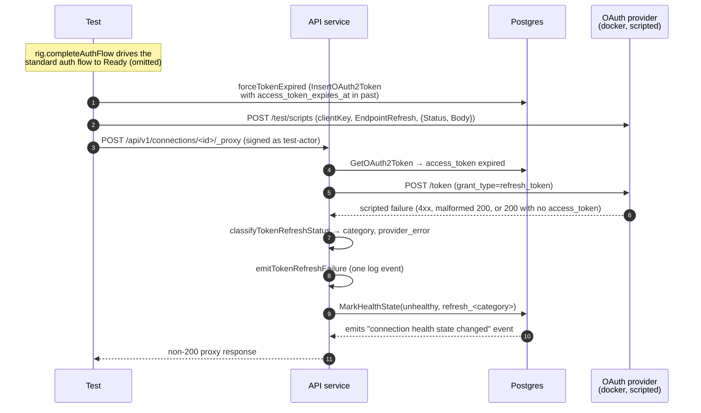

# OAuth2 Refresh Failure Modes

Companion specification for `proxy_refresh_failure_test.go`. Covers
the *deterministic* refresh failure cases that must flip the connection
unhealthy on the first failed POST.

The transient/retry cases (5xx-then-success, exhausted retry budget) live
in `proxy_refresh_retry_test.md`. The auth-flow leg uses the
`/test/authorize` shortcut rather than chromedp because the failure
point under test is the refresh endpoint, not the consent screen — same
reasoning as `callback_token_exchange_failure_test.md`.

## Cases covered

The deterministic refresh-failure matrix covers six observable failure modes for the
refresh leg:

| Refresh failure case                     | Test                       | Scripted refresh response                              | Category            |
| ---------------------------------------- | -------------------------- | ------------------------------------------------------ | ------------------- |
| Refresh token expired / revoked / invalid; provider returns `invalid_grant` | `InvalidGrant`             | `400 {"error":"invalid_grant"}`                       | `invalid_grant`     |
| Provider returns `invalid_client`         | `InvalidClient`            | `401 {"error":"invalid_client"}`                      | `invalid_client`    |
| Non-spec 4xx (WAF / rate-limiter page)    | `Provider4xxOther`         | `403 text/html "Forbidden by WAF"`                    | `provider_4xx_other`|
| Provider returns malformed refresh response | `MalformedResponse`        | `200` with unparseable JSON body                       | `malformed_response`|
| Provider returns success without an access token | `NoAccessTokenInResponse`  | `200 {"token_type":"Bearer","expires_in":3600}`        | `malformed_response`|

### Why `invalid_grant` Collapses Three Provider Cases

RFC 6749 §5.2 deliberately folds *refresh-token expired*, *refresh-token
revoked*, and *refresh-token invalid* into the single `error=invalid_grant`
response code:

> The provided authorization grant (e.g., authorization code, resource
> owner credentials) or refresh token is invalid, expired, revoked, does
> not match the redirection URI used in the authorization request, or
> was issued to another client.

The proxy classifies on `error=invalid_grant` from the body, not on which
underlying provider-side condition produced it, so producing each
condition against the real test provider would not strengthen the
assertion. A single scripted case exercises the classification path.

### Why `NoAccessTokenInResponse` folds into `malformed_response`

A 200 with a well-formed JSON envelope that omits `access_token` is
indistinguishable from a 200 with unparseable JSON from the proxy's
recovery perspective — both leave it with no usable credential and no
useful information about *why*. `createDbTokenFromResponse` rejects both
into `tokenRefreshMalformedResponse`. This case also guards against an
endless reconnect loop: malformed refresh success responses must mark the
connection unhealthy instead of repeatedly trying to use a bad token row.

## What is asserted

For every case:

- **Proxy request fails.** The original `/api/v1/connections/<id>/_proxy`
  call must not return 200 — no valid access token means no proxy.
- **Health flips unhealthy.** `connection.health_state` reads
  `unhealthy`. The marketplace UI keys reconnect prompts off this column.
- **Structured refresh-failed event.** Exactly one
  `oauth token refresh failed` record with the expected `category`,
  `connection_id`, and (where applicable) `provider_status_code` /
  `provider_error`. Operators alert on `category=…` rather than parsing
  message strings — silent category renames break dashboards.
- **Structured health-transition event.** Exactly one
  `connection health state changed` record with
  `previous_health_state=healthy`, `health_state=unhealthy`, and
  `reason=refresh_<category>`. Joining this against the refresh-failed
  event by `connection_id` is what the operational dashboards do.
- **No success event.** Even a single
  `oauth token refresh succeeded` event would corrupt
  success/failure ratios.
- **Token row preservation.** The persisted `oauth2_tokens` row must
  still have its `id` and its `encrypted_refresh_token` bytes unchanged
  — a malformed refresh response must not overwrite the row with
  garbage, because the next refresh attempt would then run against
  corrupted state.
- **Exactly one refresh POST.** These cases are non-retryable, so the
  retry loop must short-circuit on the first response. Filtered on
  `grant_type=refresh_token` so the authorization-code POST from the
  initial auth flow doesn't count.

## What is *not* covered here

- **5xx / transport-error retry behavior.** Bounded retry policy + the
  "exhausted-budget" failure shape live in
  `proxy_refresh_retry_test.md`.
- **No-refresh-token short-circuit.** That case never hits the refresh
  endpoint; it's covered by `TestProxyRefresh_NoRefreshTokenFlipsUnhealthy`
  in `proxy_refresh_test.go`.
- **401-then-refresh path in `ProxyRequest`.** When the local
  expiry-clock says the access token is valid but the provider rejects
  it with a 401, `ProxyRequest` forces a refresh and replays once. That
  is covered separately; here the proactive expiry check runs *before*
  any proxy POST, so the 401 retry path never fires.
- **Internal errors** (`tokenRefreshInternalError`: decryption failures,
  mustache render failures, credential fetch failures). Reproducing
  these from the integration boundary requires injecting a fault into
  proxy infrastructure; they're covered by the unit tests in
  `internal/auth_methods/oauth2/token_refresh_failure_test.go` and
  `proxy_test.go`.

## Components

| Lever                                                       | What it controls |
| ----------------------------------------------------------- | ---------------- |
| `helpers.SetupOptions{IncludePublic: true, LogCapture: …}`  | Bring up the API + public services in-process; capture every slog record so the test can pin the failure + health-transition events. |
| `rig.completeAuthFlow(t)`                                   | Drives the standard authorization-code flow to a Ready connection with real provider-issued tokens persisted. Same one-shot helper as `proxy_refresh_test.go`. |
| `rig.forceTokenExpired(t, connID, false)`                   | Overwrites the persisted token row with one whose `access_token_expires_at` is in the past, keeping the existing `encrypted_refresh_token` intact. This is the DB-level forge used everywhere in the refresh suite — it avoids waiting for real provider TTLs. |
| `provider.Script(clientKey, EndpointRefresh, ScriptAction{…})` | Enqueue the next refresh-endpoint response. `Status + Body` covers RFC §5.2 shapes and non-spec 4xx; `BodyTemplate: BodyMalformedJSON` covers the unparseable-200 case. |
| `env.DoProxyRequest(t, connID, …)`                          | In-process POST to `/api/v1/connections/<id>/_proxy` signed as `test-actor`. The proxy detects the expired access token, hits the refresh endpoint with the scripted response, and the test inspects the resulting observable state. |
| `logCapture.RecordsWithMessage(t, …)`                       | Surface the structured failure / success / health-transition events for category + status + reason assertions. |
| `provider.Requests(EndpointRefresh, …)`                     | Confirm exactly one `grant_type=refresh_token` call hit the provider's refresh endpoint — proves no retry loop fired. |

## Sequence

## Direct HTTP, not chromedp

Same reasoning as `callback_token_exchange_failure_test.md`: the user-
flow leg is irrelevant to these cases — the failure mode is purely
server-side at the refresh endpoint. The `/test/*` control plane on the
go-oauth2-server test provider mints real codes/tokens without booting a
browser, and the DB-level forge advances the access-token expiry without
waiting for real provider TTLs.
