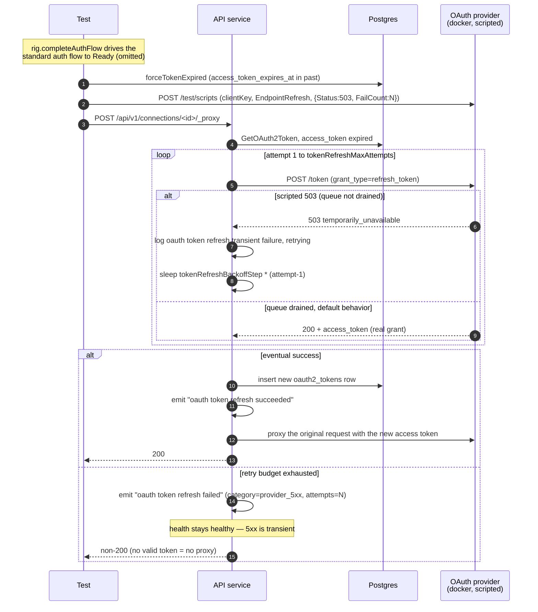

# OAuth2 Refresh Transient Retry

Companion specification for `proxy_refresh_retry_test.go`. Covers
the *transient* refresh failure cases that exercise the bounded retry
policy in `postRefreshWithRetry`.

The permanent failure cases live in `proxy_refresh_failure_test.go`. The retry policy itself (constants and
loop shape) lives in `internal/auth_methods/oauth2/proxy.go` and is
unit-tested in `proxy_test.go`; this file pins the end-to-end observable
shape via real provider scripts.

## Retry policy under test

Mirrors the token-exchange retry policy:

| Setting                       | Value (production)                |
| ----------------------------- | --------------------------------- |
| Max attempts                  | `tokenRefreshMaxAttempts = 3`     |
| Backoff between attempts      | linear: 200ms, 400ms (`tokenRefreshBackoffStep × (attempt-1)`) |
| Retryable categories          | provider 5xx, transport errors    |
| Non-retryable                 | every 4xx and every 2xx outcome   |

4xx is never retried because resubmitting the same refresh token cannot
change the provider's verdict, and with rotation policies, retries can
make things observably worse. 2xx is never retried because there is no
remaining transient signal to wait out.

## Cases covered

| Test                                            | Scripted refresh response                | Expected outcome                                                                                                                                        |
| ----------------------------------------------- | ---------------------------------------- | ------------------------------------------------------------------------------------------------------------------------------------------------------- |
| `TestProxyRefresh_TransientRetrySucceeds`       | 503 ×2, then default refresh-token grant | Proxy returns 200; new token persisted; one success event; no failure event; 2 retry-warn logs.                                                          |
| `TestProxyRefresh_TransientRetryExhausted`      | 503 ×10 (well past budget)               | Proxy returns non-200; one failure event with `category=provider_5xx`, `provider_status_code=503`, `attempts=3`; health stays **healthy** (5xx is transient); token row unchanged. |
| `TestProxyRefresh_5xxVariants_AllRetried`       | 502 ×1, then default                     | Proxy returns 200 after one retry; pins that retry triggers on the 5xx *range*, not on 503 specifically.                                                |

## What is asserted

For every case:

- **Proxy outcome.** Success-after-retry → 200; exhausted → non-200.
- **Refresh-endpoint call count.** Exactly `tokenRefreshMaxAttempts`
  (=3) on exhaustion; `failures + 1` on success-after-retry. Counted
  with the `grant_type=refresh_token` filter to exclude the
  authorization-code POST that `completeAuthFlow` already made against
  the token endpoint.
- **Retry-warn logs.** Exactly one
  `oauth token refresh transient failure; retrying` line *between*
  each consecutive pair of attempts — i.e. `tokenRefreshMaxAttempts - 1`
  on exhaustion, `n-1` on success after `n` total attempts. The final
  attempt never logs a retry-warn because there is no further attempt
  to schedule.
- **Structured success/failure events.** Eventual success → one
  `oauth token refresh succeeded` event, no failure event. Exhaustion →
  one `oauth token refresh failed` event with
  `category=provider_5xx`, `connection_id`, `provider_status_code`, and
  `attempts=tokenRefreshMaxAttempts`. The `attempts` field is the
  dashboard signal that distinguishes exhausted-budget failures from
  single non-retryable failures and is the central reason this file
  exists.

### Health-Flip Asymmetry With Permanent Failures

`provider_5xx` is *transient* — `IsPermanent()` returns false for it —
so retry-budget exhaustion must NOT flip the connection unhealthy. The
next proxy call gets another chance.

This is the load-bearing asymmetry with permanent refresh failures, where every
permanent category (`invalid_grant`, `invalid_client`,
`provider_4xx_other`, `malformed_response`, `no_refresh_token`) flips
health on the first failure. A regression that reclassified 5xx as
permanent would silently pessimize the reconnect UX: every transient
provider blip would flip the marketplace into a reconnect prompt,
training users to ignore those prompts. The exhausted-retry test asserts
both `health_state` and the absence of a `connection health state
changed` event so the regression would be caught both at the field level
and at the event level.

### Token row preservation

The exhausted-retry test snapshots `token.Id` and
`token.EncryptedRefreshToken` after `forceTokenExpired`, then asserts
both are unchanged after the exhausted-retry proxy call. The proxy must
not write a partial response on 5xx (the response body is unparsed in
that path), and must not mutate the existing row on any failed refresh.
A regression that started persisting partial responses would corrupt
the next refresh attempt's input state — this catches it.

## Why direct DB forge + scripts, not real TTLs

Same reasoning as the permanent refresh-failure tests (`proxy_refresh_failure_test.md`): the
failure point under test is purely at the refresh endpoint. The
go-oauth2-server test provider's `/test/scripts` queue mints arbitrary
refresh-endpoint responses without booting a browser, and
`forceTokenExpired` advances `access_token_expires_at` into the past
directly in the DB so the proxy's proactive expiry check fires
immediately. Driving this through chromedp would add 30+ seconds per
case for zero observable signal.

## Why `FailCount` on `ScriptAction`

`FailCount=2` consumes two scripted responses then falls through to the
provider's default refresh-token behavior. This is exactly the
"transient blip then recovery" shape needed for the
success-after-retry test, without having to enqueue a second scripted
action with a real refresh-token grant body (which would duplicate the
provider's own logic). For the exhausted-retry test, `FailCount=10`
outlasts the proxy's budget so the test does not have to count
scripted actions to know the queue will not drain.

## Sequence

## What is *not* covered here

- **Permanent failure categories** (`invalid_grant`, `invalid_client`,
  `provider_4xx_other`, `malformed_response`, `no_refresh_token`).
  See `proxy_refresh_failure_test.md`.
- **Per-attempt log line schema.** The retry-warn line carries
  `attempt`, `max_attempts`, and `provider_status_code` / `error` fields;
  the field-level shape is pinned by the unit tests in
  `internal/auth_methods/oauth2/proxy_test.go`. These integration tests
  only assert the message count, which is the public observability
  contract.
- **Backoff timing.** Linear-backoff schedule is constants in
  `proxy.go`; the unit tests around `postRefreshWithRetry` pin the
  schedule. Asserting wall-clock timing from an integration test would
  be flaky.
- **Transport-error retries.** `network_error` is retried the same way
  as `provider_5xx` but reproducing a transport error against the test
  provider requires `DropConnection` or in-process fault injection. The
  unit tests in `proxy_test.go` cover the transport-error branch
  (`TestPostRefreshWithRetry_TransportErrorRetried`).

## Components

| Lever                                                       | What it controls |
| ----------------------------------------------------------- | ---------------- |
| `proxyRefreshRig` + `completeAuthFlow` / `forceTokenExpired` | Shared refresh fixture. Drives the standard auth flow to Ready, then advances the access-token expiry into the past via a DB-level forge so the proxy's expiry check fires immediately. |
| `provider.Script(clientKey, EndpointRefresh, ScriptAction{Status:5xx, FailCount:N})` | Enqueue N scripted 5xx responses; subsequent calls fall through to the provider's default refresh-token grant. `FailCount=10` outlasts the retry budget for the exhaustion case. |
| `env.DoProxyRequest(...)`                                   | Triggers the expired-token → refresh path in-process. The retry loop is driven entirely server-side; the test never has to wait for real TTLs. |
| `rig.refreshCallCount()`                                    | Counts `grant_type=refresh_token` POSTs the provider has observed for this client. Filtered to exclude the authorization-code POSTs from the auth-flow leg. |
| `logCapture.RecordsWithMessage(t, tokenRefreshRetryMessage)` | Surface every per-attempt retry-warn log so the test can assert the expected count. |
| `logCapture.RecordsWithMessage(t, tokenRefreshFailureMessage)` | Surface the structured failure event for `attempts` / `category` / `provider_status_code` assertions. |
| `logCapture.RecordsWithMessage(t, connectionHealthStateChangedMessage)` | Pin the *absence* of a health transition on transient exhaustion. |
