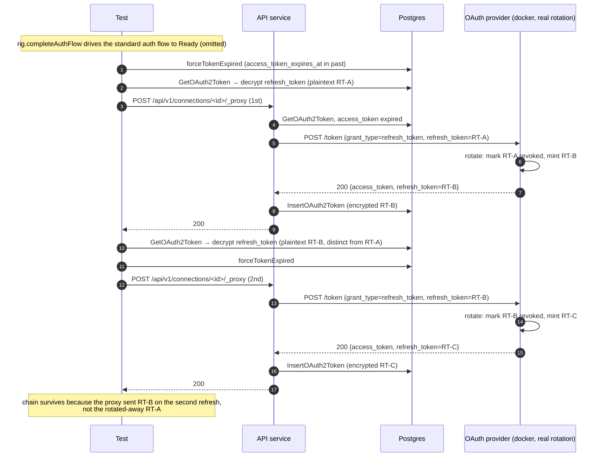

# OAuth2 Refresh Token Rotation

Companion specification for `proxy_refresh_rotation_test.go`. Covers
refresh-token rotation. RFC 6749 §6 allows but does not require the
provider to issue a new `refresh_token` on every
refresh response. The proxy must persist any rotated value, carry the
prior value forward when the provider chooses not to rotate, and send
the *current* `refresh_token` on every subsequent refresh.

The "old refresh token is not restored by stale writes" property is a
concurrency property — the redis mutex around `refreshAccessToken`
prevents a slow concurrent refresh from writing back a stale value after
a faster one has rotated. That is exercised in
`proxy_refresh_concurrent_test.go`.

## Cases covered

| Test                                                  | Provider rotation policy | Asserted shape                                                                                                                                |
| ----------------------------------------------------- | ------------------------ | --------------------------------------------------------------------------------------------------------------------------------------------- |
| `TestProxyRefresh_RotationPersistsNewToken`           | on (test-mode default)   | One proxy call → one refresh POST → new token row with rotated refresh_token plaintext.                                                       |
| `TestProxyRefresh_RotationNextRefreshUsesRotatedToken`| on (test-mode default)   | Two proxy calls → two refresh POSTs → second refresh succeeds, proving the proxy sent the rotated RT (replaying the original would 400).      |
| `TestProxyRefresh_NoRotationRetainsRefreshToken`      | off (toggled by test)    | Two proxy calls → two refresh POSTs → refresh_token plaintext is unchanged across the chain.                                                  |

## What is asserted

For every case:

- **Proxy outcome.** Every proxy call returns 200 — a successful refresh
  is invisible to the customer's app modulo the fresh token.
- **Refresh-token plaintext shape.** Read via
  `env.DecryptOAuth2RefreshToken(t, tok)`. AES-GCM uses a fresh nonce per
  encryption, so the column bytes change on every write even when the
  underlying plaintext is identical. Comparing plaintext is the only
  reliable signal of whether the proxy actually changed the
  refresh_token.
- **Refresh-endpoint call count.** Exactly one
  `grant_type=refresh_token` POST per proxy call, filtered via
  `refreshGrantRequests(rig)`. An inflated count would mean the
  retry-once-after-refresh path fired against `/echo` — would silently
  invalidate the rotation chain assertions and is itself a regression.
- **Structured events.** One `oauth token refresh succeeded` event per
  successful refresh, zero `oauth token refresh failed` events. A
  failure event in the rotation chain test would mean the second refresh sent
  the rotated-away RT and the provider rejected it.

### Why the forward-chain test relies on the provider's revocation behaviour

When rotation is on, go-oauth2-server atomically marks the prior
refresh_token revoked
(`UPDATE oauth_refresh_tokens SET revoked_at = now() WHERE id = ? AND revoked_at IS NULL`),
and `GetValidRefreshToken` returns `invalid_grant` on a revoked replay.
So if a regression caused the proxy to keep sending the original RT
after the first refresh, the second refresh would 400, the proxy would emit a
refresh-failed event, and the connection would flip unhealthy. The
chain succeeding twice is therefore proof-by-survival that the proxy is
reading the rotated value and sending it.

## Why direct DB-level expiry forge + real rotation, not scripts

Scripting refresh responses (the technique used by refresh failure and
retry tests) fails for rotation tests because:

- the test provider redacts `refresh_token` values in the recorded
  request log (`recorder.go:redactedFormFields`), so pinning wire-level
  RT bytes is impossible regardless of which side mints the tokens;
- scripted access tokens are not valid bearer credentials at the
  provider's resource server. Proxying with one to `/echo` would 401,
  triggering the proxy's retry-once-after-refresh path, which double-
  counts refresh POSTs *and* burns the next scripted action;
- the revocation-on-replay signal that makes the forward-chain test
  meaningful only exists on the real rotation implementation.

The real go-oauth2-server rotation path (test-mode default on) issues a
new access AND refresh token per refresh, atomically revokes the old
RT, and links the new RT to the old via `parent_id`. Toggling
`/test/refresh-tokens/rotate-policy` (via `provider.SetRefreshRotation`)
switches between rotation and reuse without restarting the provider.

`forceTokenExpired` is the same DB-level forge used everywhere in the
refresh suite — it advances `access_token_expires_at` into the past
without waiting for real provider TTLs.

## Why decrypt, not compare encrypted bytes

`createDbTokenFromResponse` re-encrypts every refresh_token written to
the DB, even on the "no rotation" carry-forward path when it copies
the plaintext directly from the prior row. AES-GCM is randomized — the
nonce changes per encryption — so `EncryptedField.Data` will differ
across writes of identical plaintext. A naive byte-equality assertion
on the column would flake every time. Decrypt the column and compare
plaintext.

`env.DecryptOAuth2RefreshToken(t, tok)` uses the same
`DM.GetEncryptService().DecryptString` path the proxy itself uses, so
the test reads what the proxy reads.

## Sequence

## What is *not* covered here

- **Concurrent refresh safety.** The mutex around `refreshAccessToken`
  serializes concurrent refreshes; a slow goroutine must not write back
  a stale RT after a faster one rotated. Covered by
  `proxy_refresh_concurrent_test.go`, driven by a `DelayMs`-padded
  scripted refresh.
- **`response omits refresh_token` carry-forward branch.** The proxy's
  `createDbTokenFromResponse` has a branch that copies
  `refreshFrom.EncryptedRefreshToken` byte-for-byte when the response
  JSON omits `refresh_token`. The test provider always *includes*
  `refresh_token` in its response (even in no-rotation mode it returns
  the same value), so this branch is not exercisable from the
  integration boundary against go-oauth2-server. The internal carry-
  forward semantics are pinned by unit tests in
  `internal/auth_methods/oauth2/token_response_test.go`. The integration
  contract — plaintext refresh_token is preserved across the chain — is
  pinned here regardless of which proxy branch implements it.
- **Wire-level refresh_token value.** Redacted by the test provider's
  request recorder; we read the persisted (decrypted) column instead.
- **Rotation under provider 5xx / transient retry.** Covered by
  `proxy_refresh_retry_test.go`; the rotation tests assume
  the happy path on the refresh response itself.

## Components

| Lever                                                       | What it controls |
| ----------------------------------------------------------- | ---------------- |
| `proxyRefreshRig` + `completeAuthFlow` / `forceTokenExpired` | Shared refresh fixture. Drives the standard auth flow to Ready, then advances `access_token_expires_at` into the past via a DB-level forge so the proxy's expiry check fires immediately. |
| `provider.SetRefreshRotation(bool)` (+ `t.Cleanup` restore)  | Toggle the provider's rotation policy at runtime. Test mode defaults to **on**; the no-rotation test disables and restores. |
| `env.DoProxyRequest(t, connID, …)`                          | Triggers the expired-token → refresh path in-process. The retry loop is driven entirely server-side; the test never has to wait for real TTLs. |
| `env.GetOAuth2Token(t, connID)`                             | Read the current token row out of the database. |
| `env.DecryptOAuth2RefreshToken(t, tok)`                     | Decrypt the persisted refresh_token to plaintext. Required for any meaningful equality assertion because AES-GCM ciphertext changes per write. |
| `refreshGrantRequests(rig)`                                 | Count `grant_type=refresh_token` POSTs the provider has observed for this client. Filtered to exclude the authorization-code POSTs from the auth-flow leg. |
| `logCapture.RecordsWithMessage(t, …)`                       | Surface the structured success / failure events for chain-survival assertions. |
