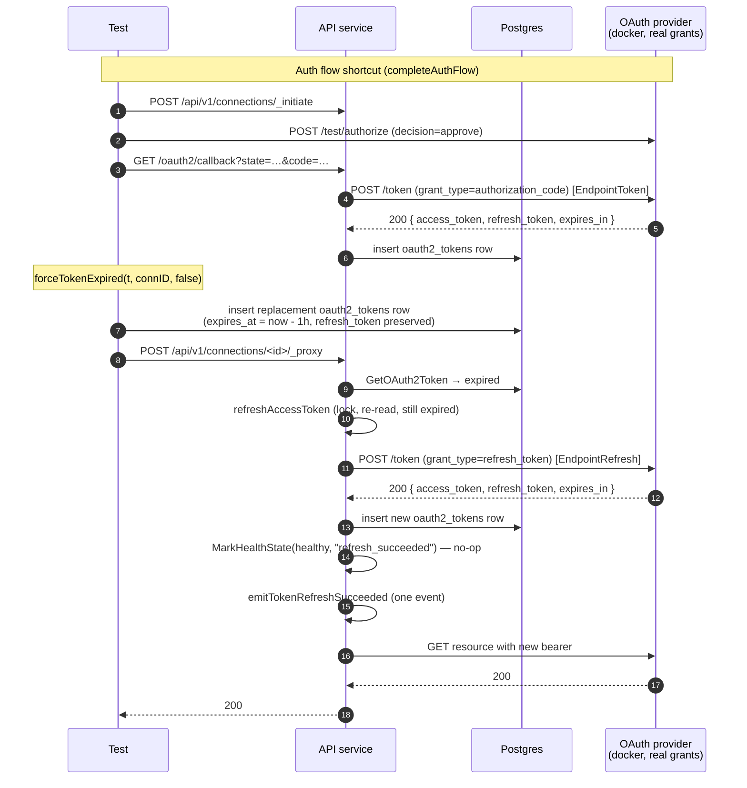
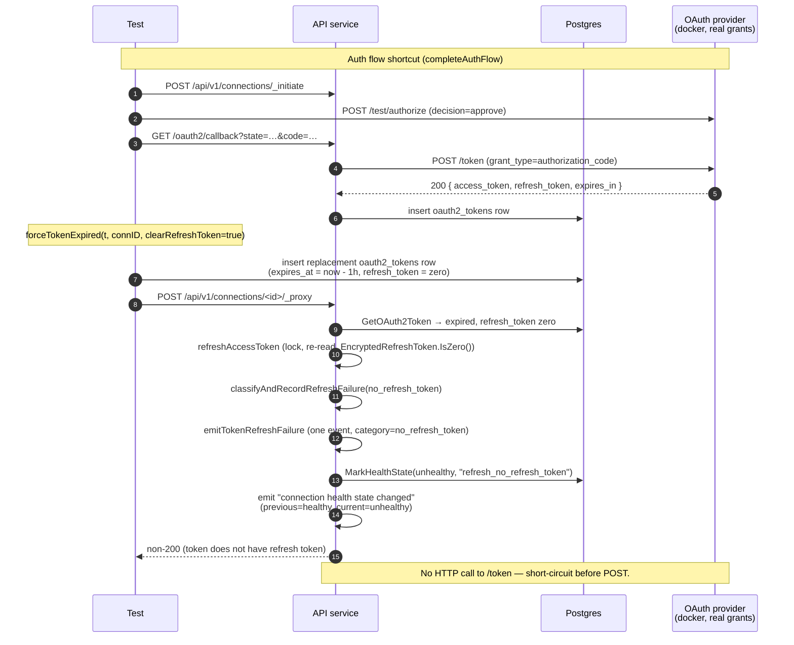

# OAuth2 Proxy-Time Refresh Cases

Companion specification for `proxy_refresh_test.go`. Covers the
proxy-time refresh leg of issue #169 — at request time the proxy
detects that the persisted access token has expired, and either
exchanges the persisted `refresh_token` for a new access token
(scenario 6) or, if no `refresh_token` was issued, flips the
connection's `health_state` to unhealthy without making any HTTP
call (scenario 13).

The initial code → token exchange leg lives in
`callback_token_exchange_failure_test.go` / `callback_token_exchange_retry_test.go`
(issue #168). Refresh-call 4xx/5xx rejection cases (invalid_grant,
invalid_client, provider 4xx-other, 5xx) and the
retry-once-after-401 path are deliberately not included here — see
"What is *not* covered" below.

## What proxy-time refresh is, and why

Source: `internal/auth_methods/oauth2/proxy.go:31-132, 166-189`.

- `getValidToken` is called for every proxied request. If the
  persisted `AccessTokenExpiresAt` is in the past, it calls
  `refreshAccessToken(ctx, token, refreshModeOnlyExpired)` before
  letting the request proceed.
- `refreshAccessToken` acquires a per-connection mutex, re-reads the
  token (so a concurrent refresh from another in-flight proxy call
  doesn't fire twice), and only POSTs to the provider's token
  endpoint if the just-reloaded row is still expired.
- If the row has no `refresh_token` (zero `EncryptedRefreshToken`),
  the helper returns `errNoRefreshToken` *before* any HTTP call.
  `classifyAndRecordRefreshFailure` records it as
  `tokenRefreshNoRefreshToken` and, because the category is
  permanent, calls `MarkHealthState(unhealthy, "refresh_no_refresh_token")`.
- On a successful refresh, `MarkHealthState(healthy, "refresh_succeeded")`
  is called unconditionally. `MarkHealthState` is idempotent — if the
  connection was already healthy, no `connection health state changed`
  event is emitted. This is what the scenario-6 assertion pins.

The health-state flip is the load-bearing signal the marketplace UI
keys off to render its reconnect prompt. A refresh failure that
silently failed to flip would leave the user unable to recover; an
over-eager flip on a transient blip would spam reconnect prompts.

## What is asserted

### Scenario 6 — expired access token refreshes

- **200 from the proxy.** The customer's app sees the request succeed
  modulo the fresh token. End-to-end proof that the refresh round-trip
  ran, the new token was persisted, and the proxy retried the request
  with the new bearer.
- **New `oauth2_tokens` row.** The replacement row has a different
  `id` from the pre-expiry row and a future `AccessTokenExpiresAt`.
  `InsertOAuth2Token` soft-deletes the prior row, so the proxy must
  resolve to the new one on the next `GetOAuth2Token`.
- **Exactly one refresh-token grant observed at the provider.** The
  test inspects requests under `EndpointRefresh` (the test provider
  categorizes refresh-token grants under a separate endpoint label from
  the initial authorization-code exchange — see "Test-provider
  endpoint labels" below). The retry-once-after-401 path must NOT
  fire: the proactive expiry check refreshes before any 401 can come
  back.
- **One `oauth token refresh succeeded` event, zero failure events.**
  Dashboards correlate success events with prior failures to detect
  recovery; a successful refresh that also emitted a failure event
  would corrupt that signal.
- **Connection stays healthy AND no transition event.** The
  pre-refresh state was healthy, so the post-refresh `MarkHealthState(healthy, …)`
  is a no-op. A `connection health state changed` event firing on
  healthy → healthy would render the dashboard's "unhealthy →
  healthy recovery" alert useless.

### Scenario 13 — no refresh token flips unhealthy

- **Non-200 from the proxy.** The proxy cannot obtain a new access
  token without user interaction, so the customer's request fails.
  Pinned as `!= 200` rather than a specific status code because the
  bubbled-up error path is a refinement target — what matters here is
  that the request did not succeed silently.
- **`health_state = unhealthy`.** The load-bearing assertion. The
  marketplace UI reads this column to decide whether to render the
  reconnect prompt; a regression that failed to flip would leave
  customers stuck with no way to recover.
- **Exactly one `oauth token refresh failed` event** with
  `category=no_refresh_token` and the correct `connection_id`. Permanent
  refresh categories emit one event per detection — the next proxy
  call won't re-emit because the connection is already unhealthy and
  the auth-state hasn't changed.
- **Exactly one `connection health state changed` event** with
  `previous_health_state=healthy`, `health_state=unhealthy`,
  `reason=refresh_no_refresh_token`. This is what dashboards correlate
  with the refresh-failure event — same connection_id, same wall-clock
  window — to attribute the health flip to its root cause without
  parsing log lines.
- **Zero refresh-endpoint HTTP calls.** `errNoRefreshToken` short-circuits
  before the POST. Asserting zero calls (not "≤ 1") catches a
  regression where the proxy POSTs an empty `refresh_token` field and
  the provider returns `invalid_request` — observably similar but with
  a wasted round-trip and a misclassified failure category.

## Test plan

| Test | Pre-expiry refresh_token? | Expected proxy response | Expected health state | Issue #169 case(s) covered |
| ---- | ------------------------- | ----------------------- | --------------------- | -------------------------- |
| `TestProxyRefresh_ExpiredAccessTokenRefreshes` | yes | 200 (request succeeds) | healthy (no transition) | 6 — expired access token, valid refresh_token |
| `TestProxyRefresh_NoRefreshTokenFlipsUnhealthy` | no (cleared) | non-200 (refresh impossible) | unhealthy (transition emitted) | 13 — expired access token, no refresh_token |

## Why direct HTTP + DB-level expiry forge, not chromedp

Same rationale as the issue #168 tests: the user-flow leg (Connect →
login → consent) is irrelevant to these cases. The failure mode is
purely at the persisted-token level — once the auth flow has minted a
real token, the test forces the expiry condition and exercises the
refresh path.

Each test:

1. Calls the standard auth flow (Initiate → `provider.Authorize` →
   `DeliverOAuth2Callback`) once via the `completeAuthFlow` helper to
   mint a real provider-issued token (with refresh_token). This is
   the same shortcut pattern the token-exchange tests use.
2. Calls `forceTokenExpired(t, connID, clearRefreshToken)` to insert a
   replacement `oauth2_tokens` row with `AccessTokenExpiresAt` in the
   past, optionally clearing the refresh_token.
3. Calls `env.DoProxyRequest(t, connID, …)` to exercise the proxy
   path with the now-expired token.

### Why `InsertOAuth2Token` with the existing encrypted fields works

`forceTokenExpired` reuses the existing `EncryptedAccessToken` and
`EncryptedRefreshToken` rather than re-encrypting fresh strings.
Two reasons:

- `IsAccessTokenExpired(ctx)` (`internal/database/oauth2_token.go`)
  compares `AccessTokenExpiresAt` to `apctx.GetClock(ctx).Now()`
  *before* any decrypt. The encrypted contents are irrelevant to the
  expiry check that gates the refresh path.
- The underlying provider-issued refresh_token (encrypted into the
  reused field) is still valid at the provider, so when the proxy
  decrypts and POSTs it, the provider accepts it and returns a fresh
  grant.

For scenario 13, `encfield.EncryptedField{}` (zero value) is passed
instead. `EncryptedRefreshToken.IsZero()` returns true → the
`errNoRefreshToken` short-circuit fires.

## Test-provider endpoint labels

The test provider (`integration_tests/helpers/oauth2_provider.go`)
records every observed request under an `EndpointLabel`:

```
EndpointToken      = "token"    // POST /oauth2/token, grant_type=authorization_code
EndpointRefresh    = "refresh"  // POST /oauth2/token, grant_type=refresh_token
EndpointAuthorize  = "authorize"
…
```

Both `EndpointToken` and `EndpointRefresh` map to the same HTTP path
on the provider, but the inspector classifies by `grant_type` so
tests can filter cleanly without scanning form bodies. The scenario-6
refresh assertion filters by `EndpointRefresh`; scenario 13 asserts
zero `EndpointRefresh` calls.

## What is *not* covered here

- **Refresh-call 4xx rejections (`invalid_grant`, `invalid_client`,
  `provider_4xx_other`).** These cover the case where the provider
  rejects a refresh request that the proxy did make. They're a
  permanent-failure category too (flip unhealthy), but the assertion
  shape is different (one failure event with the right category, one
  health transition with `reason=refresh_<category>`) and they belong
  in their own test file when added — they're not currently exercised
  in the integration suite.
- **Refresh-call 5xx rejections.** Transient — does *not* flip
  unhealthy. The next proxy call gets another chance. Covered by
  unit tests in `internal/auth_methods/oauth2/token_refresh_failure_test.go`.
- **Retry-once-after-401 in `ProxyRequest`.** When the upstream returns
  401 despite our local expiry-clock saying the token was valid, the
  proxy forces a refresh and replays the request once with the new
  token. Covered by unit tests in
  `internal/auth_methods/oauth2/proxy_test.go`.
- **Concurrent expired requests.** Two in-flight proxy calls both
  observing the same expired token should result in one refresh, not
  two — guarded by `tokenMutex().Lock(ctx)` in `refreshAccessToken`.
  Reproducing the race deterministically from the integration boundary
  is flaky; the unit tests cover the mutex behavior.
- **Network-layer refresh failures.** Transport errors (DNS, dial,
  TLS, read timeout) — transient, classified as
  `tokenRefreshNetworkError`. Covered by unit tests; the scripted
  provider can only synthesize HTTP responses, not transport faults.
- **Malformed 200 refresh responses.** Provider returns 200 with a
  body the proxy can't parse — classified as
  `tokenRefreshMalformedResponse` (permanent). Covered by unit tests.

## Components

| Lever                                                       | What it controls |
| ----------------------------------------------------------- | ---------------- |
| `helpers.SetupOptions{IncludePublic: true, LogCapture: …}`  | Bring up the public service in-process and capture every slog record so the test can pin refresh + health-transition events. |
| `completeAuthFlow(t)` (test-local helper)                   | One-call auth flow: `InitiateOAuth2Connection` → `provider.Authorize` → `DeliverOAuth2Callback`. Returns a `connection_id` with a real provider-issued token persisted. |
| `forceTokenExpired(t, connectionID, clearRefreshToken)`     | Insert a replacement `oauth2_tokens` row with `AccessTokenExpiresAt` 1 hour in the past, optionally with a zero-value `EncryptedRefreshToken`. Reuses the existing encrypted access-token field — the expiry check fires before any decrypt. |
| `env.DoProxyRequest(t, connectionID, url, method)`          | In-process POST to `/api/v1/connections/<id>/_proxy`. Exercises `oAuth2Connection.ProxyRequest` end to end, including the refresh path triggered by `getValidToken`. |
| `provider.Requests(RequestsFilter{Endpoint: EndpointRefresh, ClientID})` | Count refresh-token grants observed at the provider. The load-bearing assertion that proves the refresh round-trip ran (scenario 6) or did not (scenario 13). |
| `logCapture.RecordsWithMessage(t, tokenRefreshSuccessMessage / FailureMessage / connectionHealthStateChangedMessage)` | Surface the three structured events the tests pin: refresh success/failure (`oauth token refresh succeeded` / `failed`) and the health transition (`connection health state changed`). Message strings are duplicated as constants at the top of `proxy_refresh_test.go` and fail-fast if either drifts from the production source. |

## Sequence (scenario 6 — successful refresh)



## Sequence (scenario 13 — no refresh token, flip unhealthy)


