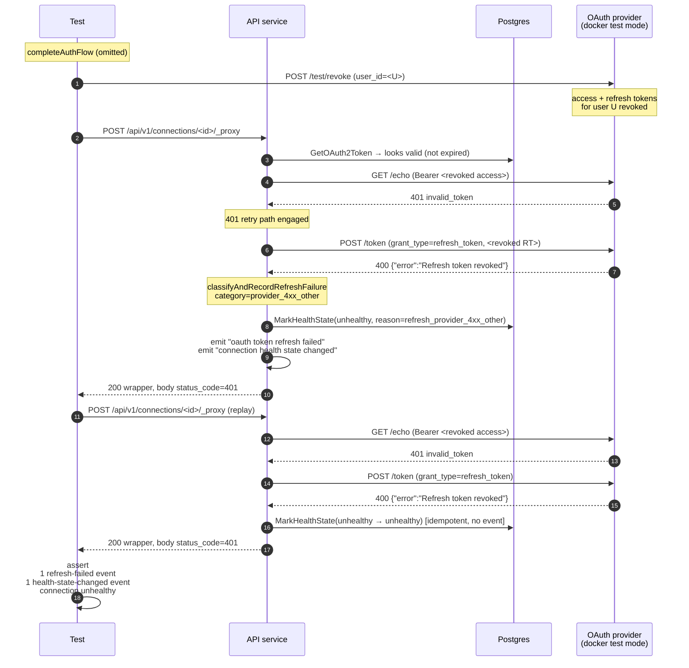

# OAuth2 Third-Party Revocation Detection (scenario 11)

Companion specification for `proxy_third_party_revocation_test.go`.
Covers issue #172 scenario 11 — when a user revokes access at the
provider, the proxy must detect the dead credential on its next
request, surface it as a reconnect-required failure (unhealthy), and
stop using the dead refresh token.

Three tests cover the full surface:

1. `TestProxyRevocation_UserRevocationFlipsUnhealthy` — full user
   revocation (access + refresh both dead) → unhealthy.
2. `TestProxyRevocation_AccessOnlyRevocationSelfHealsViaRefresh` —
   access-only revocation → proxy self-heals via the 401-retry path,
   connection stays healthy.
3. `TestProxyRevocation_AccessTokenRevokeDoesNotCascadeToRefresh` —
   sanity guard against a future test-provider change.

Scenario 7 (`proxy_refresh_test.go`'s InvalidGrant case) is the
related spec: it scripts an RFC-compliant `invalid_grant` response on
the refresh endpoint and pins the proxy's reaction in isolation.
Scenario 11 is the causal-chain version — the provider's natural
revocation state machine produces the failure end-to-end, exercising
the same proxy code path through a real-world cause.

## What is asserted

### Test 1 — full user revocation

- **Upstream 401 surfaces to the caller.** `parseRevocationProxyResponse`
  parses the proxy API's wrapper response and asserts the inner
  `status_code == 401`. The proxy API itself returns 200 — that is
  proxy plumbing success; the upstream failure lives in the wrapper.
- **Connection flipped unhealthy.** `MarkHealthState` was called
  during the refresh failure path.
- **Exactly one refresh-failed event.** Captures the first attempted
  refresh (the 401-retry path). Asserts:
  - `category = provider_4xx_other` (see fixture caveat below)
  - `connection_id = <connID>`
  - `provider_status_code = 400`
  - `provider_error = "Refresh token revoked"`
- **Exactly one health-state-changed event** with
  `previous_health_state=healthy → health_state=unhealthy` and
  `reason=refresh_provider_4xx_other`.
- **Exactly one refresh-token POST** on the wire — only the failed
  attempt, no retry.
- **Token row preserved.** Failed refresh does not delete the row.
- **Second proxy request keeps failing.** Upstream 401 again, but
  `MarkHealthState(unhealthy → unhealthy)` is idempotent so the
  health-state-changed event count stays at 1 — that is the
  load-bearing signal for dashboards that don't want every replay
  attempt to look like a new event.

### Test 2 — access-only revocation, self-heal

- **Proxy returns upstream 200.** The 401-retry path resolved the
  dead access token by refreshing.
- **Connection stays healthy.** Self-heal must not flip unhealthy or
  emit a transition event.
- **Exactly one refresh-succeeded event.** Pins the refresh leg.
- **No refresh-failed event.**
- **Exactly one refresh-token POST.** The 401-retry path fires once
  and the replay succeeds — no further refresh.
- **Token row rotated forward.** New row id, new refresh_token
  plaintext (test provider default rotation policy is on). This
  re-exercises scenario 9's rotation guarantee under the 401-retry
  path.
- **Second proxy request also 200, no additional refresh.** Pins that
  the self-heal stuck — the new access token works at `/echo` on its
  own.

### Test 3 — non-cascade sanity guard

- **Proxy returns upstream 200** after access-only revoke +
  forge-expire (proactive refresh path). If `RevokeToken(access)`
  cascaded to the refresh token, this would 400 and the connection
  would flip unhealthy.
- **No refresh-failed event, connection healthy.**
- **Exactly one refresh-token POST.**

## The wrapped response — why we parse the body

The proxy API at `POST /api/v1/connections/<id>/_proxy` returns 200
whenever the proxy *plumbing* succeeds, regardless of what the
upstream said. The upstream's status, headers, and body are nested
inside the response body as `{"status_code":401,"headers":{…},
"body_raw":…,"body_json":…}`. Most refresh tests in this package
only need success vs. failure at the API layer, but revocation tests
must inspect the *inner* status to tell apart 200 (self-heal
succeeded) from 401 (refresh-then-replay failed, original upstream
401 propagated).

`parseRevocationProxyResponse` does this — it asserts the outer
`w.Code == 200` (proxy plumbing didn't error) and decodes the wrapped
body. The pattern mirrors `parseProxyResponse` in
`integration_tests/proxy/ratelimit_test.go`.

## Fixture caveat: failure category is `provider_4xx_other`

RFC 6749 §5.2 specifies `{"error":"invalid_grant"}` for a revoked
refresh token, and the proxy's classifier maps that to category
`invalid_grant` and health-state reason `refresh_invalid_grant`.

The go-oauth2-server test provider does not return RFC-compliant
errors — its `ErrRefreshTokenRevoked` sentinel has the string
`"Refresh token revoked"`, and the token handler writes that string
verbatim to the JSON `error` field via `err.Error()` (see
`oauth/handlers.go` and `oauth/refresh_token.go` in the test provider
repo). The proxy's classifier sees a string it does not recognize and
labels the failure `provider_4xx_other` with reason
`refresh_provider_4xx_other`.

Scenario 7's InvalidGrant test covers the RFC-compliant mapping
(scripted response). Scenario 11 covers the causal chain end-to-end;
its assertions reflect what the fixture actually emits. If the test
provider is ever updated to return RFC-compliant `invalid_grant` for
revoked tokens, this test should be updated to assert
`category=invalid_grant` / `reason=refresh_invalid_grant` — the
proxy code path is unchanged.

## Provider-side revocation primitives

| Helper | Effect on access token | Effect on refresh token |
| --- | --- | --- |
| `provider.RevokeUser(userID)` | all access tokens for the user revoked | all refresh tokens for the user revoked |
| `provider.RevokeToken(<access plaintext>)` | that access token revoked | unchanged |
| `provider.RevokeToken(<refresh plaintext>)` | all access tokens for the same client+user revoked (cascade) | that refresh token revoked |

The non-cascade behavior of `RevokeToken(<access plaintext>)` is what
makes test 2's self-heal scenario reproducible — only the access leg
is dead, so the refresh response is real and the replay succeeds.
Test 3 pins this behavior at the fixture boundary so a future change
to the test provider's `AdminRevokeByToken` semantics would surface
here rather than as a confusing `invalid_grant` in test 2.

## Why `DecryptOAuth2AccessToken`

The test provider's request recorder redacts `refresh_token` form
values, so the rotation tests already had to read the persisted token
row and decrypt to compare plaintext. The revocation tests need the
same primitive for the *access* token — `RevokeToken` requires the
exact plaintext that the provider issued. `DecryptOAuth2AccessToken`
in `integration_tests/helpers/setup_oauth2.go` parallels the existing
`DecryptOAuth2RefreshToken` helper.

## Sequence — test 1 (full user revocation)

## What is *not* covered here

- **Scripted invalid_grant.** Scenario 7's existing test covers the
  RFC-compliant response (`{"error":"invalid_grant"}`) and the
  `category=invalid_grant` / `reason=refresh_invalid_grant` mapping.
- **Revocation discovered by the introspection endpoint.** The proxy
  detects revocation via 401-at-resource and 400-at-token, not via
  RFC 7662 introspection. If introspection-based detection is added,
  it would warrant its own scenario.
- **Concurrent proxy requests against a revoked credential.**
  Scenario 10 (`proxy_refresh_concurrent_test.go`) covers concurrent
  refresh safety. Concurrent requests against a revoked credential
  would all fail individually but the redis mutex behavior is
  unchanged — adding that combinatorial case would add little
  signal.
- **Recovery via a fresh OAuth flow after revocation.** Re-running
  `completeAuthFlow` against an unhealthy connection is the
  reconnect path; the auth-flow tests cover the recovery side.
  Scenario 11 only asserts that revocation is *detected* and the
  unhealthy state sticks.

## Components

| Lever | What it controls |
| --- | --- |
| `proxyRefreshRig` + `completeAuthFlow` | Standard fixture used by scenarios 6, 7, 8, 9, 10, 13. Drives the auth flow to Ready and exposes `rig.userID` and `rig.provider`. |
| `provider.RevokeUser(userID)` | Test-mode control plane: revokes all access + refresh tokens for the user. Models a user revoking access at the provider's UI. |
| `provider.RevokeToken(plaintext)` | Test-mode control plane: revokes just that token. Access plaintext → access-only revoke (no cascade). Refresh plaintext → cascade to all access tokens for the same client+user. |
| `env.DecryptOAuth2AccessToken(t, token)` | Plaintext of the encrypted access_token column — required to call `RevokeToken` on the access leg. |
| `parseRevocationProxyResponse(t, w)` | Unwraps the proxy API's 200 envelope and exposes the upstream `status_code` for the assertion. |
| `logCapture.RecordsWithMessage(t, …)` | Pins refresh-success / refresh-failed event counts and health-state-changed transitions, including the category and reason fields. |
| `refreshGrantRequests(rig)` | Counts `grant_type=refresh_token` POSTs against the provider's recorder — load-bearing for the no-retry-storm property. |
