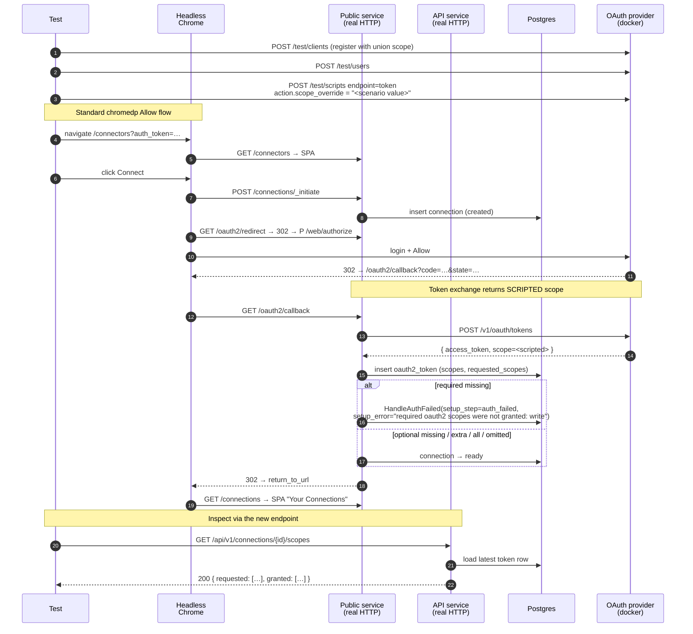

# OAuth2 Scope Mismatch Handling

Companion specification for `scope_mismatch_test.go`.

## Scenario

The connector definition declares a set of OAuth2 scopes (each marked
required or optional). The provider may return a different set at the
token endpoint — RFC 6749 §3.3 explicitly allows the provider to honor
only a subset of the request, and §5.1 specifies that an omitted `scope`
parameter means the granted set equals the request.

The proxy must:

1. Persist what the provider returned (`oauth2_tokens.scopes`) and what
   the connector requested (`oauth2_tokens.requested_scopes`) so callers
   can inspect divergence.
2. Treat **missing required** scopes as an authorization failure and
   land the connection in `auth_failed` with a descriptive
   `setup_error`.
3. Treat **missing optional** scopes as a soft failure: the connection
   goes ready and the divergence is exposed via the `/scopes` endpoint
   so callers can decide which features to expose. (A future
   capabilities system, #209, will surface this to downstream systems
   directly.)
4. Treat **extra granted** scopes as informational: log them, store the
   granted set verbatim, no blocking.
5. Treat an **omitted scope** field per RFC 6749 §5.1 as silent
   agreement — store `scopes = requested_scopes` and proceed normally.

A new endpoint `GET /api/v1/connections/{id}/scopes` exposes both the
requested and granted sets so applications can render the current
capability surface to end users without inspecting tokens directly. The
endpoint returns 422 for non-OAuth2 connections.

## What is asserted

The file contains five flow tests (one per scope-shape case):

| Test                                      | Connector declares                       | Token-endpoint script   | Connection state | Notable assertion                                  |
| ----------------------------------------- | ---------------------------------------- | ----------------------- | ---------------- | -------------------------------------------------- |
| `TestScopeMismatch_RequiredMissing`       | `read` (req), `write` (req)              | `scope=read`            | `auth_failed`    | `setup_error` calls out the missing required scope |
| `TestScopeMismatch_OptionalMissing`       | `read` (req), `write` (opt)              | `scope=read`            | `ready`          | `/scopes` returns granted=`[read]`, requested=`[read, write]` |
| `TestScopeMismatch_AllScopesGranted`      | `read` (req), `write` (opt)              | `scope=read write`      | `ready`          | granted set equals requested set                   |
| `TestScopeMismatch_ExtraGranted`          | `read` (req)                             | `scope=read admin`      | `ready`          | `/scopes` granted=`[read, admin]`, requested=`[read]` |
| `TestScopeMismatch_ProviderOmitsScope`    | `read` (req)                             | `scope=""` (RFC §5.1)   | `ready`          | granted falls back to requested                    |

For the success cases, each test additionally hits
`GET /api/v1/connections/{id}/scopes` over the real HTTP server and
asserts the returned `requested` and `granted` arrays match the stored
token state.

The 422-on-non-OAuth2 contract check lives as a unit test in
`internal/routes/connections_test.go` — it doesn't need an integration
flow.

## Components

Same as the standard-flow test (see `standard_flow_test.md`). The only
new pieces are the `OAuth2TestProvider`'s `/test/scripts` endpoint —
used to override the `scope` field of the token response — and the
`OptionalScopes` field on `OAuth2ConnectorOptions` for declaring
optional scopes.

| Lever                                                | What it controls |
| ---------------------------------------------------- | ---------------- |
| `OAuth2ConnectorOptions{Scopes, OptionalScopes}`     | Connector definition: required vs. optional scope declarations. |
| `provider.Script(clientKey, EndpointToken, ScriptAction{ScopeOverride: …})` | What the token-endpoint response carries in its `scope` field. Applied **before** the user clicks Allow so it's in place when authproxy exchanges the code. |
| `provider.CreateClient(Scope: "…")`                  | What scope the test provider's authorize endpoint will accept. We register the union of all scopes the test plans to grant so authorize never rejects upfront — divergence is introduced only at the token endpoint. |

## Sequence

## Why chromedp + provider scripts

This is an OAuth flow scenario, so per the
[chromedp vs `/test/*` convention](https://github.com/rmorlok/authproxy/issues/159#issuecomment-4361428298)
adopted across the test suite, we drive the consent leg through the real
marketplace + provider UI. The user-facing interaction (click Allow) is
identical to the happy path in `standard_flow_test.go`; what varies is
purely server-side — what the token endpoint returns. We control that
via `provider.Script(EndpointToken, ScriptAction{ScopeOverride: …})`,
which the test provider applies on the next token request matching the
client key. The script is enqueued before the browser clicks Allow so
it's in place by the time the proxy posts to `/v1/oauth/tokens`.

## Per-run isolation

Each test gets a fresh client key + secret + user email suffixed with
`time.Now().UnixNano()` to avoid 409s on the test provider's persisted
client/user store. Each test also gets a fresh isolated database via
pgtestdb. Scripts on the provider are cleared by the
`NewOAuth2TestProvider` cleanup hook, so a script enqueued by one test
can't leak into the next.
