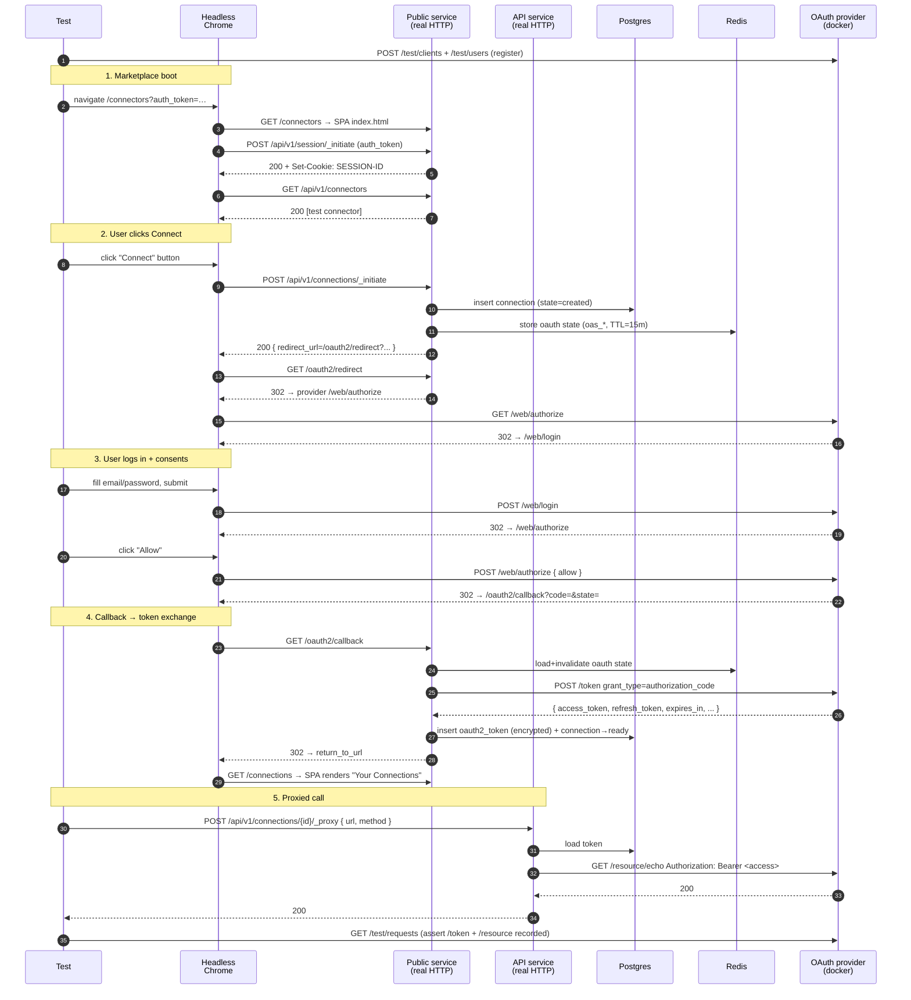

# Standard Authorization-Code Flow

Companion specification for `standard_flow_test.go`.

## Scenario

A user opens the marketplace, clicks Connect on an OAuth2 connector, logs
in and approves the consent prompt at the upstream provider, the proxy
exchanges the authorization code for tokens, persists them encrypted, and
a subsequent proxied API call carries a Bearer access token.

This is the "happy path" baseline — no PKCE, no probes, no configure
step, no scope renegotiation, no token refresh. It establishes that the
proxy correctly drives every leg of RFC 6749 §4.1 against a real
provider, against the real marketplace UI, and stores what it receives.

## What is asserted

1. **Connect button** renders on the marketplace's `/connectors` page
   after the SPA's `session._initiate` resolves.
2. **State round-trips** from authorize → callback verbatim.
3. **Final navigation** lands the browser on the marketplace's
   `/connections` page (`return_to_url`).
4. **Callback** persists encrypted access and refresh tokens with a
   future `access_token_expires_at`.
5. **Connection** transitions to `ready` (no probes/configure on this
   connector).
6. **Proxied request** to the provider's resource endpoint returns 200
   and carries an `Authorization: Bearer …` header observed by the
   provider.
7. **Provider records** show a `grant_type=authorization_code` token
   call and the bearer-authenticated resource call.

## Components

| Component                | Where it runs                  | Role |
| ------------------------ | ------------------------------ | ---- |
| Headless Chrome          | **chromedp** in-process driver | Drives the marketplace SPA, the provider's `/web/login` and `/web/authorize` forms, and the OAuth callback. |
| API service (`api`)      | **Real HTTP server** on a random port | Hosts `/api/v1/connections/{id}/_proxy`. The test issues a signed bearer-authenticated POST against `env.ServerURL`. |
| Public service (`public`) | **Real HTTP server** on a random port | Hosts the marketplace SPA at `/`, the marketplace APIs at `/api/v1/*`, and the OAuth flow at `/oauth2/redirect` + `/oauth2/callback`. The browser navigates here directly. |
| Marketplace SPA          | Built once per `go test` process via `yarn build`, served by the public service's `static` middleware. |
| OAuth2 provider          | **Docker** (`oauth-server`)    | `rmorlok/go-oauth2-server --test-mode`, port 8086. Acts as the upstream identity provider with real `/web/login` + `/web/authorize` forms and a `/test/*` control plane the harness uses to register clients/users and read recorded requests. |
| Postgres                 | **Docker**                     | Real database the API and public services share. |
| Redis                    | **Docker**                     | Stores the OAuth `state` (`oas_*`) record between `/oauth2/redirect` and `/oauth2/callback`, plus session cookies. |
| MinIO, ClickHouse, Vault | **Docker**                     | Brought up by docker-compose for other tests; not exercised here. |

## Sequence

## Why we run real HTTP servers + a real browser

Earlier iterations of this test drove each leg in-process via
`httptest.ResponseRecorder` against the API and public Gin engines. That
shortcut bypassed the marketplace SPA entirely and missed real browser
behaviors — cookie SameSite handling on the OAuth provider's cross-site
redirect, the SPA's `_initiate → connectors → connect` choreography, and
the SPA-served `/connections` page after the callback. The browser-driven
flow exercises the path real users take.

`chromedp` runs Chrome headless via the DevTools protocol from a Go
test, so the browser is launched, driven, and torn down within the
process. The marketplace bundle is built once per `go test` invocation
(`EnsureMarketplaceBuilt`) into `ui/marketplace/dist/` and served by the
public service via its `static` middleware.

## Per-run isolation

The dockerized OAuth provider persists registered clients and users
across runs of `go test`. The test suffixes the client key, secret, and
user email with `time.Now().UnixNano()` so reruns don't 400 on
"Client ID taken" or "Username taken". The connector ID is generated
fresh via `apid.New(apid.PrefixConnectorVersion)` per run, and each test
gets an isolated database via `pgtestdb`.
