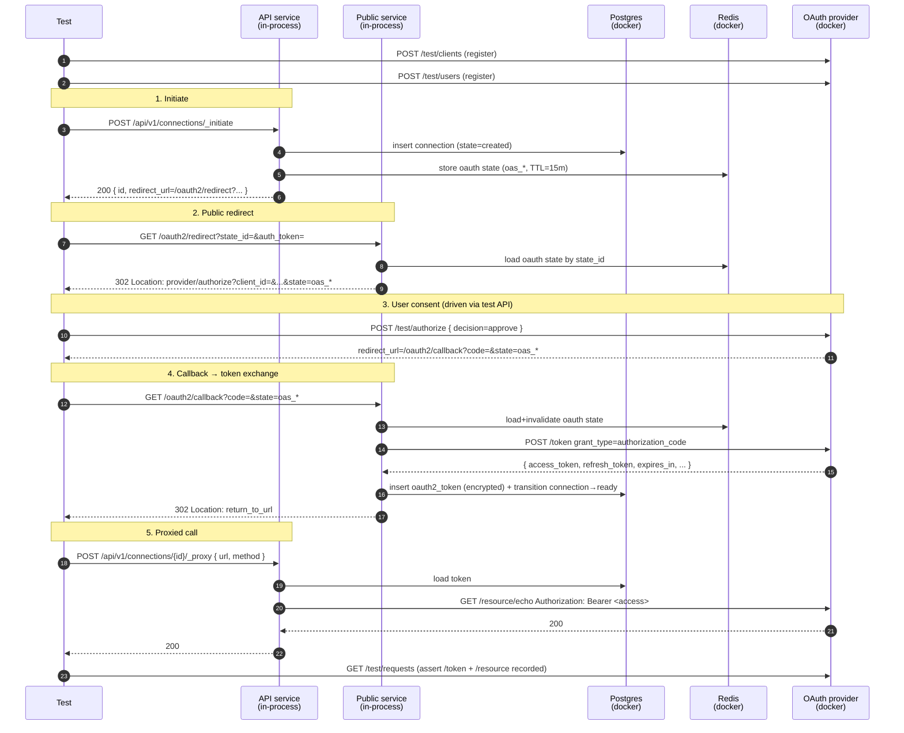

# Standard Authorization-Code Flow

Companion specification for `standard_flow_test.go`.

## Scenario

A user starts an OAuth2 connection from the proxy, approves the consent
prompt at the upstream provider, the proxy exchanges the authorization
code for tokens, persists them encrypted, and a subsequent proxied API
call carries a Bearer access token.

This is the "happy path" baseline — no PKCE, no probes, no configure
step, no scope renegotiation, no token refresh. It establishes that the
proxy correctly drives every leg of RFC 6749 §4.1 against a real
provider and stores what it receives.

## What is asserted

1. **Authorize URL** carries `client_id`, `response_type=code`,
   `redirect_uri` (matches the public service's `/oauth2/callback`),
   `scope`, and a non-empty opaque `state`.
2. **State round-trips** from authorize → callback verbatim.
3. **Callback** persists encrypted access and refresh tokens with a
   future `access_token_expires_at`.
4. **Connection** transitions to `ready` (no probes/configure on this
   connector).
5. **Final redirect** lands on the caller's `return_to_url`.
6. **Proxied request** to the provider's resource endpoint returns 200
   and carries an `Authorization: Bearer …` header observed by the
   provider.
7. **Provider records** show a `grant_type=authorization_code` token
   call and the bearer-authenticated resource call.

## Components

| Component                | Where it runs                  | Role |
| ------------------------ | ------------------------------ | ---- |
| API service (`api`)      | **In-process** Gin engine      | Hosts `/api/v1/connections/_initiate` and `/api/v1/connections/{id}/_proxy`. The test signs requests with `env.ApiAuthUtil` and dispatches them via `httptest.ResponseRecorder` against `env.ApiGin`. |
| Public service (`public`) | **In-process** Gin engine     | Hosts `/oauth2/redirect` and `/oauth2/callback`. Brought up by `SetupOptions.IncludePublic=true`, sharing the API service's `DependencyManager` (DB, Redis, core, encryption). Requests signed with `env.PublicAuthUtil` and dispatched against `env.PublicGin`. |
| OAuth2 provider          | **Docker** (`oauth-server`)    | `rmorlok/go-oauth2-server --test-mode`, port 8086. Acts as the upstream identity provider — authorize, token, resource endpoints — and exposes a `/test/*` control plane the harness uses to register clients/users and drive consent programmatically. |
| Postgres                 | **Docker**                     | Real database the API and public services share. |
| Redis                    | **Docker**                     | Stores the OAuth `state` (`oas_*`) record between `/oauth2/redirect` and `/oauth2/callback`. |
| MinIO, ClickHouse, Vault | **Docker**                     | Brought up by docker-compose for other tests; not exercised here. |

The user agent (browser) is simulated by the test driving each leg
deterministically — no real HTTP is made between `localhost` services;
the only real HTTP call is the in-process services' outbound calls to
the dockerized OAuth provider for `/token` exchange and the proxied
resource request.

## Sequence

## Why we have to use the public service in-process

`/oauth2/redirect` and `/oauth2/callback` only live on the public
service (`internal/service/public`). The API service handles
`/_initiate` and `/_proxy`. To walk the full flow without a browser,
both engines have to be reachable from the test. They share a single
`DependencyManager` so the state Redis write from API is visible to
public, and the token DB write from public is visible to API.

## Per-run isolation

The dockerized OAuth provider persists registered clients and users
across runs of `go test`. The test suffixes the client key, secret, and
user email with `time.Now().UnixNano()` so reruns don't 400 on
"Client ID taken" or "Username taken". The connector ID is generated
fresh via `apid.New(apid.PrefixConnectorVersion)` per run.
