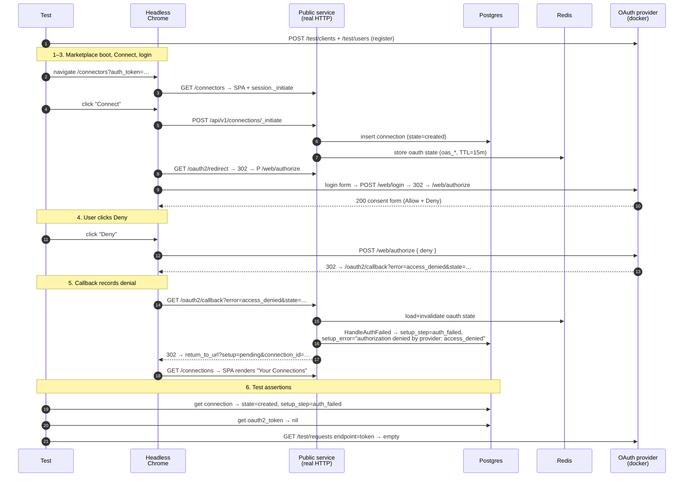

# User Denial Flow

Companion specification for `user_denial_test.go`.

## Scenario

A user opens the marketplace, clicks Connect on an OAuth2 connector, logs
in at the upstream provider, and then **denies** the consent prompt. The
provider redirects the browser back to the proxy's callback with
`error=access_denied&state=…`, the proxy records the denial on the
connection, and the browser lands on the marketplace's `/connections`
page so the user can retry or cancel.

This is the denial branch of RFC 6749 §4.1 (paired with
`standard_flow_test.go` for the approval branch). It establishes that the
proxy correctly handles a provider error response — no token exchange,
no token storage, connection in a retryable failure state — and that the
denial is surfaced to the user via the standard return-URL.

## What is asserted

1. **Deny button** renders on the provider's `/web/authorize` consent
   form after login.
2. **Provider redirect** carries `error=access_denied` (verified
   indirectly: the proxy can only land in `auth_failed` if the provider
   redirected with `error=`, since otherwise either a token would be
   stored or `setup_error` would say "no code in query" — see assertion
   5).
3. **Final navigation** lands on the marketplace's `/connections` page.
   The proxy decorates the return URL with `?setup=pending&connection_id=…`
   but the SPA strips those params as soon as it consumes them
   (`ui/marketplace/src/components/ConnectionList.tsx`), so the test does
   not assert the suffix — the connection-level checks (5) prove the
   denial path executed.
4. **No token row** exists for the connection — denial means no
   code-for-token exchange should have happened.
5. **Connection** sits at `state=created` with
   `setup_step=auth_failed` and a `setup_error` containing
   `access_denied`. The connection stays around so the user can retry
   via `/connections/{id}/_retry`.
6. **Provider records** show **no** `/token` call for this client.

## Components

Same as the standard-flow test (see `standard_flow_test.md`). The only
difference at the provider is the form button the harness clicks:

| Button on `/web/authorize` | What it submits | Provider behavior |
| -------------------------- | --------------- | ----------------- |
| `input[name="allow"]`      | `allow=Allow`   | Issues a code, redirects with `?code=…&state=…` |
| `input[name="deny"]`       | `deny=Deny`     | Redirects with `?error=access_denied&state=…` |

The form template is at
[`web/includes/authorize.html`](https://github.com/rmorlok/go-oauth2-server/blob/main/web/includes/authorize.html)
in `rmorlok/go-oauth2-server` and the deny branch is implemented at
[`web/authorize.go`](https://github.com/rmorlok/go-oauth2-server/blob/main/web/authorize.go)
(`if !authorized { errorRedirect(... "access_denied" ...) }`).

## Sequence

## Why a chromedp test rather than `/test/authorize`

The go-oauth2-server `/test/authorize` control plane accepts a
`decision: deny` shortcut that produces the same redirect URL the real
flow would produce, but it bypasses the very leg under test: the user
clicking the "Deny" button on a real consent form. The primary goal of
this scenario is to verify that the marketplace + provider UI + proxy
callback behave correctly when a real user denies, so we drive the full
browser flow (matching the
[chromedp vs `/test/*` convention](https://github.com/rmorlok/authproxy/issues/159#issuecomment-4361428298)
adopted across the test suite).
