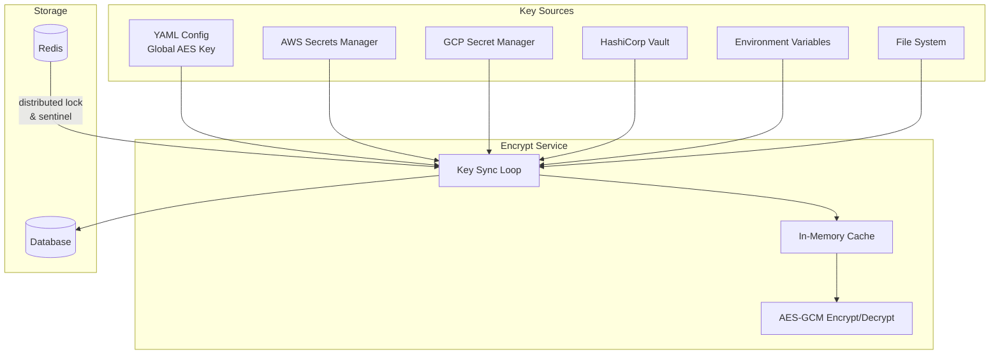
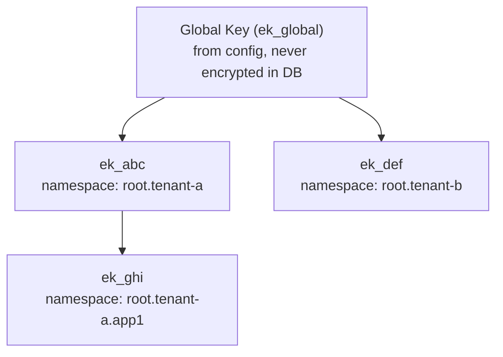
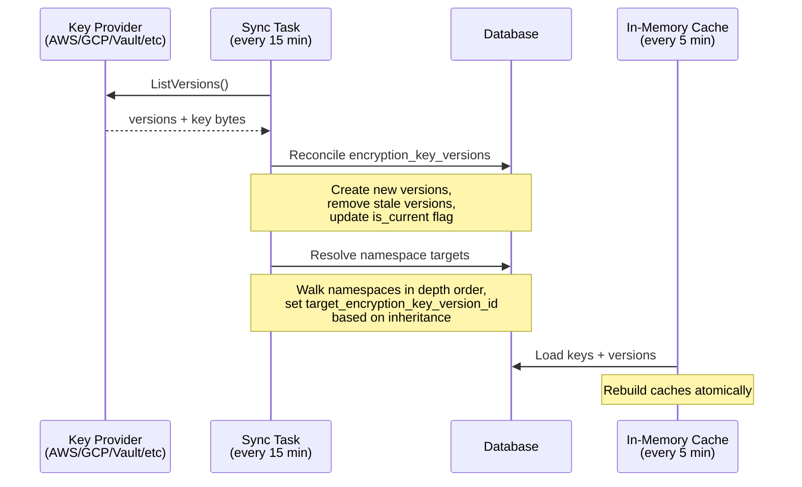

# Encryption Package

The `encrypt` package provides AES-GCM encryption for all sensitive data in AuthProxy. It supports a hierarchy of encryption keys, external secret providers, namespace-scoped encryption, and automatic key rotation with re-encryption.

## Architecture Overview



## Key Hierarchy

Encryption keys form a tree rooted at a single **global AES key**.



- The **global key** is loaded from `system_auth.global_aes_key` in the YAML configuration. It is always present and its raw key data is never stored in the database.
- **Entity keys** are stored in the `encryption_keys` table. Their `KeyData` configuration (which tells the system how to fetch the actual key bytes) is itself encrypted using the parent key and stored in the `encrypted_key_data` column.
- Each key has one or more **versions** (`encryption_key_versions` table). Exactly one version is marked `is_current` and is used for new encryptions. Old versions are retained for decryption until all data is re-encrypted.

## Encrypted Field Format

All encrypted values are stored as JSON using the `EncryptedField` type:

```json
{"id": "ekv_abc123", "d": "base64-encoded-ciphertext"}
```

- `id` — the `encryption_key_version` ID that encrypted this value
- `d` — AES-GCM ciphertext: `nonce (12 bytes) || ciphertext || auth tag`, base64-encoded

This self-describing format enables decryption without knowing which key was used ahead of time, and drives the re-encryption system by comparing `id` against the target version.

## Namespace-Scoped Encryption

Namespaces can be assigned a specific encryption key via `encryption_key_id`. When encrypting data for a namespace, the service resolves the key by walking up the namespace path:

```
root.tenant-a.app1  →  root.tenant-a  →  root  →  global
```

The first namespace with an `encryption_key_id` set determines the key used. If none is found, the global key is used.

Child namespaces automatically inherit their parent's key unless they explicitly set their own, enabling tenant-level or application-level key isolation.

## Key Providers

The `KeyData` wrapper supports multiple sources for key material. Each provider implements `KeyDataType`, which supplies versioned key bytes.

| Provider | Config Field | Description |
|---|---|---|
| **AWS Secrets Manager** | `aws_secret_id`, `aws_region` | Fetches secret value from AWS. Supports `aws_secret_key` for JSON extraction. Caches with configurable TTL. |
| **GCP Secret Manager** | `gcp_secret_name`, `gcp_project` | Fetches from Google Cloud. Defaults to `latest` version. |
| **HashiCorp Vault** | `vault_address`, `vault_path` | KV v1/v2 auto-detection. Reads `VAULT_TOKEN` from env if not configured. Exponential backoff retry. |
| **Environment Variable** | `env_var` | Reads key bytes from an environment variable (also available as base64-encoded variant). |
| **File** | `path` | Reads key bytes from a file. Supports `~` expansion. |
| **Value** | `value` | Inline string value. Development/testing only. |
| **Random Bytes** | `num_bytes` | Generates secure random bytes at startup. Useful for ephemeral/dev keys. |

Cloud providers (AWS, GCP, Vault) support caching via `cache_ttl` and return multiple versions when the underlying secret has been rotated.

## Key Sync and Rotation

Two sync processes keep encryption keys current:



### Config-to-Database Sync (every 15 minutes)

1. Acquires a Redis distributed lock to prevent concurrent syncs
2. Syncs the global key first, then enumerates entity keys in dependency order (breadth-first from root) so parent keys are available to decrypt child key configs
3. For each key, calls `ListVersions()` on the provider and reconciles against `encryption_key_versions`: creates new records, removes stale ones, updates `is_current`
4. Walks all namespaces in depth order and resolves each namespace's `target_encryption_key_version_id` by inheritance
5. Sets a Redis sentinel key (15-minute TTL) to rate-limit syncs

### Database-to-Memory Sync (every 5 minutes)

A background goroutine loads all keys and versions from the database into in-memory caches. Caches are rebuilt atomically and swapped under a write lock. Version data is immutable and reused across syncs.

On startup, the service blocks until the global key is available (up to 5 minutes with exponential backoff), then signals readiness.

## Automatic Re-encryption

A background task (every 30 minutes) automatically re-encrypts data when key versions change:

1. Scans all tables registered in the **encrypted field registry** (see below)
2. For each encrypted column, compares the `EncryptedField.id` against the row's namespace `target_encryption_key_version_id`
3. Mismatched fields are decrypted with the old key version and re-encrypted with the target version
4. Updates are applied in batches

This means key rotation is fully automatic: rotate the secret in your provider, and the system will detect the new version, sync it, and re-encrypt all data.

### Encrypted Field Registry

Tables with encrypted columns register themselves at init time:

```go
database.RegisterEncryptedField(database.EncryptedFieldRegistration{
    Table:          "oauth2_tokens",
    PrimaryKeyCols: []string{"id"},
    EncryptedCols:  []string{"encrypted_access_token", "encrypted_refresh_token"},
    JoinTable:      "connections",     // resolve namespace via JOIN
    JoinLocalCol:   "connection_id",
    JoinRemoteCol:  "id",
    JoinNamespaceCol: "namespace",
})
```

The registry supports both direct namespace columns and indirect resolution via JOINs.

## API

The `E` interface provides encryption scoped at different levels:

```go
type E interface {
    // Encrypt with the global key
    EncryptGlobal(ctx, data) (EncryptedField, error)

    // Encrypt with a specific encryption key
    EncryptForKey(ctx, keyId, data) (EncryptedField, error)

    // Encrypt using the key resolved for a namespace
    EncryptForNamespace(ctx, namespacePath, data) (EncryptedField, error)

    // Encrypt using the namespace from an entity
    EncryptForEntity(ctx, entity, data) (EncryptedField, error)

    // Decrypt any EncryptedField (key version is embedded in the field)
    Decrypt(ctx, ef) ([]byte, error)

    // Re-encrypt a field to a target key version
    ReEncryptField(ctx, ef, targetEkvId) (EncryptedField, error)
}
```

All encrypt methods block until the initial key sync is complete.

## Development / Testing

- **Fake encryption**: Enable `dev_settings.fake_encryption` in config to bypass real encryption. All "encrypted" fields store plaintext.
- **Test helper**: `NewTestEncryptService(cfg, db)` performs a synchronous key sync and returns immediately ready, with no background goroutine.
