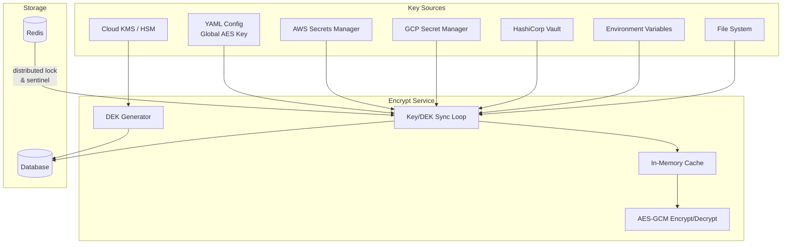
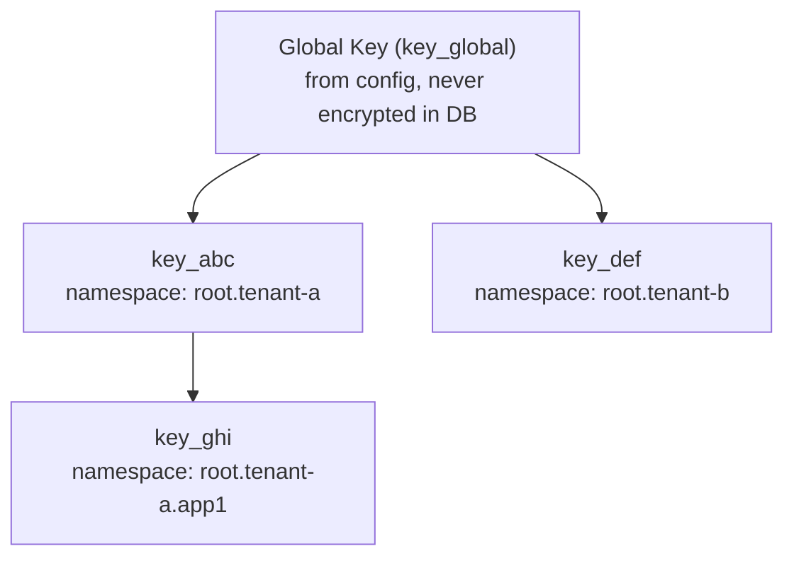
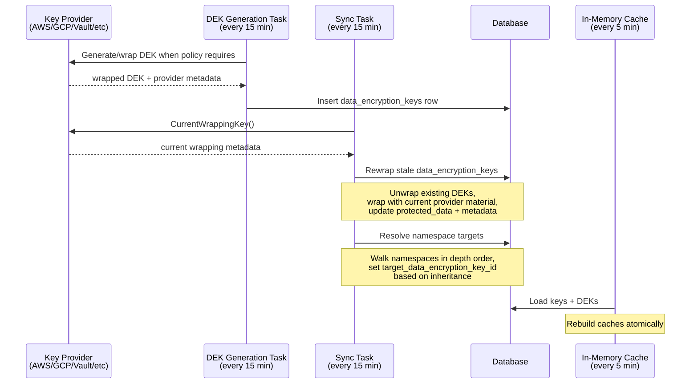

# Encryption Package

The `encrypt` package provides AES-GCM encryption for all sensitive data in AuthProxy. It supports a hierarchy of encryption keys, external secret providers, namespace-scoped encryption, and automatic key rotation with re-encryption.

## Architecture Overview



## Key Hierarchy

Encryption keys form a tree rooted at a single **global AES key**.



- The **global key** is loaded from `system_auth.global_aes_key` in the YAML configuration. It is always present and its raw key data is never stored in the database.
- **Keys** are stored in the `keys` table. Their `KeyData` configuration (which tells the system how to fetch or use wrapping material) is itself encrypted using the parent key's current DEK and stored in the `encrypted_key_data` column.
- Each data-encryption key owns one or more **DEKs** (`data_encryption_keys` table). Exactly one DEK is marked `is_current` and is used for new encryptions. Old DEKs are retained for decryption until all data is re-encrypted.

## Encrypted Field Format

All encrypted values are stored as JSON using the `EncryptedField` type:

```json
{"id": "dek_abc123", "d": "base64-encoded-ciphertext"}
```

- `id` — the `data_encryption_keys` ID that encrypted this value
- `d` — AES-GCM ciphertext: `nonce (12 bytes) || ciphertext || auth tag`, base64-encoded

This self-describing format enables decryption without knowing which DEK was used ahead of time, and drives the re-encryption system by comparing `id` against the namespace's target DEK.

## Namespace-Scoped Encryption

Namespaces can be assigned a specific key via `key_id`. When encrypting data for a namespace, the service resolves the key by walking up the namespace path:

```
root.tenant-a.app1  →  root.tenant-a  →  root  →  global
```

The first namespace with a `key_id` set determines the key used. If none is found, the global key is used.

Child namespaces automatically inherit their parent's key unless they explicitly set their own, enabling tenant-level or application-level key isolation.

## Key Providers

The `KeyData` wrapper supports multiple sources for key material. Each provider implements `KeyDataType`, which supplies versioned key bytes.

| Provider | Config Field | Description |
|---|---|---|
| **AWS Secrets Manager** | `aws_secret_id`, `aws_region` | Fetches secret value from AWS. Supports `aws_secret_key` for JSON extraction. Caches with configurable TTL. |
| **AWS KMS** | `aws_kms_key_id`, `aws_region` | Uses AWS KMS to generate, wrap, and unwrap DEKs. The KMS key material never leaves AWS; AuthProxy persists only wrapped DEKs and provider metadata. Supports `aws_credentials`, `aws_kms_endpoint`, and `cache_ttl`. |
| **GCP Secret Manager** | `gcp_secret_name`, `gcp_project` | Fetches from Google Cloud. Defaults to `latest` version. |
| **GCP KMS** | `gcp_kms_key_name` or `gcp_project`, `gcp_location`, `gcp_key_ring`, `gcp_crypto_key` | Uses Google Cloud KMS to generate DEK bytes, wrap/unwrap DEKs with the configured CryptoKey, and track the CryptoKeyVersion used for wrapping. Supports ADC, `gcp_credentials_file`, `gcp_credentials_json`, `gcp_kms_endpoint`, and `cache_ttl`. |
| **HashiCorp Vault** | `vault_address`, `vault_path` | KV v1/v2 auto-detection. Reads `VAULT_TOKEN` from env if not configured. Exponential backoff retry. |
| **HashiCorp Vault Transit** | `vault_address`, `vault_transit_key_name` | Uses Transit datakey generation and encrypt/decrypt operations to generate, wrap, and unwrap DEKs. Supports `vault_token`, `vault_namespace`, `vault_transit_mount_path`, and `cache_ttl`. |
| **Environment Variable** | `env_var` | Reads key bytes from an environment variable (also available as base64-encoded variant). |
| **File** | `path` | Reads key bytes from a file. Supports `~` expansion. |
| **Value** | `value` | Inline string value. Development/testing only. |
| **Random Bytes** | `num_bytes` | Generates secure random bytes at startup. Useful for ephemeral/dev keys. |
| **KMS-backed providers** | provider-specific | Generate AuthProxy DEKs and wrap them with a provider-held KEK. The KEK never leaves the provider. |

Cloud providers (AWS, GCP, Vault) support caching via `cache_ttl` and report provider-version metadata when the underlying secret or KMS material has been rotated.

KMS-backed providers are different from secret-backed providers. Secret-backed providers return AES key bytes directly to AuthProxy, and AuthProxy uses those bytes to wrap generated DEKs. KMS-backed providers keep wrapping material outside AuthProxy, generate or wrap DEKs through provider APIs, and persist only wrapped DEKs plus provider metadata in `data_encryption_keys`. Runtime encryption and re-encryption are driven by the current DEK for the namespace key.

## Key Sync and Rotation

Three processes keep keys and DEKs current:



### DEK Generation (every 15 minutes)

The DEK generation task walks keys in dependency order, decrypts each key's `KeyData` config, and applies `system_auth.data_encryption_keys` policy:

1. If `ensure_current` is true (the default) and a data-encryption key has no current DEK, generate one.
2. If the current DEK is older than `rotation_interval` (default 90 days), generate a new current DEK.
3. Persist only provider metadata and protected DEK material in `data_encryption_keys`.
4. Cache each plaintext DEK in memory during traversal so nested child key configs can be decrypted.

### Config-to-Database Sync (every 15 minutes)

1. Acquires a Redis distributed lock to prevent concurrent syncs
2. Syncs the global key first, then enumerates entity keys in dependency order (breadth-first from root) so parent keys are available to decrypt child key configs
3. Loads existing `data_encryption_keys` rows and asks each provider for the current wrapping metadata.
4. Rewraps stale DEKs by unwrapping with the recorded provider metadata, wrapping with the latest provider material, and updating only DEK wrapping fields.
5. Walks all namespaces in depth order and resolves each namespace's `target_data_encryption_key_id` by inheritance
6. Sets a Redis sentinel key (15-minute TTL) to rate-limit syncs

### Database-to-Memory Sync (every 5 minutes)

A background goroutine loads keys and DEKs from the database into in-memory caches. Caches are rebuilt atomically and swapped under a write lock.

On startup, the service blocks until the global key is available (up to 5 minutes with exponential backoff), then signals readiness.

## Operational Runbook

There are two separate rotations:

- **Wrapping-key rotation** changes the provider material that protects existing DEKs. Run or wait for `encrypt:sync_keys_to_database`; it keeps each `dek_` id stable while updating `protected_data`, `provider_version`, and `provider_metadata`.
- **DEK rotation** creates a new current DEK for a key. Run or wait for `encrypt:generate_data_encryption_keys`, then `encrypt:sync_keys_to_database` to advance namespace targets, then `encrypt:reencrypt_all` to move stored fields to the target DEK.

DEK policy lives under `system_auth.data_encryption_keys`:

```yaml
system_auth:
  data_encryption_keys:
    ensure_current: true
    rotation_interval: 2160h # 90 days
```

Defaults are `ensure_current: true` and a 90-day `rotation_interval`. A `rotation_interval` of `0` disables age-based DEK rotation, but `ensure_current` can still create the first DEK for a key.

Operational guardrails:

- Keep old provider wrapping material available until sync has rewrapped every retained DEK.
- Keep old DEK rows available until re-encryption has moved all encrypted fields off their `dek_` ids.
- Rotating wrapping material alone should not change encrypted field ids.
- Rotating DEKs should change namespace targets first, then encrypted field ids as the re-encryption task processes rows.

The full migration and operator guide lives in [docs/key-model-migration.md](../../docs/key-model-migration.md).

## Automatic Re-encryption

A background task (every 30 minutes) automatically re-encrypts data when namespace target DEKs change:

1. Scans all tables registered in the **encrypted field registry** (see below)
2. For each encrypted column, compares the `EncryptedField.id` against the row's namespace `target_data_encryption_key_id`
3. Mismatched fields are decrypted with the old DEK and re-encrypted with the target DEK
4. Updates are applied in batches

This means key rotation is fully automatic: rotating wrapping material in a provider rewraps existing DEKs, and rotating to a new current DEK causes the system to re-encrypt stored data.

### Encrypted Field Registry

Tables with encrypted columns register themselves at init time:

```go
database.RegisterEncryptedField(database.EncryptedFieldRegistration{
    Table:          "oauth2_tokens",
    PrimaryKeyCols: []string{"id"},
    EncryptedCols:  []string{"encrypted_access_token", "encrypted_refresh_token"},
    JoinTable:      "connections",     // resolve namespace via JOIN
    JoinLocalCol:   "connection_id",
    JoinRemoteCol:  "id",
    JoinNamespaceCol: "namespace",
})
```

The registry supports both direct namespace columns and indirect resolution via JOINs.

## API

The `E` interface provides encryption scoped at different levels:

```go
type E interface {
    // Encrypt with the global key
    EncryptGlobal(ctx, data) (EncryptedField, error)

    // Encrypt with a specific key
    EncryptForKey(ctx, keyId, data) (EncryptedField, error)

    // Encrypt using the key resolved for a namespace
    EncryptForNamespace(ctx, namespacePath, data) (EncryptedField, error)

    // Encrypt using the namespace from an entity
    EncryptForEntity(ctx, entity, data) (EncryptedField, error)

    // Decrypt any EncryptedField (DEK ID is embedded in the field)
    Decrypt(ctx, ef) ([]byte, error)

    // Re-encrypt a field to a target DEK
    ReEncryptField(ctx, ef, targetDEKId) (EncryptedField, error)
}
```

All encrypt methods block until the initial key sync is complete.

## Development / Testing

- **Fake encryption**: Enable `dev_settings.fake_encryption` in config to bypass real encryption. All "encrypted" fields store plaintext.
- **Test helper**: `NewTestEncryptService(cfg, db)` performs a synchronous key sync and returns immediately ready, with no background goroutine.
